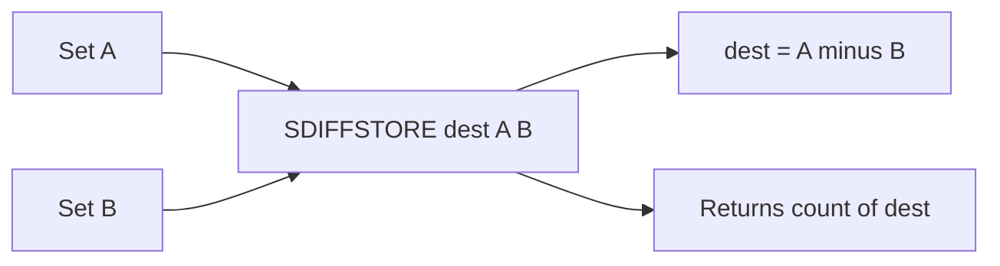

# How to Use SDIFFSTORE in Redis to Store Set Differences

Author: [nawazdhandala](https://www.github.com/nawazdhandala)

Tags: Redis, Set, SDIFFSTORE, Command

Description: Learn how to use SDIFFSTORE in Redis to compute the difference between sets and store the result in a destination key for later reuse.

---

## Introduction

`SDIFFSTORE` works like `SDIFF` but instead of returning the result to the client, it stores the resulting set in a destination key. This is useful when you need to persist a difference for further operations, share it across multiple clients, or combine it with an expiry.

## Syntax

```redis
SDIFFSTORE destination key [key ...]
```

- `destination` is the key where the result will be stored.
- Subsequent keys define the sets to diff.
- Returns the number of elements in the resulting set.
- If `destination` already exists, it is overwritten.

## How It Works



## Basic Example

```redis
SADD set:a "apple" "banana" "cherry" "date"
SADD set:b "cherry" "date" "elderberry"

SDIFFSTORE result:diff set:a set:b
-- (integer) 2

SMEMBERS result:diff
-- 1) "apple"
-- 2) "banana"
```

The original sets are unchanged and the difference is now accessible as `result:diff`.

## Overwriting the Destination

```redis
SADD result:diff "stale"

SDIFFSTORE result:diff set:a set:b
-- (integer) 2

SMEMBERS result:diff
-- 1) "apple"
-- 2) "banana"
-- "stale" is gone, destination was overwritten
```

## Real-World Use Cases

### Daily New Users Report

Find users who signed up today but not yesterday, then store for reporting:

```redis
SADD users:2026-03-31 "u:101" "u:102" "u:103"
SADD users:2026-03-30 "u:101" "u:100"

SDIFFSTORE report:new-users:2026-03-31 users:2026-03-31 users:2026-03-30
-- (integer) 2

SMEMBERS report:new-users:2026-03-31
-- 1) "u:102"
-- 2) "u:103"
```

### Pending Tasks After Completion

```redis
SADD tasks:assigned "t:1" "t:2" "t:3" "t:4"
SADD tasks:completed "t:2" "t:4"

SDIFFSTORE tasks:pending tasks:assigned tasks:completed
-- (integer) 2

SMEMBERS tasks:pending
-- 1) "t:1"
-- 2) "t:3"
```

### Feature Flag Rollout Gap

Store users who need a feature but haven't received it yet:

```redis
SADD feature:eligible "u:1" "u:2" "u:3" "u:4" "u:5"
SADD feature:deployed  "u:1" "u:3" "u:5"

SDIFFSTORE feature:pending-deploy feature:eligible feature:deployed
-- (integer) 2

-- Set expiry so it auto-refreshes
EXPIRE feature:pending-deploy 300
```

## Combining SDIFFSTORE with EXPIRE

Because the result is stored as a regular Redis key, you can attach a TTL:

```redis
SDIFFSTORE temp:diff set:a set:b
EXPIRE temp:diff 60
-- Temporary diff available for 60 seconds
```

## Three-Set Difference with SDIFFSTORE

```redis
SADD all:items  "a" "b" "c" "d" "e"
SADD blocked    "b" "d"
SADD hidden     "e"

SDIFFSTORE visible:items all:items blocked hidden
-- (integer) 2

SMEMBERS visible:items
-- 1) "a"
-- 2) "c"
```

## Time Complexity

**O(N)** where N is the total number of elements across all input sets. Storing the result adds a constant overhead.

## SDIFFSTORE vs SDIFF

| Feature          | SDIFF       | SDIFFSTORE        |
|------------------|-------------|-------------------|
| Returns          | Members     | Integer (count)   |
| Stores result    | No          | Yes (destination) |
| Overwrites dest  | N/A         | Yes               |
| Use with EXPIRE  | No          | Yes               |

## Summary

`SDIFFSTORE` computes a set difference and saves the result to a destination key, returning the element count. It is ideal for persisting computed exclusion sets, sharing diff results between clients, and applying TTLs to temporary difference snapshots. The destination is always overwritten, so it can be used to refresh a cached diff on each computation.
