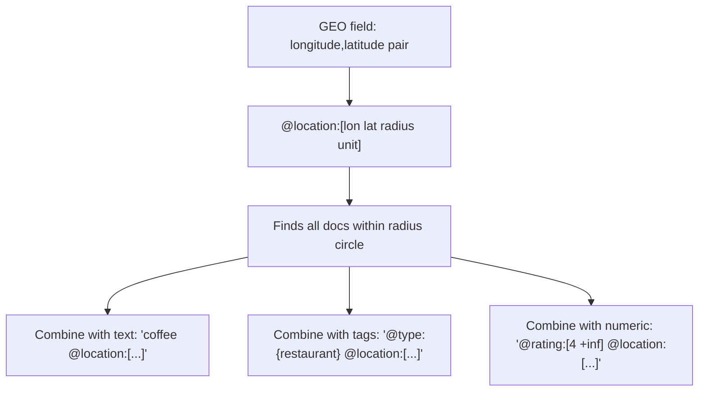

# How to Use Geo Filters in Redis Search

Author: [nawazdhandala](https://www.github.com/nawazdhandala)

Tags: Redis, RediSearch, Search, Geo, Filter

Description: Learn how to use geo filters in RediSearch to search for documents within a radius of a geographic coordinate, combining location-based filtering with text and tag queries.

---

## How Geo Filters Work in RediSearch

RediSearch indexes GEO fields as longitude/latitude coordinate pairs. Geo filters allow you to search for documents whose location falls within a circular radius around a given coordinate. The filter uses the `@field:[lon lat radius unit]` syntax and supports meters, kilometers, miles, and feet as radius units.



## Syntax

```redis
@geofield:[longitude latitude radius unit]
```

- `longitude` - center point longitude (-180 to 180)
- `latitude` - center point latitude (-90 to 90)
- `radius` - search radius as a number
- `unit` - `m` (meters), `km` (kilometers), `mi` (miles), `ft` (feet)

## Setting Up the Index

```redis
FT.CREATE places ON HASH PREFIX 1 place:
  SCHEMA name TEXT
         type TAG
         rating NUMERIC SORTABLE
         location GEO

-- Add sample places (lon,lat format)
-- New York City: -74.0060, 40.7128
HSET place:1 name "Central Park Coffee" type "cafe" rating 4.5 location "-73.9654,40.7829"
HSET place:2 name "Times Square Diner" type "restaurant" rating 3.8 location "-73.9857,40.7580"
HSET place:3 name "Brooklyn Pizza" type "restaurant" rating 4.7 location "-73.9442,40.6782"
HSET place:4 name "Midtown Library" type "library" rating 4.9 location "-73.9826,40.7527"
HSET place:5 name "Union Square Gym" type "gym" rating 4.1 location "-73.9916,40.7359"
```

Note: GEO values are stored as `"longitude,latitude"` strings in hashes.

## Examples

### Find Places Within 1 Kilometer

Search within 1 km of Times Square (-73.9857, 40.7580):

```redis
FT.SEARCH places "@location:[-73.9857 40.7580 1 km]"
```

```text
1) (integer) 2
2) "place:2"
3) 1) "name"  2) "Times Square Diner"
   3) "location"  4) "-73.9857,40.7580"
4) "place:4"
5) 1) "name"  2) "Midtown Library"
   3) "location"  4) "-73.9826,40.7527"
```

### Find Places Within 5 Kilometers

Expand the radius to find more places:

```redis
FT.SEARCH places "@location:[-73.9857 40.7580 5 km]"
```

### Combine Geo with Tag Filter

Restaurants within 3 km:

```redis
FT.SEARCH places "@type:{restaurant} @location:[-73.9857 40.7580 3 km]"
```

### Combine Geo with Numeric Filter

Highly-rated places (4.5+) within 5 km:

```redis
FT.SEARCH places "@rating:[4.5 +inf] @location:[-73.9857 40.7580 5 km]"
```

### Combine Geo with Text Search

Find "coffee" within 2 km:

```redis
FT.SEARCH places "coffee @location:[-73.9857 40.7580 2 km]"
```

### Using Miles

Find places within 2 miles:

```redis
FT.SEARCH places "@location:[-73.9857 40.7580 2 mi]"
```

## Sorting by Distance

RediSearch geo filters do not natively sort by distance. To sort by proximity, use `FT.AGGREGATE` with the `GEODISTANCE` function:

```redis
FT.AGGREGATE places "@location:[-73.9857 40.7580 5 km]"
  LOAD 4 @name @type @rating @location
  APPLY "geodist(@location, -73.9857, 40.7580)" AS distance_km
  SORTBY 2 @distance_km ASC
```

```text
1) 1) "name"
   2) "Times Square Diner"
   3) "distance_km"
   4) "0.01"
2) 1) "name"
   2) "Midtown Library"
   3) "distance_km"
   4) "0.62"
...
```

The `GEODISTANCE` function returns the distance in kilometers between the stored coordinate and the given point.

## Practical Use Cases

### Store Locator

Find the nearest stores to a user's location:

```redis
FT.AGGREGATE stores "@location:[-122.4194 37.7749 10 km]"
  LOAD 3 @name @address @hours
  APPLY "geodist(@location, -122.4194, 37.7749)" AS distance_km
  SORTBY 2 @distance_km ASC
  LIMIT 0 5
```

### Delivery Zone Check

Determine if a delivery address is within service range:

```redis
-- Check if address is within 15 km of warehouse
FT.SEARCH warehouses "@location:[-73.9857 40.7580 15 km]"
-- If result count > 0, delivery is possible
```

### Real Estate Search

Find properties in a neighborhood:

```redis
FT.SEARCH listings "@type:{apartment} @price:[-inf 3000] @location:[-73.9654 40.7829 1 km]"
```

### Event Discovery

Find upcoming events near a user:

```redis
FT.SEARCH events "@date:[1710000000 +inf] @location:[-87.6298 41.8781 5 km]"
```

## GEO Field Storage Format

GEO field values in hashes must be stored as `"longitude,latitude"` (comma-separated, no spaces):

```redis
-- Correct
HSET place:1 location "-73.9654,40.7829"

-- Incorrect (space-separated or reversed)
HSET place:1 location "-73.9654 40.7829"
HSET place:1 location "40.7829,-73.9654"
```

The filter query uses the same lon/lat order: `@location:[lon lat radius unit]`.

## Limitations

- Radius-based only: ellipse, polygon, and bounding-box shapes are not supported
- Maximum supported radius is approximately 6000 km
- GEO does not support `SORTABLE` (use `GEODISTANCE` in aggregations instead)

## Summary

Geo filters in RediSearch use the `@field:[lon lat radius unit]` syntax to find documents within a circular radius. Store coordinates as `"lon,lat"` strings in hash fields indexed as `GEO`. Combine geo filters with TEXT, TAG, and NUMERIC filters for location-aware queries. To sort by distance, use `FT.AGGREGATE` with the `GEODISTANCE` apply function.
