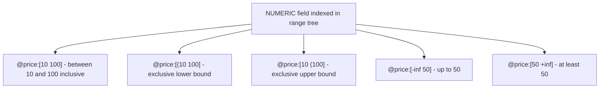

# How to Use Numeric Range Filters in Redis Search

Author: [nawazdhandala](https://www.github.com/nawazdhandala)

Tags: Redis, RediSearch, Search, Numeric, Filter

Description: Learn how to use numeric range filters in RediSearch to query documents by number ranges, combine them with text search, and sort results by numeric fields.

---

## How Numeric Range Filters Work

RediSearch indexes NUMERIC fields in a range tree, enabling fast comparisons for equality, greater-than, less-than, and between queries. Numeric filters use bracket notation and can be combined with text search, tag filters, and geographic filters in a single query.



## Syntax

```redis
@field:[min max]
@field:[(min max]    -- exclusive min
@field:[min (max]    -- exclusive max
@field:[-inf max]    -- no lower bound
@field:[min +inf]    -- no upper bound
@field:[(min (max]   -- both exclusive
```

Special values:
- `-inf` means no lower bound
- `+inf` means no upper bound
- `(` before a value makes that bound exclusive

## Setting Up the Index

```redis
FT.CREATE products ON HASH PREFIX 1 product:
  SCHEMA title TEXT
         category TAG
         price NUMERIC SORTABLE
         rating NUMERIC SORTABLE
         stock NUMERIC

HSET product:1 title "Redis Guide" category "book" price 45 rating 4.8 stock 100
HSET product:2 title "Redis Cookbook" category "book" price 32 rating 4.5 stock 50
HSET product:3 title "Redis T-Shirt" category "apparel" price 24 rating 4.2 stock 200
HSET product:4 title "Redis Mug" category "apparel" price 15 rating 4.0 stock 500
HSET product:5 title "Redis Course" category "course" price 99 rating 4.9 stock 1000
```

## Examples

### Basic Range Query

Find products priced between $20 and $50:

```redis
FT.SEARCH products "@price:[20 50]"
```

```text
1) (integer) 3
2) "product:1"
3) 1) "price"  2) "45"
4) "product:2"
5) 1) "price"  2) "32"
6) "product:3"
7) 1) "price"  2) "24"
```

### Exclusive Bounds

Find products with price strictly less than $30 (exclusive upper bound):

```redis
FT.SEARCH products "@price:[0 (30]"
```

```text
1) (integer) 2
-- product:3 (24) and product:4 (15)
```

### No Lower Bound

All products priced $40 or less:

```redis
FT.SEARCH products "@price:[-inf 40]"
```

### No Upper Bound

All products rated at least 4.5:

```redis
FT.SEARCH products "@rating:[4.5 +inf]"
```

```text
-- Returns product:1 (4.8) and product:5 (4.9) and product:2 (4.5)
```

### Combine with Text Search

Find "redis" products in the $20-$50 price range:

```redis
FT.SEARCH products "redis @price:[20 50]"
```

### Combine with Tag Filter

Books priced under $40:

```redis
FT.SEARCH products "@category:{book} @price:[-inf 40]"
```

### Combine Multiple Numeric Filters

High-rated and affordably priced products:

```redis
FT.SEARCH products "@price:[-inf 50] @rating:[4.5 +inf]"
```

## Sorting by Numeric Fields

Numeric fields declared as `SORTABLE` can be used in `SORTBY`:

```redis
-- Sort by price ascending (cheapest first)
FT.SEARCH products "@category:{book}" SORTBY price ASC

-- Sort by rating descending (best first)
FT.SEARCH products "*" SORTBY rating DESC LIMIT 0 3
```

```text
1) (integer) 5
2) "product:5"
3) 1) "rating" 2) "4.9"
4) "product:1"
5) 1) "rating" 2) "4.8"
6) "product:2"
7) 1) "rating" 2) "4.5"
```

## Using Numeric Filters in Aggregations

```redis
FT.AGGREGATE products "@price:[20 100]"
  GROUPBY 1 @category
  REDUCE COUNT 0 AS count
  REDUCE AVG 1 @price AS avg_price
  SORTBY 2 @avg_price DESC
```

```text
1) 1) "category"
   2) "course"
   3) "count"
   4) "1"
   5) "avg_price"
   6) "99"
...
```

## Indexing Considerations

### SORTABLE Flag

Adding `SORTABLE` to a NUMERIC field stores the value in a separate sorted structure, enabling fast `SORTBY` operations without loading hash fields. It uses extra memory but dramatically speeds up sort-heavy queries:

```redis
FT.CREATE products ON HASH PREFIX 1 product:
  SCHEMA price NUMERIC SORTABLE
         stock NUMERIC
```

- `price NUMERIC SORTABLE` - fast sorting by price
- `stock NUMERIC` - range queries on stock but slower to sort

### NOINDEX Flag

For numeric fields you only want to load but not filter on:

```redis
FT.CREATE products ON HASH PREFIX 1 product:
  SCHEMA price NUMERIC SORTABLE
         internal_id NUMERIC NOINDEX
```

`NOINDEX` fields are stored for `RETURN` but not added to the range index.

## Practical Use Cases

### E-commerce Price Filtering

```redis
-- Sidebar price filter: $25-$75
FT.SEARCH catalog "@category:{electronics} @price:[25 75]" SORTBY price ASC LIMIT 0 20
```

### Inventory Management

```redis
-- Low stock alert: less than 10 units
FT.SEARCH products "@stock:[-inf (10]"
```

### Metric Monitoring

```redis
-- Servers with CPU usage above 80%
FT.SEARCH servers "@cpu_usage:[80 +inf]"
```

## Summary

Numeric range filters in RediSearch use bracket notation (`@field:[min max]`) with support for exclusive bounds using `(`, unbounded ranges using `-inf` and `+inf`, and multi-field combinations using AND logic. Mark frequently sorted fields as `SORTABLE` for optimal performance. Numeric filters can be freely combined with TEXT, TAG, and GEO filters in a single query string.
