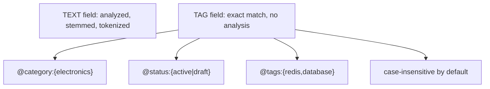

# How to Use Tag Fields in Redis Search for Exact Matching

Author: [nawazdhandala](https://www.github.com/nawazdhandala)

Tags: Redis, RediSearch, Search, Tag, Filter

Description: Learn how to use TAG fields in RediSearch for exact-match filtering, multi-value tags, OR and AND logic, and faceted navigation without text analysis.

---

## How TAG Fields Work

TAG fields in RediSearch store one or more exact string values without text analysis, stemming, or tokenization. This makes them ideal for categorical data such as status codes, category names, IDs, enumeration values, and labels where you need exact matching rather than fuzzy text search.



## Defining TAG Fields in an Index

```redis
FT.CREATE products ON HASH PREFIX 1 product:
  SCHEMA title TEXT
         category TAG
         tags TAG SEPARATOR ","
         status TAG
         sku TAG CASESENSITIVE
```

- `TAG` - default comma separator (`,`)
- `TAG SEPARATOR ","` - explicit separator (default)
- `TAG CASESENSITIVE` - preserve original case for matching
- By default, tag values are lowercased during indexing

## Setting Up Sample Data

```redis
HSET product:1 title "Redis Guide" category "book" tags "redis,database,nosql" status "active" sku "BK-001"
HSET product:2 title "Redis Patterns" category "ebook" tags "redis,patterns,architecture" status "active" sku "EB-002"
HSET product:3 title "Database Design" category "book" tags "database,sql,design" status "archived" sku "BK-003"
HSET product:4 title "NoSQL Essentials" category "video" tags "nosql,database,video" status "active" sku "VD-004"
HSET product:5 title "Redis T-Shirt" category "apparel" tags "merchandise,redis" status "draft" sku "AP-005"
```

## Query Syntax

```redis
-- Single tag value
@field:{value}

-- OR: matches either value
@field:{value1 | value2}

-- NOT: exclude a value
-@field:{value}

-- Escaped special characters
@field:{value\-with\-dashes}
```

Tag values in queries must be wrapped in curly braces `{}`.

## Examples

### Exact Single Value Match

```redis
FT.SEARCH products "@category:{book}"
```

```text
1) (integer) 2
2) "product:1"
3) "product:3"
```

### OR Match (Multiple Values)

Find books or ebooks:

```redis
FT.SEARCH products "@category:{book | ebook}"
```

```text
1) (integer) 3
-- product:1 (book), product:2 (ebook), product:3 (book)
```

### Negation

Find all products that are NOT archived:

```redis
FT.SEARCH products "-@status:{archived}"
```

```text
1) (integer) 4
-- product:1, product:2, product:4, product:5
```

### Multi-Value TAG Field

The `tags` field contains comma-separated values. Each individual value is indexed separately:

```redis
-- Find products tagged with "redis"
FT.SEARCH products "@tags:{redis}"
```

```text
1) (integer) 3
-- product:1, product:2, product:5
```

```redis
-- Find products tagged with both "redis" AND "database"
FT.SEARCH products "@tags:{redis} @tags:{database}"
```

```text
1) (integer) 1
-- product:1 only (has both tags)
```

### Combine TAG with TEXT Search

Active books containing "redis":

```redis
FT.SEARCH products "redis @category:{book} @status:{active}"
```

### Combine TAG with NUMERIC Filter

Active products under $50:

```redis
FT.SEARCH products "@status:{active} @price:[-inf 50]"
```

## Faceted Search with FT.TAGVALS

Retrieve all available category values for a filter sidebar:

```redis
FT.TAGVALS products category
```

```text
1) "apparel"
2) "book"
3) "ebook"
4) "video"
```

Then build dynamic facet queries based on user selections.

## Case Sensitivity

By default, TAG values are lowercased during indexing and at query time, making matching case-insensitive:

```redis
-- These all match product:1 with category "book"
FT.SEARCH products "@category:{book}"
FT.SEARCH products "@category:{Book}"
FT.SEARCH products "@category:{BOOK}"
```

To preserve case, add `CASESENSITIVE` to the field definition:

```redis
FT.CREATE products ON HASH PREFIX 1 product:
  SCHEMA sku TAG CASESENSITIVE

-- Now "BK-001" and "bk-001" are different values
FT.SEARCH products "@sku:{BK-001}"
```

## Escaping Special Characters

Tag values containing special characters must be escaped in queries:

```redis
-- Tag value: "c++"
FT.SEARCH products "@tags:{c\+\+}"

-- Tag value: "us-east-1"
FT.SEARCH products "@region:{us\-east\-1}"
```

Special characters that require escaping: `,`, `.`, `<`, `>`, `{`, `}`, `[`, `]`, `"`, `'`, `:`, `;`, `!`, `@`, `#`, `$`, `%`, `^`, `&`, `*`, `(`, `)`, `-`, `+`, `=`, `~`

## Custom Separators

For tag values that contain commas, use a different separator:

```redis
FT.CREATE products ON HASH PREFIX 1 product:
  SCHEMA regions TAG SEPARATOR "|"

HSET product:1 regions "us-east-1|eu-west-1|ap-southeast-1"

FT.SEARCH products "@regions:{us\-east\-1}"
```

## TAG vs TEXT: When to Use Each

| Use Case | Field Type |
|----------|-----------|
| Category, status, type | TAG |
| IDs, SKUs, slugs | TAG |
| Free-form descriptions | TEXT |
| Article body content | TEXT |
| Enumeration values | TAG |
| User-entered text | TEXT |

## Summary

TAG fields in RediSearch store exact string values without text analysis, making them ideal for categorical filters, status codes, and labels. Use `{value}` in queries for exact matching, `{v1 | v2}` for OR logic, and `-@field:{value}` for negation. Multi-value fields use a separator (default comma) to store multiple tags per document. Combine TAG filters with TEXT search and NUMERIC ranges for precise faceted queries.
