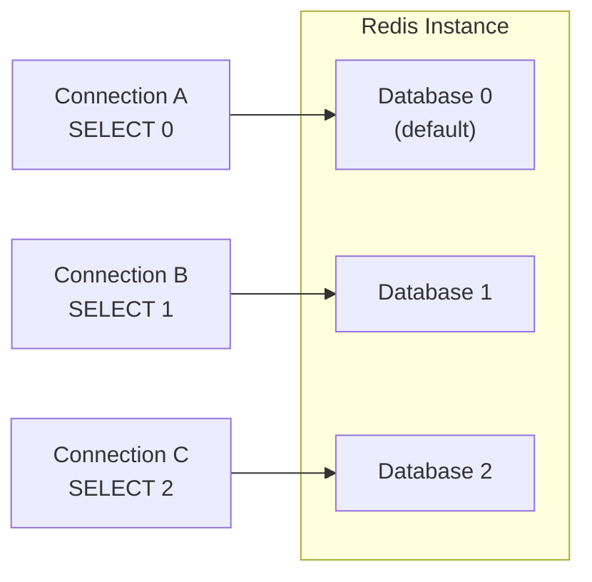
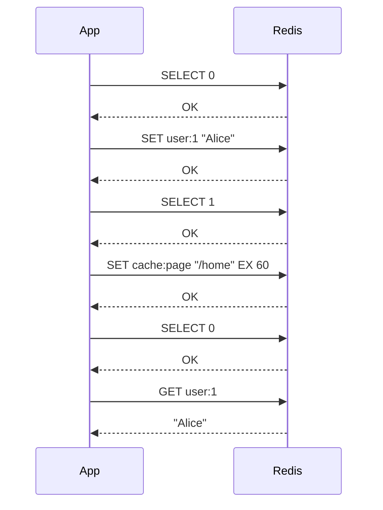

# How to Use SELECT in Redis to Switch Databases

Author: [nawazdhandala](https://www.github.com/nawazdhandala)

Tags: Redis, Select, Database, Administration, Connection

Description: Learn how to use the SELECT command in Redis to switch between logical databases within a single instance, including use cases, limitations, and best practices.

---

## Introduction

Redis ships with support for multiple logical databases on a single instance. By default there are 16 databases, numbered 0 through 15. The `SELECT` command switches the current connection's active database. Each database is a completely separate keyspace, so keys in database 0 are invisible from database 1.

## Basic Syntax

```redis
SELECT index
```

- `index` - integer from 0 to the configured `databases` value minus 1 (default max is 15)

Returns `OK` on success, or an error if the index is out of range.

## How Database Isolation Works



Each connection has its own selected database. `SELECT` does not affect other connections.

## Examples

### Switch to database 1

```redis
SELECT 1
# OK

SET app:config "production"
# OK

GET app:config
# "production"
```

### Verify isolation between databases

```redis
SELECT 0
SET greeting "hello"

SELECT 1
GET greeting
# (nil)   -- key is not visible here
```

### Switch back to default

```redis
SELECT 0
GET greeting
# "hello"
```

### Out-of-range index

```redis
SELECT 16
# ERR DB index is out of range
```

## Practical Workflow



## Increasing the Number of Databases

Edit `redis.conf`:

```redis
databases 32
```

Then restart Redis. You can now use `SELECT 0` through `SELECT 31`.

## Limitations

- Redis Cluster supports only database 0. `SELECT` in Cluster mode returns an error.
- Data in different databases cannot be accessed together in a single command; there are no cross-database operations.
- Most client libraries manage the database selection per connection pool entry, so verify your driver's behavior when using non-default databases.
- `FLUSHDB` only clears the currently selected database. `FLUSHALL` clears all databases.

## Best Practices

- Prefer using key prefixes (e.g., `session:`, `cache:`) in database 0 instead of multiple databases for simpler operations.
- Use separate databases for test vs. development data to avoid collisions during local development.
- Always call `SELECT` explicitly at the start of a connection if your application requires a non-default database.

## Summary

`SELECT index` switches a Redis connection to the specified logical database. It provides keyspace isolation within a single instance but has no effect on other connections. Because Redis Cluster only supports database 0, `SELECT` is most useful in standalone or Sentinel deployments. For most production workloads, key prefixes are a more portable alternative to multiple databases.
