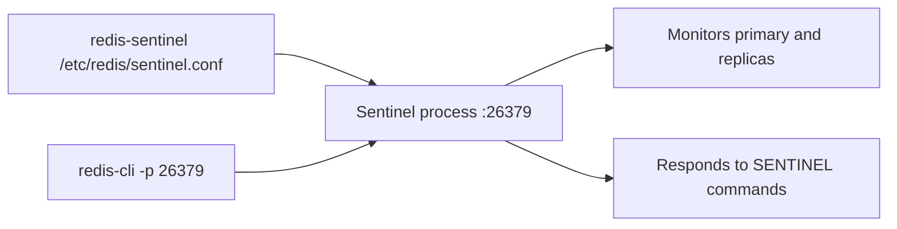

# How to Use redis-sentinel CLI for Sentinel Management

Author: [nawazdhandala](https://www.github.com/nawazdhandala)

Tags: Redis, Sentinel, CLI, High Availability, Operations

Description: Learn how to use the redis-sentinel CLI and redis-cli connected to Sentinel to manage and monitor Redis Sentinel instances, including discovering topology, checking health, and triggering failovers.

---

## Overview

The `redis-sentinel` binary starts a Sentinel process. For management and monitoring, you connect to a running Sentinel using `redis-cli` on the Sentinel port (default 26379) and issue `SENTINEL` subcommands. This is how you discover primary/replica topology, check health, and perform administrative operations.



## Starting a Sentinel Process

```bash
redis-sentinel /etc/redis/sentinel.conf
```

Or equivalently:

```bash
redis-server /etc/redis/sentinel.conf --sentinel
```

### Minimal sentinel.conf

```text
port 26379
sentinel monitor mymaster 127.0.0.1 6379 2
sentinel down-after-milliseconds mymaster 5000
sentinel failover-timeout mymaster 60000
```

## Connecting to Sentinel

```bash
redis-cli -p 26379
```

Or with authentication if `requirepass` is set on Sentinel:

```bash
redis-cli -p 26379 -a sentinelpassword
```

## Discovering the Primary

```redis
SENTINEL get-master-addr-by-name mymaster
```

```text
1) "192.168.1.10"
2) "6379"
```

This is the command application code uses to find the current primary address.

## Listing Monitored Masters

```redis
SENTINEL masters
```

Returns full details for all monitored primary sets.

## Getting Sentinel Status

```redis
SENTINEL info-cache mymaster
```

```redis
SENTINEL ckquorum mymaster
```

```text
OK 3 usable Sentinels. Quorum and failover authorization can be reached
```

This confirms that enough Sentinels are reachable to form a quorum.

## Listing Replicas

```redis
SENTINEL replicas mymaster
```

```text
1)  1) "name"
    2) "192.168.1.11:6380"
    3) "ip"
    4) "192.168.1.11"
    5) "port"
    6) "6380"
    7) "flags"
    8) "slave"
    9) "role-reported"
   10) "slave"
```

## Listing All Sentinels

```redis
SENTINEL sentinels mymaster
```

Returns a list of all other Sentinel processes monitoring the same primary.

## Checking Sentinel Configuration

```redis
SENTINEL myid
```

```text
"a1b2c3d4e5f6789012345678901234567890abcd"
```

Returns the unique ID of the Sentinel process.

## Removing a Monitored Master

```redis
SENTINEL remove mymaster
```

```text
OK
```

## Adding a New Master to Monitor

```redis
SENTINEL monitor newmaster 192.168.1.20 6379 2
```

```text
OK
```

## Changing Sentinel Configuration at Runtime

```redis
SENTINEL set mymaster down-after-milliseconds 3000
SENTINEL set mymaster failover-timeout 30000
```

```text
OK
```

## Triggering a Manual Failover

```redis
SENTINEL failover mymaster
```

```text
OK
```

## Sentinel CLI Scripting Example

A shell script to discover the current primary and connect to it:

```bash
#!/bin/bash
SENTINEL_HOST=127.0.0.1
SENTINEL_PORT=26379
MASTER_NAME=mymaster

# Get primary address
read -r PRIMARY_HOST PRIMARY_PORT <<< $(redis-cli -h $SENTINEL_HOST -p $SENTINEL_PORT \
  SENTINEL get-master-addr-by-name $MASTER_NAME | tr '\n' ' ')

echo "Primary is at $PRIMARY_HOST:$PRIMARY_PORT"
redis-cli -h "$PRIMARY_HOST" -p "$PRIMARY_PORT" PING
```

## Key SENTINEL Subcommands Reference

| Command | Purpose |
|---------|---------|
| `SENTINEL masters` | List all monitored primaries |
| `SENTINEL replicas <name>` | List replicas for a primary |
| `SENTINEL sentinels <name>` | List other Sentinels for a primary |
| `SENTINEL get-master-addr-by-name <name>` | Get current primary host:port |
| `SENTINEL ckquorum <name>` | Verify quorum is reachable |
| `SENTINEL failover <name>` | Trigger manual failover |
| `SENTINEL monitor <name> <host> <port> <quorum>` | Start monitoring a new primary |
| `SENTINEL remove <name>` | Stop monitoring a primary |
| `SENTINEL set <name> <param> <value>` | Update Sentinel configuration |
| `SENTINEL myid` | Get this Sentinel's unique ID |
| `SENTINEL info-cache <name>` | Return cached INFO output for monitored nodes |

## Summary

The `redis-sentinel` binary starts a Sentinel process from a configuration file. All management commands are issued by connecting to the Sentinel port (default 26379) with `redis-cli` and using `SENTINEL` subcommands. Key operations include discovering the current primary with `SENTINEL get-master-addr-by-name`, listing replicas and other Sentinels, checking quorum health with `SENTINEL ckquorum`, and triggering manual failovers with `SENTINEL failover`. Use `SENTINEL set` to update configuration values at runtime without restarting.
