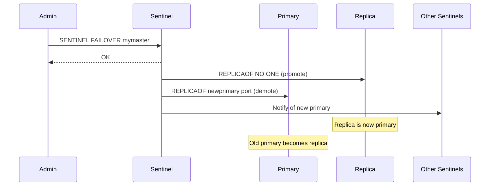
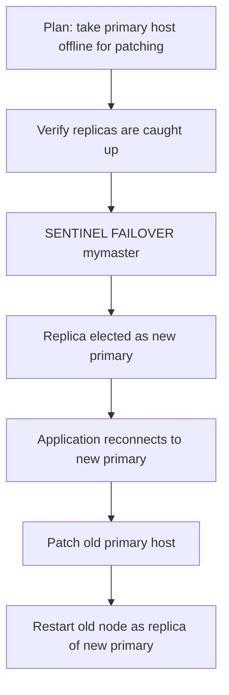

# How to Use SENTINEL FAILOVER for Manual Failover

Author: [nawazdhandala](https://www.github.com/nawazdhandala)

Tags: Redis, Sentinel, Failover, High Availability, Operation

Description: Learn how to use SENTINEL FAILOVER to trigger a manual failover in Redis Sentinel, promoting a replica to primary for planned maintenance, upgrades, or testing failover procedures.

---

## Overview

`SENTINEL FAILOVER` triggers a manual failover of a monitored Redis primary. Unlike automatic failover, which activates only when the primary is detected as down, manual failover can be initiated at any time -- even when the primary is healthy. This is useful for planned maintenance, primary host upgrades, or testing that your failover procedure and application reconnection logic work correctly.



## Syntax

```redis
SENTINEL FAILOVER master-name
```

Connect to a Sentinel process on port 26379 and issue the command.

Returns `OK` immediately. The failover proceeds asynchronously.

## Triggering a Manual Failover

```bash
redis-cli -p 26379
```

```redis
SENTINEL FAILOVER mymaster
```

```text
OK
```

## Monitoring Failover Progress

After triggering, monitor the failover by watching `SENTINEL masters`:

```redis
SENTINEL masters
```

Look for the `flags` field changing:

```text
"flags" -> "failover_in_progress"
# ... then ...
"flags" -> "master"  # on the new primary
```

Also subscribe to Sentinel events on a separate connection:

```redis
SUBSCRIBE +failover-triggered +promoted-slave +failover-end +failover-end-for-timeout
```

```text
1) "message"
2) "+failover-triggered"
3) "master mymaster 192.168.1.10 6379"

1) "message"
2) "+promoted-slave"
3) "slave 192.168.1.11:6380 192.168.1.11 6380 @ mymaster 192.168.1.10 6379"
```

## Getting the New Primary Address

After failover completes, query the new primary:

```redis
SENTINEL get-master-addr-by-name mymaster
```

```text
1) "192.168.1.11"
2) "6380"
```

## Failover During Planned Maintenance



### Full planned maintenance workflow

```bash
# 1. Verify replication lag is near zero
redis-cli -p 6379 INFO replication | grep slave

# 2. Connect to Sentinel and trigger failover
redis-cli -p 26379 SENTINEL FAILOVER mymaster

# 3. Wait and confirm the new primary
sleep 5
redis-cli -p 26379 SENTINEL get-master-addr-by-name mymaster

# 4. Verify the old primary is now a replica
redis-cli -p 6379 INFO replication
```

## Failover Timeout

If failover does not complete within `failover-timeout` (default 3 minutes), Sentinel aborts it. The timeout can be adjusted:

```redis
SENTINEL set mymaster failover-timeout 120000
```

## Differences Between Manual and Automatic Failover

| Aspect | Manual (SENTINEL FAILOVER) | Automatic |
|--------|---------------------------|-----------|
| Trigger | Admin command | Primary detected down |
| Primary health | Can be healthy | Must be down |
| Quorum required | No (single Sentinel can initiate) | Yes |
| Use case | Planned maintenance, testing | Emergency recovery |

Manual failover does not require quorum because the admin has explicitly authorized it.

## Testing Failover in Staging

Regularly test your failover procedure in staging to ensure:
1. Applications reconnect to the new primary automatically
2. Sentinel resolves the new primary address correctly
3. The old primary becomes a replica cleanly

```bash
# Automated failover test script
redis-cli -p 26379 SENTINEL FAILOVER mymaster
sleep 10
NEW_PRIMARY=$(redis-cli -p 26379 SENTINEL get-master-addr-by-name mymaster)
echo "New primary: $NEW_PRIMARY"
redis-cli -h $(echo $NEW_PRIMARY | cut -d' ' -f1) -p $(echo $NEW_PRIMARY | cut -d' ' -f2) PING
```

## Summary

`SENTINEL FAILOVER master-name` triggers an immediate, manual failover of a monitored Redis primary, promoting the best available replica. It does not require quorum and works even when the primary is healthy. Use it for planned maintenance, zero-downtime upgrades, and testing failover procedures. Monitor progress with `SENTINEL masters`, Sentinel Pub/Sub events, and `SENTINEL get-master-addr-by-name` to confirm the new primary address after the failover completes.
