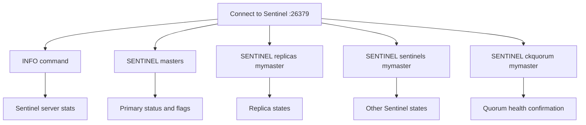

# How to Monitor Redis Sentinel Status with SENTINEL INFO

Author: [nawazdhandala](https://www.github.com/nawazdhandala)

Tags: Redis, Sentinel, Monitoring, High Availability, Operations

Description: Learn how to use SENTINEL INFO and related Sentinel commands to monitor the health, status, and topology of a Redis Sentinel deployment in real time.

---

## Overview

Monitoring a Redis Sentinel deployment involves querying Sentinel processes for the health of the primary, replicas, and the Sentinel cluster itself. The `INFO` command on a Sentinel process returns server statistics. Dedicated `SENTINEL` subcommands provide topology data, quorum status, and the health of monitored nodes.



## Connecting to Sentinel

```bash
redis-cli -p 26379
```

## INFO Command on a Sentinel

The `INFO` command issued to a Sentinel process returns Sentinel-specific sections:

```redis
INFO sentinel
```

```text
# Sentinel
sentinel_masters:1
sentinel_tilt:0
sentinel_tilt_since_seconds:-1
sentinel_running_scripts:0
sentinel_scripts_queue_length:0
sentinel_simulate_failure_flags:0
master0:name=mymaster,status=ok,address=192.168.1.10:6379,slaves=2,sentinels=3
```

### Full INFO

```redis
INFO
```

Returns all sections including server, clients, memory, and the sentinel section.

## Checking Primary Status with SENTINEL masters

```redis
SENTINEL masters
```

Key fields to inspect:

```text
...
"name"       -> "mymaster"
"ip"         -> "192.168.1.10"
"port"       -> "6379"
"flags"      -> "master"
"num-slaves" -> "2"
"num-other-sentinels" -> "2"
"quorum"     -> "2"
"status"     -> "ok"
...
```

### Flags indicating problems

| Flag value | Meaning |
|------------|---------|
| `master` | Normal operation |
| `s_down` | Subjectively down (this Sentinel thinks it's down) |
| `o_down` | Objectively down (quorum agrees it's down) |
| `odown,failover_in_progress` | Failover is happening |
| `no-auth-warning` | Primary has no password set |

## Checking Replica Status

```redis
SENTINEL replicas mymaster
```

Look at the `flags` field for each replica:

```text
"flags" -> "slave"       # Normal
"flags" -> "s_down,slave" # Subjectively down
"flags" -> "disconnected,slave" # Not reachable
```

Also check `slave-repl-offset` values to see if replicas are keeping up:

```text
"slave-repl-offset" -> "12345"
```

Compare against the primary's replication offset to detect lag.

## Checking Quorum

`SENTINEL ckquorum` verifies that enough Sentinels are reachable to form a quorum and initiate a failover:

```redis
SENTINEL ckquorum mymaster
```

```text
OK 3 usable Sentinels. Quorum and failover authorization can be reached
```

If quorum is not reachable:

```text
NOQUORUM 1 usable Sentinels. Quorum and failover authorization cannot be reached
```

## Checking TILT Mode

Sentinels enter TILT mode when the system clock jumps or the process is paused (such as under VM live migration). In TILT mode, the Sentinel stops taking autonomous actions:

```redis
INFO sentinel
```

```text
sentinel_tilt:1
sentinel_tilt_since_seconds:45
```

TILT mode exits automatically after 30 seconds of stable clock behavior.

## Monitoring Script Example

```bash
#!/bin/bash
SENTINEL_PORT=26379
MASTER_NAME=mymaster

echo "=== Sentinel Health Check ==="
redis-cli -p $SENTINEL_PORT INFO sentinel

echo ""
echo "=== Primary Status ==="
redis-cli -p $SENTINEL_PORT SENTINEL masters

echo ""
echo "=== Quorum Check ==="
redis-cli -p $SENTINEL_PORT SENTINEL ckquorum $MASTER_NAME

echo ""
echo "=== Replica Status ==="
redis-cli -p $SENTINEL_PORT SENTINEL replicas $MASTER_NAME
```

## Alerting on Sentinel Events

Sentinel publishes events to Pub/Sub channels. Subscribe to monitor failovers:

```redis
SUBSCRIBE +sdown +odown +failover-triggered +reboot
```

```text
1) "subscribe"
2) "+sdown"
3) (integer) 1

# When a node goes down:
1) "message"
2) "+sdown"
3) "master mymaster 192.168.1.10 6379"
```

Key event channels:

| Channel | Event |
|---------|-------|
| `+sdown` | Sentinel marks a node subjectively down |
| `-sdown` | Sentinel clears subjective down state |
| `+odown` | Node marked objectively down |
| `+failover-triggered` | Failover started |
| `+promoted-slave` | New primary elected |
| `+reboot` | Node restarted |

## Summary

Monitor Redis Sentinel status using `INFO sentinel` for server-level stats and sentinel section data, `SENTINEL masters` for primary health and flags, `SENTINEL replicas mymaster` for replica states, and `SENTINEL ckquorum mymaster` to verify quorum is intact. Watch for `s_down` and `o_down` flags in master and replica output. Subscribe to Sentinel's Pub/Sub channels (`+sdown`, `+odown`, `+failover-triggered`) to receive real-time event notifications. Check `sentinel_tilt` in `INFO sentinel` to detect when Sentinels have entered TILT mode.
