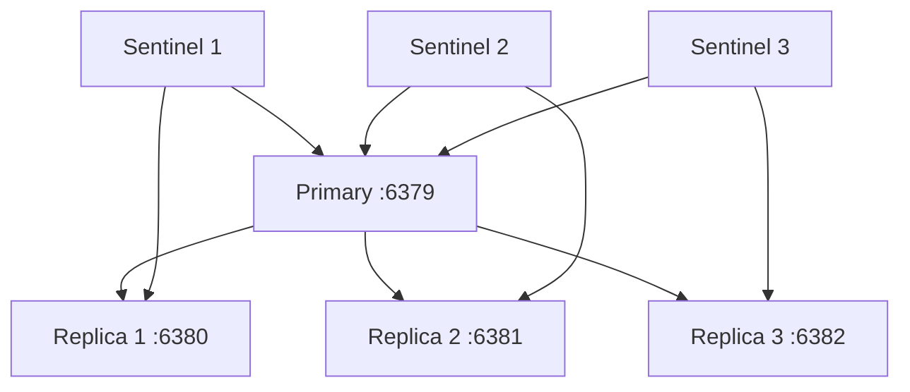
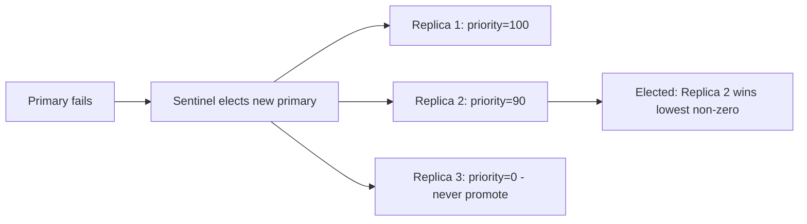

# How to Configure Redis Sentinel with Multiple Replicas

Author: [nawazdhandala](https://www.github.com/nawazdhandala)

Tags: Redis, Sentinel, High Availability, Replication, Configuration

Description: Learn how to configure Redis Sentinel with multiple replicas to increase read throughput and fault tolerance, including quorum settings and replica priority configuration.

---

## Overview

A Redis Sentinel setup with multiple replicas provides both high availability through automatic failover and increased read throughput by distributing read queries across replicas. When the primary fails, Sentinel elects one replica as the new primary. Remaining replicas automatically reconfigure to replicate from the new primary.



## Architecture

A typical production setup uses:
- 1 primary node
- 2 or more replicas
- 3 Sentinel processes (odd number for quorum)

The quorum is the minimum number of Sentinels that must agree the primary is unreachable before a failover is initiated.

## Primary Configuration

In `redis.conf` for the primary:

```text
port 6379
bind 0.0.0.0
requirepass strongpassword
masterauth strongpassword
```

## Replica Configuration

In `redis.conf` for each replica:

```text
# Replica 1
port 6380
bind 0.0.0.0
replicaof 192.168.1.10 6379
requirepass strongpassword
masterauth strongpassword
replica-read-only yes
replica-priority 100
```

```text
# Replica 2
port 6381
bind 0.0.0.0
replicaof 192.168.1.10 6379
requirepass strongpassword
masterauth strongpassword
replica-read-only yes
replica-priority 90
```

```text
# Replica 3
port 6382
bind 0.0.0.0
replicaof 192.168.1.10 6379
requirepass strongpassword
masterauth strongpassword
replica-read-only yes
replica-priority 80
```

Lower `replica-priority` means higher preference for promotion. Priority 0 means never promote.

## Sentinel Configuration

Create `sentinel.conf` for each Sentinel process (three copies, one per host):

```text
port 26379
daemonize no
sentinel monitor mymaster 192.168.1.10 6379 2
sentinel auth-pass mymaster strongpassword
sentinel down-after-milliseconds mymaster 5000
sentinel failover-timeout mymaster 60000
sentinel parallel-syncs mymaster 1
```

Key parameters:

| Parameter | Description |
|-----------|-------------|
| `sentinel monitor <name> <host> <port> <quorum>` | Defines the primary to monitor and quorum count |
| `sentinel auth-pass` | Password used to connect to primary and replicas |
| `down-after-milliseconds` | Milliseconds of non-response before marking a node down |
| `failover-timeout` | Milliseconds before a failover attempt is considered failed |
| `parallel-syncs` | Number of replicas syncing in parallel after failover |

## Starting the Services

```bash
# Start primary
redis-server /etc/redis/primary.conf

# Start replicas
redis-server /etc/redis/replica1.conf
redis-server /etc/redis/replica2.conf
redis-server /etc/redis/replica3.conf

# Start sentinels
redis-sentinel /etc/redis/sentinel1.conf
redis-sentinel /etc/redis/sentinel2.conf
redis-sentinel /etc/redis/sentinel3.conf
```

## Verifying Replication

```redis
# On the primary
INFO replication
```

```text
role:master
connected_slaves:3
slave0:ip=192.168.1.11,port=6380,state=online,offset=12345,lag=0
slave1:ip=192.168.1.12,port=6381,state=online,offset=12340,lag=0
slave2:ip=192.168.1.13,port=6382,state=online,offset=12338,lag=1
master_replid:abc123...
master_repl_offset:12345
```

## Verifying Sentinel

```redis
# Connect to a Sentinel
redis-cli -p 26379

SENTINEL masters
SENTINEL replicas mymaster
SENTINEL sentinels mymaster
```

```text
# From SENTINEL replicas mymaster
1)  1) "name"
    2) "192.168.1.11:6380"
    3) "ip"
    4) "192.168.1.11"
    5) "port"
    6) "6380"
    7) "flags"
    8) "slave"
    ...
```

## Replica Priority Strategy

Use `replica-priority` to control which replica is preferred for promotion:



Set `replica-priority 0` for replicas that should never become primary (for example, a replica in a geographically distant data center used only for disaster recovery).

## Distributing Reads Across Replicas

Applications can read from replicas to reduce primary load. Use Sentinel to discover replica addresses:

```redis
SENTINEL replicas mymaster
```

Parse the result to get all replica addresses and distribute read queries among them.

## Summary

Configuring Redis Sentinel with multiple replicas requires setting `replicaof` on each replica pointing to the primary, configuring `masterauth` on all nodes, and writing a `sentinel.conf` that monitors the primary with a quorum of at least 2 from 3 Sentinels. Use `replica-priority` to control which replica is preferred for promotion during failover. Set `replica-priority 0` on replicas that should never be promoted. Verify the topology with `INFO replication` on the primary and `SENTINEL replicas mymaster` on any Sentinel.
