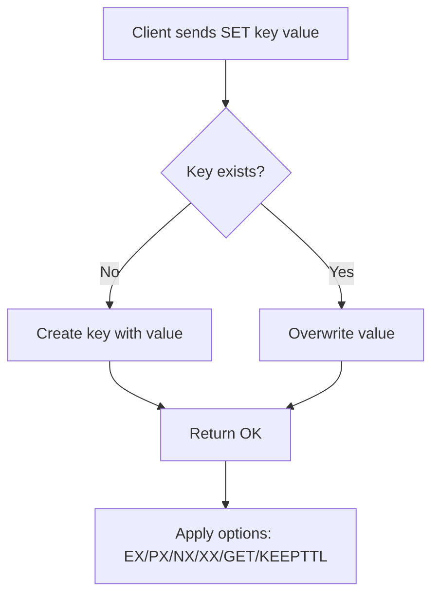

# How to Use the SET Command in Redis with All Options (EX, PX, NX, XX)

Author: [nawazdhandala](https://www.github.com/nawazdhandala)

Tags: Redis, Set, String, Key-Value, Expiration, TTL, Command

Description: Learn how to use the Redis SET command with all available options including EX, PX, NX, XX, KEEPTTL, GET, EXAT, and PXAT for full control over key storage.

---

## How SET Works

The `SET` command is the most fundamental Redis command. It stores a string value at a given key, replacing any existing value regardless of its type. By default, `SET` overwrites the existing value and removes any TTL on the key. The rich set of options lets you attach an expiration, make the operation conditional, or retrieve the previous value in a single round-trip.



## Syntax

```redis
SET key value [NX | XX] [GET] [EX seconds | PX milliseconds | EXAT unix-time-seconds | PXAT unix-time-milliseconds | KEEPTTL]
```

- `key` - the key name
- `value` - the string value to store
- `NX` - only set if the key does NOT exist
- `XX` - only set if the key ALREADY exists
- `GET` - return the previous value before overwriting (Redis 6.2+)
- `EX seconds` - set expiry in seconds
- `PX milliseconds` - set expiry in milliseconds
- `EXAT unix-time-seconds` - set expiry as a Unix timestamp (seconds)
- `PXAT unix-time-milliseconds` - set expiry as a Unix timestamp (milliseconds)
- `KEEPTTL` - retain the existing TTL when overwriting (Redis 6.0+)

## Examples

### Basic SET and GET

The simplest use case: store a value and read it back.

```redis
SET username "alice"
GET username
```

```text
OK
"alice"
```

### SET with EX (seconds expiry)

Store a session token that expires after 3600 seconds (1 hour).

```redis
SET session:abc123 "user_data_here" EX 3600
TTL session:abc123
```

```text
OK
(integer) 3600
```

### SET with PX (milliseconds expiry)

Store a short-lived rate-limit marker that expires in 500 ms.

```redis
SET ratelimit:192.168.1.1 1 PX 500
PTTL ratelimit:192.168.1.1
```

```text
OK
(integer) 499
```

### SET with EXAT (Unix timestamp expiry)

Set a key to expire at an exact Unix timestamp.

```redis
SET promo:summer2026 "SAVE20" EXAT 1751328000
TTL promo:summer2026
```

```text
OK
(integer) <seconds until 2026-07-01>
```

### SET with NX (only if not exists)

Use NX to implement a distributed lock. The first call succeeds; the second fails because the key already exists.

```redis
SET lock:resource1 "worker-1" NX EX 30
SET lock:resource1 "worker-2" NX EX 30
```

```text
OK
(nil)
```

### SET with XX (only if exists)

Use XX to update an existing record without accidentally creating a new one.

```redis
SET config:timeout 60 XX
```

```text
(nil)
```

After creating the key, the XX update succeeds:

```redis
SET config:timeout 30
SET config:timeout 60 XX
```

```text
OK
OK
```

### SET with GET (return previous value)

Atomically swap a value and retrieve the old one in a single command.

```redis
SET counter 100
SET counter 200 GET
```

```text
OK
"100"
```

If the key did not exist before, GET returns nil:

```redis
SET newkey "hello" GET
```

```text
(nil)
```

### SET with KEEPTTL

Overwrite a value without resetting its expiration.

```redis
SET session:xyz "payload_v1" EX 3600
SET session:xyz "payload_v2" KEEPTTL
TTL session:xyz
```

```text
OK
OK
(integer) <remaining TTL from first SET>
```

### Combining options

The following sets a key only if it does not exist, stores "locked", and sets a 10-second expiry.

```redis
SET mutex:job42 "locked" NX EX 10
```

```text
OK
```

## Use Cases

| Option | Typical use case |
|--------|-----------------|
| `EX` / `PX` | Session tokens, cache entries with TTL |
| `NX` | Distributed locks, idempotent job scheduling |
| `XX` | Safe in-place updates, config refresh |
| `GET` | Atomic swap, compare-and-swap patterns |
| `KEEPTTL` | Renew payload without resetting expiry |
| `EXAT` / `PXAT` | Time-bounded promotions, scheduled expiry |

## Summary

The Redis `SET` command is far more than a simple key-value write. By combining `NX`, `XX`, `GET`, expiry options (`EX`, `PX`, `EXAT`, `PXAT`), and `KEEPTTL`, you can implement distributed locks, atomic swaps, TTL-aware caching, and conditional updates all in a single round-trip. Understanding these options is foundational to building reliable Redis-backed systems.
