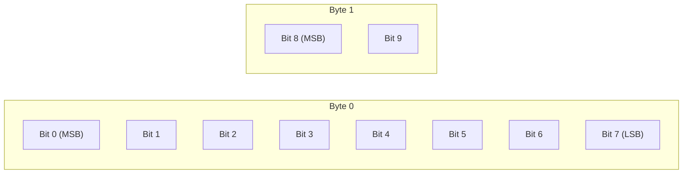

# How to Use SETBIT and GETBIT in Redis for Bit-Level Operations

Author: [nawazdhandala](https://www.github.com/nawazdhandala)

Tags: Redis, SETBIT, GETBIT, Bitmap, BIT, String, Command

Description: Learn how to use Redis SETBIT and GETBIT to store and read individual bits within a string, enabling space-efficient bitmaps for tracking and analytics.

---

## How SETBIT and GETBIT Work

Redis strings are binary-safe byte arrays, which means you can address individual bits within them. `SETBIT` sets the bit at a given offset to 0 or 1. `GETBIT` reads the bit at a given offset. If the offset is beyond the current string length, `GETBIT` returns 0 (not an error), and `SETBIT` zero-pads the string to reach the offset.

Bits are indexed from the most significant bit (MSB) of the first byte. Offset 0 is the MSB of byte 0, offset 7 is the LSB of byte 0, offset 8 is the MSB of byte 1, and so on.



## Syntax

```redis
SETBIT key offset value
GETBIT key offset
```

- `offset` - a non-negative integer (bit position, 0-based from MSB of byte 0)
- `value` for SETBIT - must be 0 or 1
- `SETBIT` returns the original bit value before the change
- `GETBIT` returns 0 or 1 (returns 0 for out-of-range offsets)

## Examples

### Basic SETBIT and GETBIT

```redis
DEL mybitmap
SETBIT mybitmap 7 1
SETBIT mybitmap 0 1
GETBIT mybitmap 0
GETBIT mybitmap 7
GETBIT mybitmap 1
```

```text
(integer) 0
(integer) 0
(integer) 1
(integer) 1
(integer) 0
```

`SETBIT` returns the old bit value (0 before setting).

### Daily active user tracking

Track which users were active on a given day. Each user ID maps to a bit offset.

```redis
SETBIT active:2026-03-31 1001 1
SETBIT active:2026-03-31 1002 1
SETBIT active:2026-03-31 2005 1
GETBIT active:2026-03-31 1001
GETBIT active:2026-03-31 1003
```

```text
(integer) 0
(integer) 0
(integer) 0
(integer) 1
(integer) 0
```

### Feature flag per user

Store which users have a feature enabled. Bit offset = user ID.

```redis
SETBIT feature:dark_mode 42 1
SETBIT feature:dark_mode 43 0
GETBIT feature:dark_mode 42
GETBIT feature:dark_mode 43
```

```text
(integer) 0
(integer) 0
(integer) 1
(integer) 0
```

### Checking the return value of SETBIT

`SETBIT` returns the old value of the bit. You can use this to detect transitions.

```redis
DEL flag:user:99
SETBIT flag:user:99 0 1
SETBIT flag:user:99 0 1
SETBIT flag:user:99 0 0
```

```text
(integer) 0
(integer) 0
(integer) 1
(integer) 1
```

First call: old value was 0 (bit was not set). Second call: old value was 1 (already set). Third call: old value was 1 (we just cleared it).

### GETBIT on out-of-range offset

Returns 0 without error.

```redis
DEL sparse_bitmap
GETBIT sparse_bitmap 99999
```

```text
(integer) 0
```

### Count set bits with BITCOUNT

Use `BITCOUNT` to count all set bits in a bitmap (active users for a day).

```redis
SETBIT active:2026-03-31 100 1
SETBIT active:2026-03-31 200 1
SETBIT active:2026-03-31 300 1
BITCOUNT active:2026-03-31
```

```text
(integer) 0
(integer) 0
(integer) 0
(integer) 3
```

### Memory efficiency

A bitmap for 1 million users takes only 125 KB (1,000,000 bits / 8 = 125,000 bytes). Storing the same data as a Redis Set of integers would take significantly more memory.

```redis
SETBIT users:premium 999999 1
STRLEN users:premium
```

```text
(integer) 0
(integer) 125000
```

## Related bitmap commands

| Command | Description |
|---------|-------------|
| `SETBIT key offset 0/1` | Set a single bit |
| `GETBIT key offset` | Read a single bit |
| `BITCOUNT key [start end]` | Count set bits in a range |
| `BITPOS key 0/1 [start end]` | Find first set or clear bit |
| `BITOP AND/OR/XOR/NOT dest key [key...]` | Bitwise operations across bitmaps |

## Use Cases

- Daily active user tracking (bit per user per day)
- Feature flags for millions of users
- Attendance tracking (bit per participant per event)
- Read receipts (bit per message per user)
- Compact boolean arrays for gaming, simulations, or analytics

## Summary

`SETBIT` and `GETBIT` expose Redis strings as compact, addressable bit arrays. They enable memory-efficient boolean tracking at massive scale - a bitmap for 1 million users fits in 125 KB. Combine them with `BITCOUNT` and `BITOP` for powerful analytics like daily active users, cohort overlap, and feature adoption rates.
