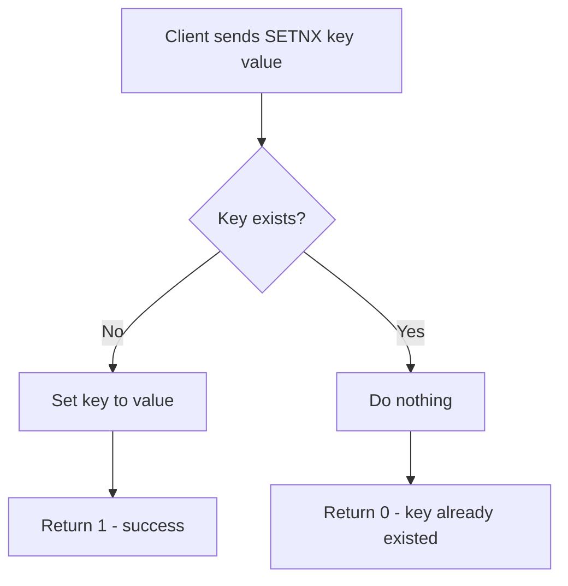

# How to Use SETNX in Redis for Conditional Key Setting

Author: [nawazdhandala](https://www.github.com/nawazdhandala)

Tags: Redis, SETNX, Distributed Lock, Conditional, String, Command

Description: Learn how to use the Redis SETNX command to set a key only when it does not exist, and understand its role in distributed locking and idempotent writes.

---

## How SETNX Works

`SETNX` (SET if Not eXists) sets a key to a value only if the key does not already exist. It returns 1 if the key was set, or 0 if the key already existed and was not changed. This atomic conditional write is the basis for distributed locking patterns in Redis.

Note: In modern Redis (2.6.12+), `SET key value NX` is preferred over `SETNX` because it supports additional options like `EX` (expiry) in one command. `SETNX` remains available for backwards compatibility.



## Syntax

```redis
SETNX key value
```

Returns:
- `1` - the key was set (did not exist)
- `0` - the key was NOT set (already existed)

## Examples

### Basic SETNX

```redis
DEL mykey
SETNX mykey "first"
SETNX mykey "second"
GET mykey
```

```text
(integer) 0
(integer) 1
(integer) 0
"first"
```

### Distributed lock with SETNX

Use SETNX to acquire a lock. Only one client succeeds.

```redis
SETNX lock:resource1 "worker-A"
SETNX lock:resource1 "worker-B"
GET lock:resource1
```

```text
(integer) 1
(integer) 0
"worker-A"
```

Worker B cannot acquire the lock while Worker A holds it.

### Adding expiry after SETNX (legacy pattern)

Before Redis 2.6.12, a common but flawed pattern was to call SETNX then EXPIRE separately. There is a race condition if the process crashes between the two commands.

```redis
SETNX lock:job "worker-1"
EXPIRE lock:job 30
```

```text
(integer) 1
(integer) 1
```

The modern, safe replacement for this is:

```redis
SET lock:job "worker-1" NX EX 30
```

```text
OK
```

### Idempotent job scheduling

Schedule a one-time job by using the job ID as the key.

```redis
SETNX job:report:2026-03-31 "scheduled"
```

```text
(integer) 1
```

A second call returns 0, preventing duplicate scheduling.

```redis
SETNX job:report:2026-03-31 "scheduled"
```

```text
(integer) 0
```

### Deduplication

Deduplicate incoming webhook events by event ID.

```redis
SETNX event:webhook:evt_abc123 "processed"
```

```text
(integer) 1
```

```redis
SETNX event:webhook:evt_abc123 "processed"
```

```text
(integer) 0
```

If the return value is 0, the event was already processed.

## SETNX vs SET NX

| Feature | SETNX | SET key value NX EX seconds |
|---------|-------|---------------------------|
| Set if not exists | Yes | Yes |
| Atomic expiry | No (needs separate EXPIRE) | Yes |
| Return value | 1/0 | OK/nil |
| Recommended | Legacy | Modern (Redis 2.6.12+) |

Always prefer `SET key value NX EX seconds` in new code to avoid the race condition between `SETNX` and `EXPIRE`.

## Releasing a lock

To release a lock, delete the key. Use a Lua script to ensure you only delete your own lock:

```redis
EVAL "if redis.call('get', KEYS[1]) == ARGV[1] then return redis.call('del', KEYS[1]) else return 0 end" 1 lock:resource1 "worker-A"
```

```text
(integer) 1
```

## Use Cases

- Distributed locks to prevent concurrent resource access
- Idempotent job scheduling (run a task only once per period)
- Webhook deduplication (process each event ID exactly once)
- First-writer-wins registration (claim a username or reservation)
- Feature flag initialization (set default if not already configured)

## Summary

`SETNX` is a simple atomic conditional write: it sets a key only if it does not exist and returns 1 or 0 to indicate success. While it remains a valid command, modern code should use `SET key value NX EX seconds` to atomically combine the conditional set and expiry. The core use cases - distributed locks, idempotent scheduling, and deduplication - rely on the guarantee that only one client can "win" the race to create a key.
