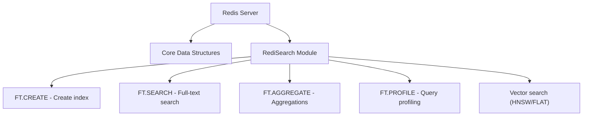

# How to Set Up Redis Search (RediSearch) Module

Author: [nawazdhandala](https://www.github.com/nawazdhandala)

Tags: Redis, RediSearch, Search, Setup, Module

Description: Learn how to install and configure the RediSearch module on Redis to enable full-text search, secondary indexing, and aggregation capabilities.

---

## What Is RediSearch?

RediSearch is a Redis module that adds full-text search, secondary indexing, aggregation, and vector similarity search to Redis. It is included in Redis Stack and Redis Enterprise. With RediSearch you can create indexes on your existing Redis hashes and JSON documents and query them with a rich query language without changing your data model.



## Installation Options

### Option 1: Redis Stack (Recommended)

Redis Stack bundles Redis with RediSearch, RedisJSON, RedisTimeSeries, RedisBloom, and RedisGraph.

**Docker (quickest start):**

```redis
-- Run Redis Stack in Docker
docker run -d --name redis-stack -p 6379:6379 -p 8001:8001 redis/redis-stack:latest
```

Port 8001 exposes RedisInsight, a browser-based GUI.

**Docker Compose:**

```text
version: "3.9"
services:
  redis:
    image: redis/redis-stack:latest
    ports:
      - "6379:6379"
      - "8001:8001"
    volumes:
      - redis_data:/data
volumes:
  redis_data:
```

### Option 2: Ubuntu/Debian APT

```text
curl -fsSL https://packages.redis.io/gpg | sudo gpg --dearmor -o /usr/share/keyrings/redis-archive-keyring.gpg

echo "deb [signed-by=/usr/share/keyrings/redis-archive-keyring.gpg] https://packages.redis.io/deb $(lsb_release -cs) main" \
  | sudo tee /etc/apt/sources.list.d/redis.list

sudo apt-get update
sudo apt-get install redis-stack-server
sudo systemctl start redis-stack-server
```

### Option 3: macOS Homebrew

```text
brew tap redis-stack/redis-stack
brew install redis-stack
redis-stack-server
```

### Option 4: Load the Module Manually

If you already have Redis installed and want to add only RediSearch:

```text
-- Download the .so file from https://github.com/RediSearch/RediSearch/releases
-- Then load it at startup:

redis-server --loadmodule /path/to/redisearch.so
```

Or add to `redis.conf`:

```text
loadmodule /path/to/redisearch.so MAXSEARCHRESULTS 10000 TIMEOUT 500
```

## Verifying the Installation

```redis
MODULE LIST
```

```text
1) 1) "name"
   2) "search"
   3) "ver"
   4) (integer) 20810
   5) "path"
   6) "/opt/redis-stack/lib/redisearch.so"
   7) "args"
   8) (empty array)
```

```redis
FT._LIST
```

```text
(empty array)
```

An empty array means RediSearch is active but no indexes have been created yet.

## Creating Your First Index

RediSearch indexes overlay existing Redis hashes or JSON documents. Create an index on the `product:` key prefix:

```redis
FT.CREATE products
  ON HASH
  PREFIX 1 product:
  SCHEMA
    title TEXT WEIGHT 2.0
    description TEXT
    category TAG
    price NUMERIC SORTABLE
    stock NUMERIC
    location GEO
```

Field types:
- `TEXT` - full-text search with stemming and ranking
- `TAG` - exact match filtering (comma-separated values)
- `NUMERIC` - range queries and sorting
- `GEO` - geographic radius queries
- `VECTOR` - vector similarity search

## Adding Documents

RediSearch automatically indexes any hash that matches the prefix:

```redis
HSET product:1 title "Redis in Action" description "Learn Redis from scratch" category "book" price 45.99 stock 100
HSET product:2 title "Redis Patterns" description "Advanced Redis design patterns" category "book" price 38.00 stock 50
HSET product:3 title "Redis T-Shirt" description "Official Redis merchandise" category "apparel" price 24.99 stock 200
```

## Running Your First Search

```redis
FT.SEARCH products "redis"
```

```text
1) (integer) 3
2) "product:1"
3) 1) "title"
   2) "Redis in Action"
   ...
```

```redis
-- Search with field filter
FT.SEARCH products "@category:{book} @price:[30 50]"

-- Search with sorting
FT.SEARCH products "redis" SORTBY price ASC

-- Return specific fields only
FT.SEARCH products "redis" RETURN 2 title price
```

## Index Management Commands

```redis
-- List all indexes
FT._LIST

-- Get index info and stats
FT.INFO products

-- Drop an index (does not delete documents)
FT.DROPINDEX products

-- Drop index AND delete all indexed documents
FT.DROPINDEX products DD
```

## Useful Configuration After Setup

```redis
-- Set query timeout to 1 second
FT.CONFIG SET TIMEOUT 1000

-- Allow longer prefix searches
FT.CONFIG SET MINPREFIX 2

-- Increase thread pool for faster indexing
FT.CONFIG SET WORKERS 4
```

## Connecting from Application Code

### Python (redis-py)

```text
pip install redis
```

```text
import redis
r = redis.Redis()
r.ft("products").search("redis")
```

### Node.js (ioredis)

```text
npm install ioredis
```

```text
const redis = new Redis();
const results = await redis.call("FT.SEARCH", "products", "redis");
```

## Summary

RediSearch is available via Redis Stack (Docker, APT, Homebrew) or as a standalone `.so` module loaded at startup. Verify installation with `MODULE LIST` then create indexes with `FT.CREATE` using TEXT, TAG, NUMERIC, GEO, or VECTOR field types. RediSearch automatically indexes matching existing and new hashes, making it non-intrusive to add to an existing Redis deployment.
