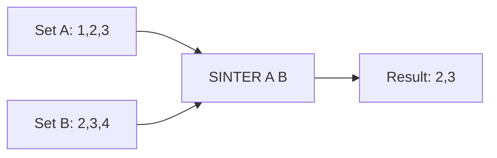

# How to Use SINTER in Redis to Find Intersection of Sets

Author: [nawazdhandala](https://www.github.com/nawazdhandala)

Tags: Redis, Set, SINTER, Command

Description: Learn how to use SINTER in Redis to find members that exist in all provided sets simultaneously, with examples for permission checks and mutual connections.

---

## Introduction

`SINTER` returns the intersection of two or more sets: only members that appear in every one of the provided sets are included in the result. This is useful for finding common tags, shared permissions, mutual friends, and other "must-have-all" scenarios.

## Syntax

```redis
SINTER key [key ...]
```

- Provide two or more set keys.
- Returns members present in all sets.
- Original sets are not modified.
- Returns an empty array if any set is empty or does not exist.

## How It Works



## Basic Example

```redis
SADD languages:alice "python" "go" "rust" "javascript"
SADD languages:bob   "go" "rust" "java"

SINTER languages:alice languages:bob
-- 1) "go"
-- 2) "rust"
```

## Intersection of Three Sets

```redis
SADD perms:role:admin   "read" "write" "delete" "manage"
SADD perms:role:editor  "read" "write"
SADD perms:role:viewer  "read"

SINTER perms:role:admin perms:role:editor perms:role:viewer
-- 1) "read"
```

Only `"read"` is common to all three roles.

## Real-World Use Cases

### Mutual Friends / Connections

```redis
SADD friends:alice "bob" "charlie" "diana" "eve"
SADD friends:frank "charlie" "diana" "george"

SINTER friends:alice friends:frank
-- 1) "charlie"
-- 2) "diana"
```

### Common Tags on Content

```redis
SADD tags:post:1 "redis" "database" "caching"
SADD tags:post:2 "redis" "caching" "performance"
SADD tags:post:3 "redis" "nosql"

SINTER tags:post:1 tags:post:2
-- 1) "redis"
-- 2) "caching"

SINTER tags:post:1 tags:post:2 tags:post:3
-- 1) "redis"
```

### Shared Inventory

```redis
SADD store:warehouse-a "sku:001" "sku:002" "sku:003"
SADD store:warehouse-b "sku:002" "sku:003" "sku:004"
SADD store:warehouse-c "sku:003" "sku:005"

SINTER store:warehouse-a store:warehouse-b store:warehouse-c
-- 1) "sku:003"
```

## Behavior with Empty or Missing Sets

If any set is empty or the key does not exist, the result is always empty:

```redis
SADD set:a "x" "y" "z"
SADD set:b "x" "y"

SINTER set:a set:b nonexistent
-- (empty array)
```

This is because intersection with an empty set is always empty.

## Single Set Intersection

```redis
SADD myset "a" "b" "c"
SINTER myset
-- 1) "a"
-- 2) "b"
-- 3) "c"
```

With a single key, `SINTER` returns all members of that set.

## Time Complexity

**O(N * M)** where N is the number of elements in the smallest set and M is the number of sets. Redis uses the smallest set as the base and checks each element against all other sets, making it efficient when one set is small.

## SINTER vs SINTERSTORE vs SINTERCARD

| Command       | Returns              | Stores to key |
|---------------|----------------------|---------------|
| `SINTER`      | Members              | No            |
| `SINTERSTORE` | Count                | Yes           |
| `SINTERCARD`  | Count (with LIMIT)   | No            |

## Summary

`SINTER` computes the intersection of multiple sets and returns the shared members. It is a fundamental building block for permission systems, social graphs, and tag matching. Use `SINTERSTORE` to persist the result or `SINTERCARD` when you only need the count of shared members.
