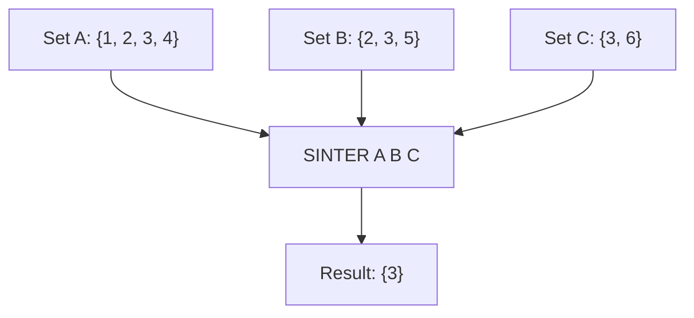

# How to Use SINTER and SINTERSTORE in Redis for Set Intersection

Author: [nawazdhandala](https://www.github.com/nawazdhandala)

Tags: Redis, Set, SINTER, SINTERSTORE, Command

Description: Learn how to use SINTER and SINTERSTORE in Redis to find common members across multiple sets, with examples for shared interests, common permissions, and mutual follows.

---

## How SINTER and SINTERSTORE Work

`SINTER` returns only the members that exist in every one of the specified sets - the mathematical intersection. A member must be present in all input sets to appear in the result.

`SINTERSTORE` computes the same intersection but stores the result in a destination key and returns the count of members in that result.



## Syntax

```redis
SINTER key [key ...]
SINTERSTORE destination key [key ...]
```

- `key [key ...]` - one or more set keys; all must contain a member for it to appear in the result
- `destination` - key where SINTERSTORE writes the result

SINTER returns an array of common members. SINTERSTORE returns the integer count of members in the result.

## Examples

### Basic Two-Set Intersection

```redis
SADD setA "a" "b" "c" "d"
SADD setB "b" "c" "e"
SINTER setA setB
```

```text
1) "b"
2) "c"
```

### Three-Set Intersection

```redis
SADD setC "c" "f"
SINTER setA setB setC
```

```text
1) "c"
```

Only "c" is in all three sets.

### No Common Members

```redis
SADD setX "x" "y"
SADD setY "p" "q"
SINTER setX setY
```

```text
(empty array)
```

### Non-Existent Key Results in Empty Intersection

```redis
DEL ghost
SINTER setA ghost
```

```text
(empty array)
```

An empty (non-existent) set has no members in common with any other set.

### SINTERSTORE

```redis
SINTERSTORE common setA setB
```

```text
(integer) 2
```

```redis
SMEMBERS common
```

```text
1) "b"
2) "c"
```

### SINTERSTORE Overwrites Destination

```redis
SADD existing "x" "y" "z"
SINTERSTORE existing setA setB
SMEMBERS existing
```

```text
1) "b"
2) "c"
```

Previous contents of "existing" are replaced.

## Use Cases

### Mutual Friends / Followers

Find users who follow both user A and user B.

```redis
SADD followers:alice "u1" "u2" "u3" "u4"
SADD followers:bob "u2" "u3" "u5"
SINTER followers:alice followers:bob
```

```text
1) "u2"
2) "u3"
```

### Common Interests Between Users

Find shared tags between two users for a recommendation engine.

```redis
SADD user:1:interests "redis" "nosql" "golang" "distributed"
SADD user:2:interests "redis" "python" "nosql" "ml"
SINTER user:1:interests user:2:interests
```

```text
1) "redis"
2) "nosql"
```

### Users Who Have All Required Permissions

Find users who have both required permissions.

```redis
SADD perm:read:users "u1" "u2" "u3"
SADD perm:write:users "u2" "u3" "u4"
SINTER perm:read:users perm:write:users
```

```text
1) "u2"
2) "u3"
```

### Articles Tagged with Multiple Tags

Find articles that have both "redis" and "tutorial" tags.

```redis
SADD tag:redis:articles "a1" "a2" "a3"
SADD tag:tutorial:articles "a2" "a3" "a4"
SINTER tag:redis:articles tag:tutorial:articles
```

```text
1) "a2"
2) "a3"
```

### Inventory Available in All Warehouses

Find SKUs stocked in every warehouse (fully available for global shipping).

```redis
SADD wh:east "sku:1" "sku:2" "sku:3"
SADD wh:west "sku:1" "sku:3" "sku:4"
SADD wh:central "sku:1" "sku:5"
SINTER wh:east wh:west wh:central
```

```text
1) "sku:1"
```

## Caching Intersection Results with SINTERSTORE

If the intersection is queried frequently, store it to avoid recomputation.

```redis
SINTERSTORE cache:common:user1:user2 user:1:interests user:2:interests
EXPIRE cache:common:user1:user2 3600
SMEMBERS cache:common:user1:user2
```

## Performance Considerations

- SINTER is O(N * M) where N is the size of the smallest set and M is the number of sets. Redis optimizes by iterating the smallest set and checking membership in all others.
- The size of the smallest input set dominates performance - Redis uses it as the pivot.
- SINTERSTORE has the same complexity plus the cost of writing the result.
- For counting the intersection size without retrieving members, use SINTERCARD (Redis 7.0+).

## Summary

`SINTER` finds members common to all specified Redis sets in a single atomic operation. `SINTERSTORE` saves that result for reuse. These commands power mutual-friend discovery, shared-interest matching, multi-tag article filtering, and any use case requiring the overlap between collections. Redis optimizes the operation using the smallest input set as a pivot, making even large multi-set intersections efficient.
