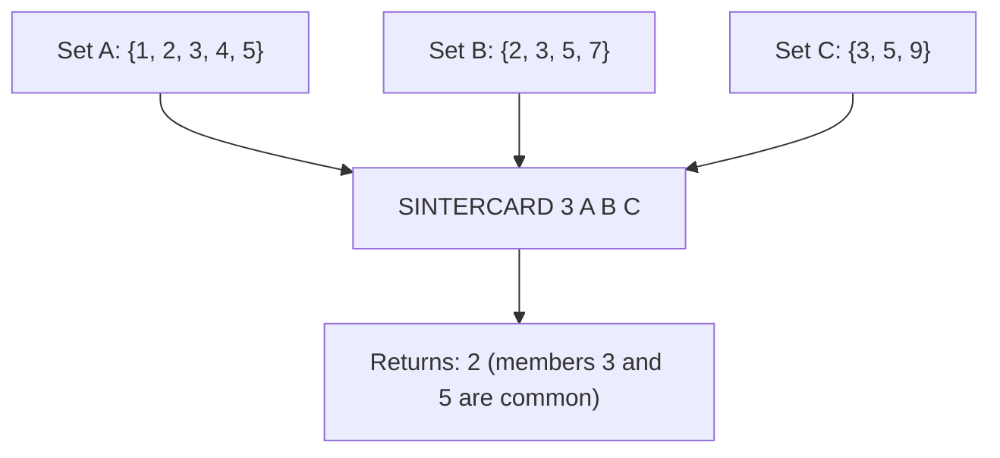

# How to Use SINTERCARD in Redis to Count Set Intersection Size

Author: [nawazdhandala](https://www.github.com/nawazdhandala)

Tags: Redis, Set, SINTERCARD, Command

Description: Learn how to use the Redis SINTERCARD command to count the number of common members across multiple sets without retrieving them, with a LIMIT option for early termination.

---

## How SINTERCARD Works

`SINTERCARD` computes the intersection of multiple sets and returns the count of common members rather than the members themselves. This is more efficient than calling SINTER and counting the result when you only need the size.

The optional `LIMIT` parameter lets you cap the count - Redis stops counting once the limit is reached. This enables early termination when you only care whether the intersection size exceeds a threshold, not the exact count.

SINTERCARD was introduced in Redis 7.0.



## Syntax

```redis
SINTERCARD numkeys key [key ...] [LIMIT limit]
```

- `numkeys` - the number of keys that follow
- `key [key ...]` - sets to intersect
- `LIMIT limit` - optional; cap the returned count at this value; 0 means no limit (default)

Returns an integer - the count of common members (or up to LIMIT if specified).

## Examples

### Basic Two-Set Intersection Count

```redis
SADD setA "a" "b" "c" "d"
SADD setB "b" "c" "e"
SINTERCARD 2 setA setB
```

```text
(integer) 2
```

"b" and "c" are common.

### Three-Set Intersection Count

```redis
SADD setC "c" "f"
SINTERCARD 3 setA setB setC
```

```text
(integer) 1
```

Only "c" is in all three.

### Using LIMIT for Early Termination

Check if the intersection has at least 2 members.

```redis
SINTERCARD 2 setA setB LIMIT 2
```

```text
(integer) 2
```

Redis stops counting after finding 2 common members.

### LIMIT Caps the Result

```redis
SINTERCARD 2 setA setB LIMIT 1
```

```text
(integer) 1
```

Even though there are 2 common members, LIMIT 1 caps the return value.

### No Common Members

```redis
SADD setX "x" "y"
SADD setY "p" "q"
SINTERCARD 2 setX setY
```

```text
(integer) 0
```

### Non-Existent Key Results in 0

```redis
DEL ghost
SINTERCARD 2 setA ghost
```

```text
(integer) 0
```

## Use Cases

### Threshold Check for Similarity

Check if two users share at least 3 interests before suggesting they follow each other.

```redis
SADD user:1:tags "redis" "nosql" "golang" "distributed"
SADD user:2:tags "redis" "python" "nosql" "distributed" "ml"
SINTERCARD 2 user:1:tags user:2:tags LIMIT 3
```

```text
(integer) 3
```

At least 3 shared tags - suggest connection.

### Checking Permission Overlap

Count how many permissions two roles share.

```redis
SADD role:A "read" "write" "publish"
SADD role:B "write" "publish" "delete"
SINTERCARD 2 role:A role:B
```

```text
(integer) 2
```

### Efficient Duplicate Detection

Count how many items from a new batch are already in the processed set.

```redis
SADD processed "item:1" "item:2" "item:3"
SADD batch:new "item:2" "item:3" "item:4" "item:5"
SINTERCARD 2 processed batch:new
```

```text
(integer) 2
```

2 of the new items are duplicates.

### Popularity Scoring

Measure the overlap between a user's interests and a recommended topic's tags.

```redis
SADD topic:redis:tags "database" "caching" "nosql" "performance"
SADD user:9:interests "caching" "nosql" "ml"
SINTERCARD 2 topic:redis:tags user:9:interests
```

```text
(integer) 2
```

### Early Exit on Large Sets

For very large sets, LIMIT allows you to avoid counting beyond a useful threshold.

```redis
SINTERCARD 2 bigset1 bigset2 LIMIT 100
```

If the intersection has more than 100 members, Redis stops counting at 100. This saves CPU when you only care about whether the overlap exceeds a threshold.

## SINTERCARD vs SINTER + LLEN

```redis
-- Inefficient: retrieves all members then counts
SINTERSTORE tmp setA setB
SCARD tmp
DEL tmp

-- Efficient: counts without storing or returning members
SINTERCARD 2 setA setB
```

## Performance Considerations

- SINTERCARD is O(N * M) where N is the size of the smallest set and M is the number of sets, same as SINTER.
- With LIMIT, Redis can stop early once the count reaches the limit, saving computation.
- SINTERCARD avoids the memory and network overhead of transferring the actual members.

## Summary

`SINTERCARD` gives you the size of the intersection across multiple sets without the cost of retrieving and transmitting the actual members. The `LIMIT` option enables efficient threshold checks by stopping early. It is ideal for similarity scoring, duplicate counting, overlap analysis, and any scenario where you need to measure intersection size, not content.
