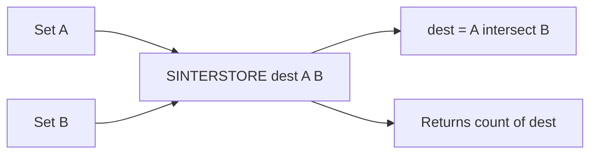

# How to Use SINTERSTORE in Redis to Store Set Intersections

Author: [nawazdhandala](https://www.github.com/nawazdhandala)

Tags: Redis, Set, SINTERSTORE, Command

Description: Learn how to use SINTERSTORE in Redis to compute the intersection of multiple sets and persist the result in a destination key for reuse.

---

## Introduction

`SINTERSTORE` computes the intersection of two or more sets and stores the resulting members in a destination key. Unlike `SINTER`, which returns members directly to the caller, `SINTERSTORE` persists the result so it can be queried, iterated, or used in subsequent set operations.

## Syntax

```redis
SINTERSTORE destination key [key ...]
```

- `destination` is the key where the intersection will be stored.
- Returns the number of elements in the result.
- If `destination` exists, it is overwritten.
- If the intersection is empty, `destination` is deleted.

## How It Works



## Basic Example

```redis
SADD skills:alice "python" "go" "kubernetes" "redis"
SADD skills:bob   "go" "kubernetes" "java"

SINTERSTORE shared:skills skills:alice skills:bob
-- (integer) 2

SMEMBERS shared:skills
-- 1) "go"
-- 2) "kubernetes"
```

## Overwriting the Destination

If the destination key already exists, it is replaced:

```redis
SADD shared:skills "old-value"

SINTERSTORE shared:skills skills:alice skills:bob
-- (integer) 2

SMEMBERS shared:skills
-- 1) "go"
-- 2) "kubernetes"
-- "old-value" is no longer present
```

## Real-World Use Cases

### Caching Common Permissions

Compute the intersection of all roles a user has and cache the effective permissions:

```redis
SADD role:admin  "read" "write" "delete" "audit"
SADD role:editor "read" "write"

SINTERSTORE user:42:effective-perms role:admin role:editor
-- (integer) 2

SMEMBERS user:42:effective-perms
-- 1) "read"
-- 2) "write"

EXPIRE user:42:effective-perms 300
```

### Audience Overlap for Campaign Targeting

```redis
SADD segment:high-value   "u:1" "u:2" "u:3" "u:4"
SADD segment:recent-login "u:2" "u:4" "u:5"

SINTERSTORE campaign:target-audience segment:high-value segment:recent-login
-- (integer) 2

SMEMBERS campaign:target-audience
-- 1) "u:2"
-- 2) "u:4"
```

### Mutual Followers for Recommendation Engine

```redis
SADD following:alice "bob" "charlie" "diana"
SADD following:eve   "charlie" "diana" "frank"

SINTERSTORE mutual:alice:eve following:alice following:eve
-- (integer) 2

SMEMBERS mutual:alice:eve
-- 1) "charlie"
-- 2) "diana"
```

## Using SINTERSTORE to Chain Operations

Because the result is a regular set key, you can use it in further set operations:

```redis
SADD set:a "1" "2" "3" "4"
SADD set:b "2" "3" "4" "5"
SADD set:c "3" "4" "5" "6"

SINTERSTORE temp:ab set:a set:b
SINTERSTORE final:abc temp:ab set:c

SMEMBERS final:abc
-- 1) "3"
-- 2) "4"
```

## Empty Intersection Deletes Destination

```redis
SADD set:x "a" "b"
SADD set:y "c" "d"

-- Pre-populate destination
SADD dest "old"

SINTERSTORE dest set:x set:y
-- (integer) 0

EXISTS dest
-- (integer) 0
```

## Time Complexity

**O(N * M)** where N is the size of the smallest set and M is the number of sets provided. Storage overhead is O(K) where K is the size of the resulting intersection.

## SINTERSTORE vs SINTER vs SINTERCARD

| Command       | Returns            | Stores result |
|---------------|--------------------|---------------|
| `SINTER`      | Members            | No            |
| `SINTERSTORE` | Count              | Yes           |
| `SINTERCARD`  | Count (with LIMIT) | No            |

## Summary

`SINTERSTORE` computes and persists the intersection of multiple sets into a destination key, returning the element count. It is the right choice when you need to reuse intersection results across requests, apply TTLs to cached intersections, or chain set operations. The destination is always overwritten, making it safe for periodic recalculation.
