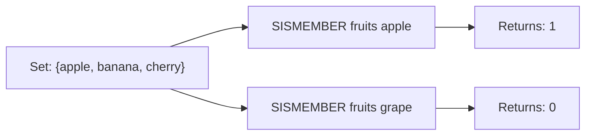

# How to Use SISMEMBER in Redis to Check Set Membership

Author: [nawazdhandala](https://www.github.com/nawazdhandala)

Tags: Redis, Set, SISMEMBER, Command

Description: Learn how to use the Redis SISMEMBER command to check whether a value is a member of a set, with examples for access control, deduplication, and filtering.

---

## How SISMEMBER Works

`SISMEMBER` checks whether a given value is a member of a Redis set. It returns 1 if the member exists and 0 if it does not. This is an O(1) operation thanks to the hash table backing of Redis sets.

SISMEMBER is one of the most frequently used Redis commands because membership testing is a fundamental operation in access control, deduplication, and feature flag evaluation.



## Syntax

```redis
SISMEMBER key member
```

- `key` - the set key
- `member` - the value to test for membership

Returns `1` if the member is in the set, `0` if it is not (or if the key does not exist).

## Examples

### Basic Membership Check

```redis
SADD allowlist "user:1" "user:2" "user:3"
SISMEMBER allowlist "user:2"
```

```text
(integer) 1
```

```redis
SISMEMBER allowlist "user:99"
```

```text
(integer) 0
```

### Non-Existent Key Returns 0

```redis
DEL myset
SISMEMBER myset "anything"
```

```text
(integer) 0
```

No error is raised for non-existent keys.

### Case Sensitivity

Redis set membership is case-sensitive.

```redis
SADD tags "Redis" "NoSQL"
SISMEMBER tags "redis"
```

```text
(integer) 0
```

```redis
SISMEMBER tags "Redis"
```

```text
(integer) 1
```

### After Removal

```redis
SADD myset "alpha" "beta"
SREM myset "beta"
SISMEMBER myset "beta"
```

```text
(integer) 0
```

## Use Cases

### Access Control / Authorization

Check if a user has a specific permission before executing an action.

```redis
SADD role:admin "read" "write" "delete" "admin"
SISMEMBER role:admin "delete"
```

```text
(integer) 1
```

### IP Blocklist Check

```redis
SADD blocklist "192.168.1.100" "10.0.0.5"
SISMEMBER blocklist "192.168.1.100"
```

```text
(integer) 1
```

Block the request if this returns 1.

### Feature Flag Evaluation

```redis
SADD feature:dark_mode:beta_users "user:101" "user:202" "user:303"
SISMEMBER feature:dark_mode:beta_users "user:202"
```

```text
(integer) 1
```

### Deduplication Before Processing

Check if a job ID has already been processed.

```redis
SADD processed:jobs "job:1001" "job:1002"
SISMEMBER processed:jobs "job:1003"
```

```text
(integer) 0
```

If 0, process and then add to the set.

```redis
SADD processed:jobs "job:1003"
```

### Subscription Check

```redis
SADD user:42:subscriptions "newsletter:weekly" "newsletter:breaking"
SISMEMBER user:42:subscriptions "newsletter:weekly"
```

```text
(integer) 1
```

### Session Validation

```redis
SADD active:sessions "token:abc123" "token:def456"
SISMEMBER active:sessions "token:abc123"
```

```text
(integer) 1
```

## Difference Between SISMEMBER and SMISMEMBER

SISMEMBER checks a single member. `SMISMEMBER` (introduced in Redis 6.2) checks multiple members in one call and returns an array of results.

```redis
-- Check one member
SISMEMBER myset "a"

-- Check multiple members at once
SMISMEMBER myset "a" "b" "c"
```

For multiple checks, SMISMEMBER is preferred as it reduces round trips.

## Performance Considerations

- SISMEMBER is O(1) - constant time regardless of set size.
- For checking multiple members, use SMISMEMBER to batch the checks into a single round trip.
- SISMEMBER is safe to call on very large sets without performance impact.

## Summary

`SISMEMBER` provides a fast O(1) yes/no answer for set membership in Redis. It is the foundation for access control checks, deduplication guards, blocklist enforcement, and feature flag evaluations. When you need to check multiple values at once, upgrade to SMISMEMBER to batch those checks efficiently.
