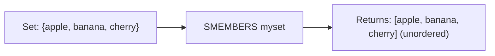

# How to Use SMEMBERS in Redis to List All Set Members

Author: [nawazdhandala](https://www.github.com/nawazdhandala)

Tags: Redis, Set, SMEMBERS, Command

Description: Learn how to use the Redis SMEMBERS command to retrieve all members of a set, with examples and guidance on when to use SSCAN for large sets instead.

---

## How SMEMBERS Works

`SMEMBERS` returns all members of a Redis set in a single call. The result is an unordered array - Redis sets do not guarantee any particular iteration order. Because SMEMBERS returns everything at once, it is simple and convenient for small sets, but can block the server and overwhelm clients for very large sets.

For sets with thousands of members or more, SSCAN is the safer alternative as it returns members incrementally.



## Syntax

```redis
SMEMBERS key
```

- `key` - the set key

Returns an array of all members. Returns an empty array if the key does not exist or the set is empty.

## Examples

### Retrieve All Members

```redis
SADD fruits "apple" "banana" "cherry" "date"
SMEMBERS fruits
```

```text
1) "cherry"
2) "banana"
3) "apple"
4) "date"
```

The order may differ from insertion order - sets are unordered.

### Empty Set or Non-Existent Key

```redis
DEL emptyset
SMEMBERS emptyset
```

```text
(empty array)
```

### After Adding and Removing Members

```redis
SADD colors "red" "green" "blue"
SREM colors "green"
SMEMBERS colors
```

```text
1) "red"
2) "blue"
```

### Confirming Uniqueness

```redis
SADD ids "u:1" "u:2" "u:1" "u:3" "u:2"
SMEMBERS ids
```

```text
1) "u:1"
2) "u:2"
3) "u:3"
```

Only unique values appear.

## Use Cases

### Loading All Tags for an Article

```redis
SADD article:99:tags "redis" "nosql" "database" "caching"
SMEMBERS article:99:tags
```

```text
1) "redis"
2) "nosql"
3) "database"
4) "caching"
```

### Listing Active Feature Flags

```redis
SADD features:enabled "dark_mode" "beta_dashboard" "new_onboarding"
SMEMBERS features:enabled
```

### Checking All Online Users

```redis
SADD session:active "user:1" "user:2" "user:3"
SMEMBERS session:active
```

### Retrieving Allowed IP Addresses

```redis
SADD allowlist "10.0.0.1" "10.0.0.2" "192.168.1.50"
SMEMBERS allowlist
```

## When to Use SSCAN Instead

SMEMBERS retrieves the entire set in a single blocking call. For large sets, this can:

- Block Redis for milliseconds (violating the single-thread rule for other clients)
- Transfer large payloads over the network
- Overwhelm client memory

Use SSCAN when your set may contain thousands of members or more.

```redis
-- Safe incremental scan for large sets
SSCAN largeset 0 COUNT 100
```

## Comparing SMEMBERS with SUNION on One Key

`SMEMBERS key` and `SUNION key` return the same result. SMEMBERS is more explicit and preferred when working with a single set.

```redis
SADD s1 "a" "b" "c"
SMEMBERS s1
SUNION s1
```

Both return `["a", "b", "c"]`.

## Performance Considerations

- SMEMBERS is O(N) where N is the number of set members.
- For small to medium sets (a few hundred members), SMEMBERS is efficient and convenient.
- For production sets that can grow large, prefer SSCAN with a cursor to avoid blocking.
- If you only need to check specific memberships, use SISMEMBER or SMISMEMBER instead.

## Summary

`SMEMBERS` is the simplest way to retrieve all members of a Redis set in one call. It is ideal for small, bounded sets where the full contents are needed at once. For sets that may grow large, prefer the incremental SSCAN command to avoid performance and memory issues. Remember that the returned order is non-deterministic - do not rely on insertion order.
