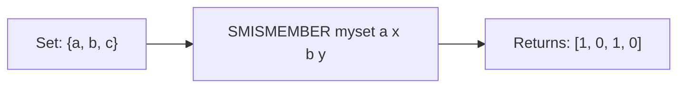

# How to Use SMISMEMBER in Redis for Multiple Membership Checks

Author: [nawazdhandala](https://www.github.com/nawazdhandala)

Tags: Redis, Set, SMISMEMBER, Command

Description: Learn how to use the Redis SMISMEMBER command to check multiple set members in a single call, reducing round trips for batch membership tests.

---

## How SMISMEMBER Works

`SMISMEMBER` checks whether multiple members exist in a Redis set in a single command. It returns an array of integers - one per member - where `1` indicates the member is in the set and `0` indicates it is not.

SMISMEMBER was introduced in Redis 6.2 as a batch version of SISMEMBER. Instead of issuing N separate SISMEMBER calls (N round trips), you check all members at once in a single round trip.



## Syntax

```redis
SMISMEMBER key member [member ...]
```

- `key` - the set key
- `member [member ...]` - one or more members to check

Returns an array of integers, one per member, in the same order as the input. Returns `1` for members in the set and `0` for those not in it. If the key does not exist, all entries return `0`.

## Examples

### Basic Multiple Membership Check

```redis
SADD fruits "apple" "banana" "cherry"
SMISMEMBER fruits "apple" "grape" "banana" "mango"
```

```text
1) (integer) 1
2) (integer) 0
3) (integer) 1
4) (integer) 0
```

"apple" and "banana" are in the set; "grape" and "mango" are not.

### Non-Existent Key

```redis
DEL noset
SMISMEMBER noset "a" "b" "c"
```

```text
1) (integer) 0
2) (integer) 0
3) (integer) 0
```

### Checking a Single Member (Same as SISMEMBER)

```redis
SMISMEMBER fruits "cherry"
```

```text
1) (integer) 1
```

### All Members Present

```redis
SADD perms "read" "write" "delete"
SMISMEMBER perms "read" "write" "delete"
```

```text
1) (integer) 1
2) (integer) 1
3) (integer) 1
```

### None Present

```redis
SMISMEMBER perms "admin" "superuser" "root"
```

```text
1) (integer) 0
2) (integer) 0
3) (integer) 0
```

## Use Cases

### Bulk Permission Check

Check if a user has all required permissions at once.

```redis
SADD user:42:perms "read" "write" "publish"
SMISMEMBER user:42:perms "read" "write" "delete"
```

```text
1) (integer) 1
2) (integer) 1
3) (integer) 0
```

The application can now make a single decision: user has "read" and "write" but not "delete".

### Batch Deduplication Filter

Filter a batch of incoming IDs to find which ones are new (not yet processed).

```redis
SADD seen:events "evt:1" "evt:2" "evt:3"
SMISMEMBER seen:events "evt:2" "evt:4" "evt:5"
```

```text
1) (integer) 1
2) (integer) 0
3) (integer) 0
```

Process only "evt:4" and "evt:5" (the ones returning 0).

### Feature Flag Batch Evaluation

Check multiple feature flags for a user in a single call.

```redis
SADD user:99:features "dark_mode" "new_dashboard"
SMISMEMBER user:99:features "dark_mode" "beta_chat" "new_dashboard" "ai_assist"
```

```text
1) (integer) 1
2) (integer) 0
3) (integer) 1
4) (integer) 0
```

### Batch Blocklist Screening

Screen a list of IPs against a blocklist in one call.

```redis
SADD blocklist "10.0.0.1" "192.168.1.5"
SMISMEMBER blocklist "10.0.0.1" "10.0.0.2" "192.168.1.5"
```

```text
1) (integer) 1
2) (integer) 0
3) (integer) 1
```

### Checking Which Tags Are Already Applied

```redis
SADD post:55:tags "redis" "database"
SMISMEMBER post:55:tags "redis" "nosql" "database" "caching"
```

```text
1) (integer) 1
2) (integer) 0
3) (integer) 1
4) (integer) 0
```

## Comparison: SISMEMBER vs SMISMEMBER

For N membership checks:

- N separate SISMEMBER calls = N round trips
- 1 SMISMEMBER call = 1 round trip

```redis
-- Inefficient: 3 round trips
SISMEMBER perms "read"
SISMEMBER perms "write"
SISMEMBER perms "delete"

-- Efficient: 1 round trip
SMISMEMBER perms "read" "write" "delete"
```

## Performance Considerations

- SMISMEMBER is O(N) where N is the number of members being checked.
- The network savings from batching are typically larger than the slight CPU cost for multiple members.
- Results are returned in the same order as the input, making it easy to zip results back to the input array in application code.

## Summary

`SMISMEMBER` is the batch alternative to SISMEMBER, checking multiple set members in a single round trip. It returns results in input order as a 0/1 array, making it easy to correlate with your input list. Whenever you need to check more than one value against a set, SMISMEMBER is more efficient than multiple SISMEMBER calls.
