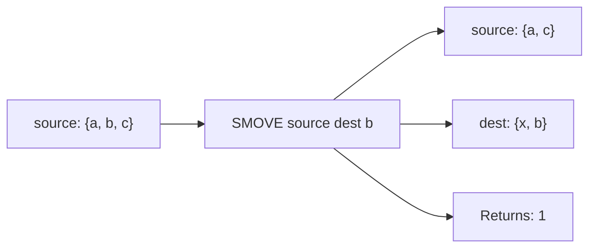

# How to Use SMOVE in Redis to Move Members Between Sets

Author: [nawazdhandala](https://www.github.com/nawazdhandala)

Tags: Redis, Set, SMOVE, Command

Description: Learn how to use the Redis SMOVE command to atomically move a member from one set to another, with examples for state transitions and workflow management.

---

## How SMOVE Works

`SMOVE` atomically removes a member from a source set and adds it to a destination set. The operation is atomic - no other client can see a state where the member has been removed from the source but not yet added to the destination.

If the member does not exist in the source set, SMOVE returns 0 and does nothing. If the member already exists in the destination set, it is still removed from the source (effectively a deletion from source).



## Syntax

```redis
SMOVE source destination member
```

- `source` - the source set key
- `destination` - the destination set key; created if it does not exist
- `member` - the value to move

Returns `1` if the member was moved, `0` if the member was not found in the source.

## Examples

### Basic Move

```redis
SADD source "a" "b" "c"
SADD dest "x" "y"
SMOVE source dest "b"
SMEMBERS source
SMEMBERS dest
```

```text
(integer) 1
---
1) "a"
2) "c"
---
1) "x"
2) "y"
3) "b"
```

### Member Not in Source

```redis
SMOVE source dest "zzz"
```

```text
(integer) 0
```

Neither set is modified.

### Member Already in Destination

If the member exists in both source and destination, it is removed from source (destination stays unchanged since it already has it).

```redis
SADD source "a" "b" "shared"
SADD dest "shared" "x"
SMOVE source dest "shared"
SMEMBERS source
SMEMBERS dest
```

```text
(integer) 1
---
1) "a"
2) "b"
---
1) "shared"
2) "x"
```

"shared" is removed from source; destination is unchanged.

### Destination Does Not Exist

SMOVE creates the destination set if it does not exist.

```redis
SADD only "item"
DEL newset
SMOVE only newset "item"
SMEMBERS newset
```

```text
1) "item"
```

### Source Becomes Empty and Is Deleted

```redis
DEL s1 s2
SADD s1 "last"
SMOVE s1 s2 "last"
EXISTS s1
```

```text
(integer) 0
```

## Use Cases

### State Machine Transitions

Move a task through processing states atomically.

```redis
SADD tasks:pending "task:1" "task:2" "task:3"
-- Worker claims task:1
SMOVE tasks:pending tasks:active "task:1"
SMEMBERS tasks:pending
SMEMBERS tasks:active
```

```text
1) "task:2"
2) "task:3"
---
1) "task:1"
```

After completion:

```redis
SMOVE tasks:active tasks:done "task:1"
```

### User Group Migration

Move a user from one group to another.

```redis
SADD group:trial "user:42" "user:99"
SADD group:paid "user:1" "user:2"
SMOVE group:trial group:paid "user:42"
SMEMBERS group:trial
SMEMBERS group:paid
```

```text
1) "user:99"
---
1) "user:1"
2) "user:2"
3) "user:42"
```

### Promoting an Item

Move an item from a pending approval set to a published set.

```redis
SADD content:pending "article:55" "article:66"
SMOVE content:pending content:published "article:55"
```

### Moving Between Priority Levels

Escalate a ticket from normal to high priority.

```redis
SADD tickets:normal "T-100" "T-101" "T-102"
SMOVE tickets:normal tickets:high "T-101"
```

### Reclassifying a User

Remove from a blocklist and add to an allowlist atomically.

```redis
SADD blocklist "user:7"
SMOVE blocklist allowlist "user:7"
```

## SMOVE vs Manual SREM + SADD

Manual SREM followed by SADD is not atomic - another client could read the state between the two commands:

```redis
-- Non-atomic (race condition possible between SREM and SADD)
SREM source "item"
SADD dest "item"

-- Atomic alternative
SMOVE source dest "item"
```

Use SMOVE whenever the two-phase move must be atomic.

## Performance Considerations

- SMOVE is O(1) - constant time for both the removal from source and insertion into destination.
- Atomicity is guaranteed even under concurrent access without needing MULTI/EXEC transactions.

## Summary

`SMOVE` atomically transfers a single member from one Redis set to another in O(1) time. It is the safe, concurrency-friendly way to implement state transitions, group migrations, and classification changes. When atomicity between removal and insertion matters, SMOVE is preferable to a manual SREM + SADD sequence.
