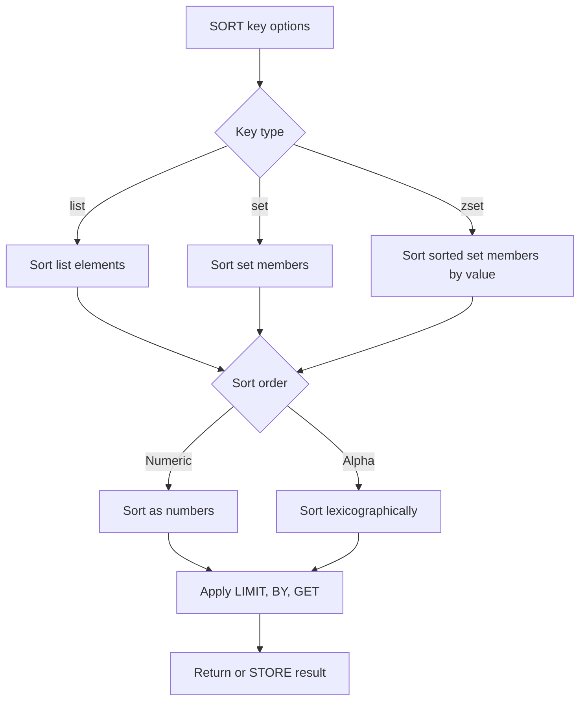

# How to Use SORT and SORT_RO in Redis for List and Set Sorting

Author: [nawazdhandala](https://www.github.com/nawazdhandala)

Tags: Redis, Sort, SORT_RO, List, Set, Sorted Set

Description: Learn how to use SORT and SORT_RO in Redis to sort lists, sets, and sorted sets by value or external keys, with options for filtering, pagination, and storing results.

---

## How SORT and SORT_RO Work

SORT returns the elements of a list, set, or sorted set in sorted order. It supports sorting numerically or lexicographically, in ascending or descending order, with pagination and the ability to sort by an external key pattern. SORT can also store the result in a new key.

SORT_RO was added in Redis 7.0 as a read-only variant of SORT. It behaves identically to SORT but without the STORE option, making it safe to run on replicas.



## Syntax

```redis
SORT key [BY pattern] [LIMIT offset count] [GET pattern [GET pattern ...]] [ASC | DESC] [ALPHA] [STORE destination]

SORT_RO key [BY pattern] [LIMIT offset count] [GET pattern [GET pattern ...]] [ASC | DESC] [ALPHA]
```

- `BY pattern` - sort by the value of external keys matching the pattern
- `LIMIT offset count` - paginate results
- `GET pattern` - retrieve related values after sorting
- `ASC / DESC` - ascending (default) or descending order
- `ALPHA` - sort lexicographically instead of numerically
- `STORE destination` - save the sorted result to a list key

## Examples

### Basic numeric sort of a list

```redis
RPUSH scores 40 10 30 20 50
SORT scores
```

```text
1) "10"
2) "20"
3) "30"
4) "40"
5) "50"
```

### Sort in descending order

```redis
SORT scores DESC
```

```text
1) "50"
2) "40"
3) "30"
4) "20"
5) "10"
```

### Lexicographic sort with ALPHA

```redis
SADD fruits apple cherry banana date elderberry
SORT fruits ALPHA
```

```text
1) "apple"
2) "banana"
3) "cherry"
4) "date"
5) "elderberry"
```

### Pagination with LIMIT

```redis
SORT fruits ALPHA LIMIT 0 3
```

```text
1) "apple"
2) "banana"
3) "cherry"
```

```redis
SORT fruits ALPHA LIMIT 3 3
```

```text
1) "date"
2) "elderberry"
```

### Sort by an external key pattern (BY)

```redis
RPUSH user:ids 1 2 3

HSET user:1 name "charlie" age 30
HSET user:2 name "alice"   age 25
HSET user:3 name "bob"     age 28

# Sort user IDs by the 'age' field of each user's hash
SORT user:ids BY user:*->age
```

```text
1) "2"
2) "3"
3) "1"
```

User 2 (alice, age 25) is first; user 1 (charlie, age 30) is last.

### GET to retrieve field values after sorting

```redis
SORT user:ids BY user:*->age GET user:*->name
```

```text
1) "alice"
2) "bob"
3) "charlie"
```

### Store sorted results in a new key

```redis
SORT user:ids BY user:*->age GET user:*->name STORE sorted:users
TYPE sorted:users
LRANGE sorted:users 0 -1
```

```text
list
1) "alice"
2) "bob"
3) "charlie"
```

### SORT_RO - read-only safe variant

```redis
SORT_RO scores DESC LIMIT 0 3
```

```text
1) "50"
2) "40"
3) "30"
```

SORT_RO behaves identically but cannot use STORE, making it safe for replica execution and read-only connections.

## Use Cases

**Sorted display without sorted sets** - Sort a plain list or set for display purposes without maintaining a separate sorted set.

**Multi-field sorting** - Use BY with hash patterns to sort IDs by any field of their associated hash (e.g., sort users by age, name, or score).

**Paginated sorted output** - Combine SORT with LIMIT to implement server-side pagination over a list.

**Derived sorted lists** - Use STORE to cache the sorted result in a list key that other commands can LRANGE over efficiently.

**Read replica sorting** - Use SORT_RO on replicas to offload read-heavy sorting operations without touching the primary.

## Performance Considerations

SORT has O(N+M*log(M)) time complexity where N is the number of elements and M is the number of elements returned. For large datasets, SORT can be slow and block the server. Consider:

- Using sorted sets (ZADD/ZRANGE) if you frequently sort by score
- Using STORE to cache sorted results instead of re-sorting on every request
- Running SORT_RO on replicas to reduce primary load

## Summary

SORT and SORT_RO provide flexible sorting of Redis lists, sets, and sorted sets with support for numeric and lexicographic ordering, external key-based sorting via BY patterns, pagination via LIMIT, and result retrieval via GET. SORT can persist results with STORE; SORT_RO is a safe read-only variant for replica usage. For static sorted data, consider sorted sets (ZADD) as a more efficient alternative to repeated SORT calls.
