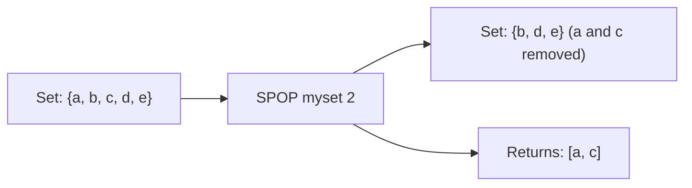

# How to Use SPOP in Redis to Remove Random Set Members

Author: [nawazdhandala](https://www.github.com/nawazdhandala)

Tags: Redis, Set, SPOP, Command

Description: Learn how to use the Redis SPOP command to remove and return random members from a set, with examples for lotteries, task dispatch, and one-time sampling.

---

## How SPOP Works

`SPOP` removes and returns one or more random members from a Redis set. Unlike SRANDMEMBER which reads without modifying the set, SPOP is destructive - removed members are no longer in the set.

This makes SPOP ideal for lottery-style selection, distributing unique work items, and any pattern where each item should be used only once.



## Syntax

```redis
SPOP key [count]
```

- `key` - the set key
- `count` - optional; number of members to pop (default 1); must be positive

Returns a single string (no count), an array of strings (with count), or nil/empty array if the set is empty.

## Examples

### Pop a Single Random Member

```redis
SADD lottery "alice" "bob" "charlie" "diana" "eve"
SPOP lottery
```

```text
"charlie"
```

```redis
SMEMBERS lottery
```

```text
1) "alice"
2) "bob"
3) "diana"
4) "eve"
```

"charlie" is gone.

### Pop Multiple Members

```redis
SPOP lottery 2
```

```text
1) "bob"
2) "diana"
```

```redis
SMEMBERS lottery
```

```text
1) "alice"
2) "eve"
```

### Pop All Members

```redis
SPOP lottery 100
SMEMBERS lottery
```

```text
(empty array)
```

When count exceeds the set size, all members are returned and the key is deleted.

### Non-Existent Key Returns Nil

```redis
DEL ghost
SPOP ghost
```

```text
(nil)
```

With count:

```redis
SPOP ghost 3
```

```text
(empty array)
```

### Auto-Delete When Set Becomes Empty

```redis
DEL tiny
SADD tiny "only"
SPOP tiny
EXISTS tiny
```

```text
(integer) 0
```

## Use Cases

### Lottery or Prize Draw

Pick winners at random from a pool of entries without picking the same person twice.

```redis
SADD entries "user:1" "user:2" "user:3" "user:4" "user:5"
-- Draw 2 winners
SPOP entries 2
```

```text
1) "user:3"
2) "user:1"
```

The winners are removed from the pool automatically.

### Distributing Unique Work Items

Assign unique tasks to workers without duplication.

```redis
SADD tasks:available "task:A" "task:B" "task:C" "task:D"
-- Each worker pops one task
SPOP tasks:available
```

```text
"task:B"
```

### One-Time Coupon Distribution

Each coupon code can only be claimed once.

```redis
SADD coupons "CODE1234" "CODE5678" "CODE9012"
SPOP coupons
```

```text
"CODE5678"
```

### Random Survey Question Selection

Pick a unique question for each survey respondent.

```redis
SADD questions "q:1" "q:2" "q:3" "q:4" "q:5"
SPOP questions 3
```

```text
1) "q:4"
2) "q:2"
3) "q:5"
```

### Batch Job Dispatch

Pop a batch of items to process in parallel.

```redis
SADD pending:items "item:1" "item:2" "item:3" "item:4" "item:5"
SPOP pending:items 3
```

```text
1) "item:3"
2) "item:5"
3) "item:1"
```

## SPOP vs SRANDMEMBER

| Aspect | SPOP | SRANDMEMBER |
|---|---|---|
| Removes members | Yes | No |
| Use when | One-time use (lottery, dispatch) | Non-destructive sampling |
| Repeatable | No (once popped) | Yes (set unchanged) |

## SPOP vs LPOP / RPOP

SPOP pops a random element from a set. LPOP/RPOP pop from the head/tail of a list (ordered). Use SPOP when ordering is irrelevant and uniqueness is enforced by the set structure.

## Performance Considerations

- For a single pop, SPOP is O(1).
- For `count` pops, SPOP is O(N) where N is the count.
- When count is close to the full set size, the complexity approaches O(S) where S is the set size.

## Summary

`SPOP` removes and returns random members from a Redis set, making each selected member unavailable for future pops. It is the ideal tool for lotteries, one-time coupon distribution, unique task dispatch, and any scenario where random selection must be non-repeating. For non-destructive random sampling, use SRANDMEMBER instead.
