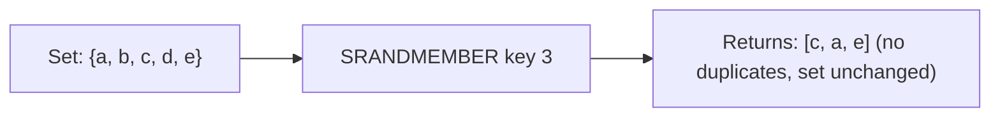

# How to Use SRANDMEMBER in Redis for Random Set Members

Author: [nawazdhandala](https://www.github.com/nawazdhandala)

Tags: Redis, Set, SRANDMEMBER, Command

Description: Learn how to use the Redis SRANDMEMBER command to retrieve random members from a set, with examples for recommendations, sampling, and random selection.

---

## How SRANDMEMBER Works

`SRANDMEMBER` returns one or more random members from a Redis set without removing them. The set is unchanged after the call, unlike SPOP which removes the returned members.

The `count` parameter controls how many members to return and whether duplicates are allowed:
- Positive `count` - returns up to `count` distinct members (no duplicates)
- Negative `count` - returns exactly `|count|` members, potentially with duplicates



## Syntax

```redis
SRANDMEMBER key [count]
```

- `key` - the set key
- `count` - optional; omit for one random member; positive for distinct sample; negative for sample with repeats

Returns a single string (no count), an array of strings (with count), or nil/empty array if the set is empty or does not exist.

## Examples

### Return a Single Random Member

```redis
SADD pool "alice" "bob" "charlie" "diana" "eve"
SRANDMEMBER pool
```

```text
"charlie"
```

(Result varies each call)

### Return Multiple Distinct Members (Positive Count)

```redis
SRANDMEMBER pool 3
```

```text
1) "alice"
2) "eve"
3) "bob"
```

No duplicates; at most 3 unique members returned.

### Count Larger Than Set Size

When count exceeds the set size, all members are returned without error.

```redis
SRANDMEMBER pool 100
```

```text
1) "alice"
2) "bob"
3) "charlie"
4) "diana"
5) "eve"
```

### Return Members with Possible Duplicates (Negative Count)

Negative count allows the same member to appear multiple times.

```redis
SRANDMEMBER pool -7
```

```text
1) "bob"
2) "alice"
3) "bob"
4) "diana"
5) "charlie"
6) "alice"
7) "charlie"
```

Duplicates appear because the absolute count (7) exceeds the set size (5).

### Non-Existent Key

```redis
DEL ghost
SRANDMEMBER ghost 3
```

```text
(empty array)
```

### Set Is Not Modified

```redis
SADD check "x" "y" "z"
SRANDMEMBER check 2
SCARD check
```

```text
(integer) 3
```

The set still has 3 members after SRANDMEMBER.

## Use Cases

### Random Recommendation

Pick a random recommendation from a user's interest tags.

```redis
SADD user:42:tags "redis" "nosql" "golang" "distributed" "caching"
SRANDMEMBER user:42:tags 3
```

```text
1) "golang"
2) "redis"
3) "caching"
```

### Daily Challenge / Featured Item

Select a random featured item from a pool.

```redis
SADD featured:challenges "challenge:101" "challenge:102" "challenge:103"
SRANDMEMBER featured:challenges
```

```text
"challenge:102"
```

### Random Sample for A/B Testing

Sample a subset of users for a test group.

```redis
SADD users:all "u1" "u2" "u3" "u4" "u5" "u6" "u7" "u8" "u9" "u10"
SRANDMEMBER users:all 3
```

```text
1) "u7"
2) "u2"
3) "u9"
```

### Weighted Random Simulation with Duplicates

Use negative count to simulate a weighted random distribution by duplicating high-weight entries.

```redis
SADD weighted "prize:big" "prize:small" "prize:small" "prize:small"
-- Note: sets deduplicate, so use a sorted set or list for true weighting
-- For small differences, negative count can approximate:
SRANDMEMBER weighted -1
```

### Shuffle a Deck or Randomize Order

Select all members in a random order (equivalent to shuffling).

```redis
SADD deck "A" "2" "3" "4" "5" "6" "7" "8" "9" "10" "J" "Q" "K"
SRANDMEMBER deck 13
```

Returns all 13 cards in random order.

## SRANDMEMBER vs SPOP

| Aspect | SRANDMEMBER | SPOP |
|---|---|---|
| Removes members | No | Yes |
| Use case | Sampling, recommendations | Lottery, one-time selection |
| Set unchanged | Yes | No |

## Performance Considerations

- For a single random member, SRANDMEMBER is O(1).
- For `count` members, it is O(N) where N is the count requested.
- With a positive count close to the full set size, the complexity approaches O(S) where S is the set size, as Redis must ensure no duplicates.
- With a negative count, it is O(|count|) since duplicates are allowed without deduplication overhead.

## Summary

`SRANDMEMBER` is a non-destructive sampling tool for Redis sets. Use a positive count for unique random samples and a negative count when you need a fixed-size sample with possible repetition. It is the go-to command for recommendations, random selection, A/B test sampling, and any scenario where randomness is needed without modifying the underlying set.
