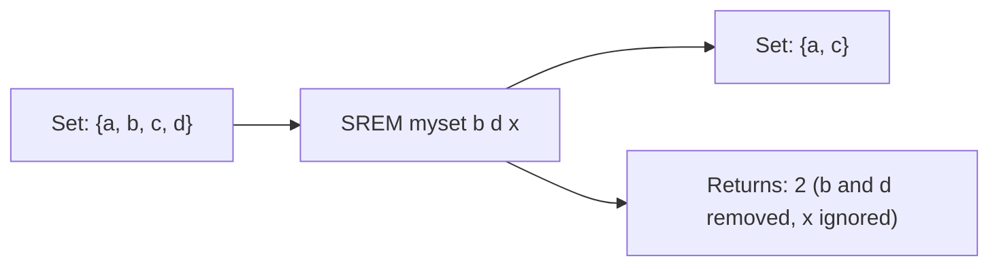

# How to Use SREM in Redis to Remove Members from a Set

Author: [nawazdhandala](https://www.github.com/nawazdhandala)

Tags: Redis, Set, SREM, Command

Description: Learn how to use the Redis SREM command to remove one or more members from a set, with examples for tag management, session cleanup, and access control.

---

## How SREM Works

`SREM` removes one or more members from a Redis set. Members that do not exist in the set are silently ignored. The command returns the count of members that were actually removed.

If removing a member causes the set to become empty, Redis automatically deletes the key. SREM is the complement to SADD and together they are the primary tools for managing set membership.



## Syntax

```redis
SREM key member [member ...]
```

- `key` - the set key
- `member [member ...]` - one or more members to remove

Returns the number of members removed (members that existed in the set).

## Examples

### Remove a Single Member

```redis
SADD myset "apple" "banana" "cherry"
SREM myset "banana"
SMEMBERS myset
```

```text
(integer) 1
---
1) "apple"
2) "cherry"
```

### Remove Multiple Members at Once

```redis
SADD myset "date" "elderberry" "fig"
SREM myset "date" "fig"
SMEMBERS myset
```

```text
(integer) 2
---
1) "apple"
2) "cherry"
3) "elderberry"
```

### Non-Existent Member Returns 0

```redis
SREM myset "grape"
```

```text
(integer) 0
```

### Mix of Existing and Non-Existing Members

```redis
SREM myset "apple" "notinset" "elderberry"
SMEMBERS myset
```

```text
(integer) 2
---
1) "cherry"
```

Two were removed ("apple" and "elderberry"), "notinset" was not in the set.

### Key Is Auto-Deleted When Empty

```redis
DEL tiny
SADD tiny "only"
SREM tiny "only"
EXISTS tiny
```

```text
(integer) 0
```

The key no longer exists after removing the last member.

### Non-Existent Key

```redis
DEL ghost
SREM ghost "value"
```

```text
(integer) 0
```

No error is returned; the command simply reports 0 removals.

## Use Cases

### Removing a Tag from an Article

```redis
SADD article:42:tags "redis" "database" "nosql" "caching"
SREM article:42:tags "caching"
SMEMBERS article:42:tags
```

```text
1) "redis"
2) "database"
3) "nosql"
```

### Revoking Permissions from a Role

```redis
SADD role:editor "read" "write" "publish" "admin"
SREM role:editor "admin"
SMEMBERS role:editor
```

```text
1) "read"
2) "write"
3) "publish"
```

### Logging Out a User (Session Cleanup)

```redis
SADD online:users "user:1" "user:2" "user:3"
-- User 2 logs out
SREM online:users "user:2"
SMEMBERS online:users
```

```text
1) "user:1"
2) "user:3"
```

### Removing from a Blocklist

```redis
SADD blocklist "ip:10.0.0.1" "ip:10.0.0.2"
-- Unblock ip
SREM blocklist "ip:10.0.0.1"
SISMEMBER blocklist "ip:10.0.0.1"
```

```text
(integer) 0
```

### Bulk Unsubscribe

Remove multiple topic subscriptions at once.

```redis
SADD user:7:subscriptions "topic:sports" "topic:tech" "topic:finance" "topic:gaming"
SREM user:7:subscriptions "topic:sports" "topic:finance"
SMEMBERS user:7:subscriptions
```

```text
1) "topic:tech"
2) "topic:gaming"
```

## Performance Considerations

- SREM is O(N) where N is the number of members being removed.
- For a single member removal, SREM is effectively O(1).
- Batch removals in a single SREM call are more efficient than issuing individual SREM calls.
- SREM never returns an error for non-existent members or keys, which simplifies error handling.

## Summary

`SREM` removes one or more members from a Redis set cleanly and efficiently. It silently ignores members that are not present, returns a count of actually removed members, and automatically deletes the key when the set becomes empty. Use batch removal with multiple members in a single call whenever possible to minimize network round trips.
