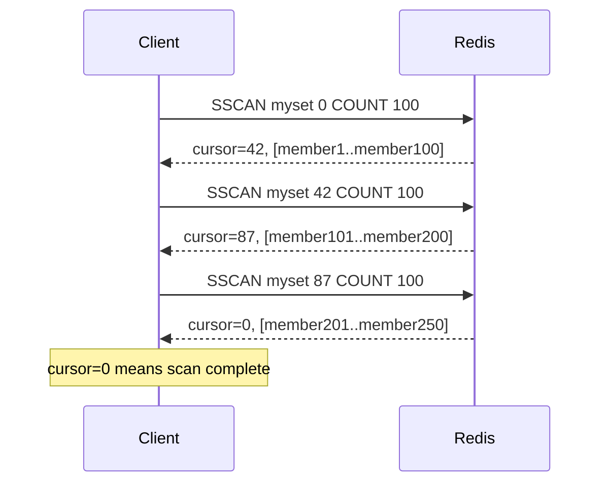

# How to Use SSCAN in Redis to Iterate Over Set Members

Author: [nawazdhandala](https://www.github.com/nawazdhandala)

Tags: Redis, Set, SSCAN, Command

Description: Learn how to use the Redis SSCAN command to safely iterate over large set members using a cursor, avoiding the blocking behavior of SMEMBERS on big sets.

---

## How SSCAN Works

`SSCAN` is a cursor-based iterator for Redis sets. Instead of returning all members at once like SMEMBERS, SSCAN returns a small batch of members per call along with a cursor. You call SSCAN repeatedly, passing the cursor from the previous response, until the cursor returns to `0` (indicating the full set has been scanned).

SSCAN is the safe alternative to SMEMBERS for large sets. Because it yields results incrementally, it does not block the Redis server or overwhelm client memory.



## Syntax

```redis
SSCAN key cursor [MATCH pattern] [COUNT count]
```

- `key` - the set key
- `cursor` - start with `0`; use the cursor returned by each call; `0` again signals completion
- `MATCH pattern` - optional; filter returned members by a glob pattern
- `COUNT count` - optional hint for how many members to return per call (default 10); Redis may return more or fewer

Returns a two-element array: `[next_cursor, [members]]`. When `next_cursor` is `0`, the scan is complete.

## Examples

### Simple Full Scan

```redis
SADD bigset "alpha" "beta" "gamma" "delta" "epsilon"
SSCAN bigset 0
```

```text
1) "0"
2) 1) "alpha"
   2) "beta"
   3) "gamma"
   4) "delta"
   5) "epsilon"
```

Cursor `0` means the scan is complete in one call (small set).

### Iterating with COUNT Hint

```redis
SSCAN bigset 0 COUNT 2
```

```text
1) "0"
2) 1) "alpha"
   2) "beta"
   3) "gamma"
   4) "delta"
   5) "epsilon"
```

Note: For small sets encoded as a listpack, Redis returns all members regardless of COUNT. COUNT is a hint that matters more for large sets.

### Filtering with MATCH

```redis
SADD users "user:alice" "user:bob" "admin:carol" "user:diana"
SSCAN users 0 MATCH "user:*"
```

```text
1) "0"
2) 1) "user:alice"
   2) "user:bob"
   3) "user:diana"
```

Only members matching the pattern are returned.

### Multi-Page Scan on a Large Set

For a set with millions of members, the scan spans multiple calls.

```bash
# Initial call
SSCAN hugeset 0 COUNT 1000
# Returns: cursor=12345, [batch1]

# Continue
SSCAN hugeset 12345 COUNT 1000
# Returns: cursor=67890, [batch2]

# Continue until cursor returns to 0
SSCAN hugeset 67890 COUNT 1000
# Returns: cursor=0, [last batch]
```

### MATCH with Wildcards

```redis
SADD products "prod:redis:1" "prod:mysql:2" "prod:redis:3" "svc:api"
SSCAN products 0 MATCH "prod:redis:*"
```

```text
1) "0"
2) 1) "prod:redis:1"
   2) "prod:redis:3"
```

## Full Iteration Pattern in Pseudocode

```text
cursor = 0
loop:
    cursor, members = SSCAN myset cursor COUNT 100
    process(members)
    if cursor == "0":
        break
```

## Use Cases

### Safe Full-Set Export

Export all members of a large set without blocking Redis.

```redis
SSCAN largeset 0 COUNT 500
-- Process batch
SSCAN largeset <cursor> COUNT 500
-- Repeat until cursor = 0
```

### Search Members by Pattern

Find all members matching a naming convention.

```redis
SADD sessions "sess:user1:web" "sess:user2:mobile" "sess:user1:mobile"
SSCAN sessions 0 MATCH "sess:user1:*"
```

```text
1) "0"
2) 1) "sess:user1:web"
   2) "sess:user1:mobile"
```

### Periodic Cleanup Scan

Scan and remove expired or invalid members without locking up Redis.

```redis
-- Scan in batches and check each member
SSCAN checklist 0 COUNT 100
-- Validate each member, call SREM for invalid ones
```

### Audit and Reporting

Iterate through members for logging or compliance reporting without loading everything into memory.

## Important Guarantees

- Members that exist throughout the scan will appear at least once.
- Members added or removed during the scan may or may not appear - SSCAN does not provide a consistent snapshot.
- COUNT is a hint, not a strict limit. Redis may return more or fewer members per call.
- A cursor of `0` in the response means the iteration is complete, not that the set is empty.

## SSCAN vs SMEMBERS

| Aspect | SMEMBERS | SSCAN |
|---|---|---|
| Returns all at once | Yes | No (batched) |
| Blocks server | For large sets | No |
| Memory safe | No | Yes |
| Use case | Small sets | Large or unknown size sets |

## Performance Considerations

- Each SSCAN call is O(N) where N is the number of members returned in that batch.
- Total complexity across all calls to complete a scan is O(S) where S is the set size.
- COUNT hint trades round trips for per-call overhead; tune based on your needs.

## Summary

`SSCAN` enables safe, incremental iteration over Redis set members using a cursor-based loop. It is the production-safe alternative to SMEMBERS for sets that may be large or unbounded. Use MATCH to filter results server-side and COUNT to control batch size. Always iterate until the returned cursor is `0` to ensure a complete scan.
