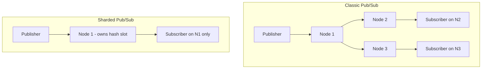

# How to Use SSUBSCRIBE and SUNSUBSCRIBE in Redis Sharded Pub/Sub

Author: [nawazdhandala](https://www.github.com/nawazdhandala)

Tags: Redis, Pub/Sub, SSUBSCRIBE, SUNSUBSCRIBE, Cluster, Sharded

Description: Learn how to use SSUBSCRIBE and SUNSUBSCRIBE for Redis Cluster's sharded Pub/Sub (Redis 7.0+), which scopes messages to individual shards for better scalability.

---

Redis 7.0 introduced sharded Pub/Sub to address a scaling limitation of traditional Pub/Sub in cluster mode. In classic Pub/Sub, messages are broadcast to all nodes in the cluster. Sharded Pub/Sub scopes messages to a single shard (the node responsible for the channel's hash slot), dramatically reducing inter-node traffic.

## Classic Pub/Sub vs Sharded Pub/Sub



In sharded Pub/Sub, a `SPUBLISH` message goes only to the shard that owns the channel's hash slot. Subscribers must connect to that shard directly.

## SSUBSCRIBE

`SSUBSCRIBE` subscribes to a sharded channel. The client must be connected to the shard that owns the channel's hash slot, or use a cluster-aware client that routes automatically.

### Syntax

```redis
SSUBSCRIBE shardchannel [shardchannel ...]
```

### Example

```redis
SSUBSCRIBE orders:us
```

Confirmation response:

```text
1) "ssubscribe"
2) "orders:us"
3) (integer) 1
```

### Receiving Messages

Messages published via `SPUBLISH` arrive as type `smessage`:

```text
1) "smessage"
2) "orders:us"
3) "New order #9001"
```

## SUNSUBSCRIBE

`SUNSUBSCRIBE` removes one or more sharded channel subscriptions.

### Syntax

```redis
SUNSUBSCRIBE [shardchannel [shardchannel ...]]
```

With no arguments, unsubscribes from all sharded channels.

### Example

```redis
SUNSUBSCRIBE orders:us
```

Response:

```text
1) "sunsubscribe"
2) "orders:us"
3) (integer) 0
```

## Publishing to a Sharded Channel

Use `SPUBLISH` (not `PUBLISH`) to send to sharded channels:

```redis
SPUBLISH orders:us "Order #9001 placed"
```

Returns the number of subscribers on the local shard that received the message.

## Monitoring Sharded Subscriptions

Check subscriber counts for sharded channels:

```redis
PUBSUB SHARDCHANNELS
PUBSUB SHARDNUMSUB orders:us orders:eu
```

## Sharded vs Classic Pub/Sub

| Feature | SUBSCRIBE/PUBLISH | SSUBSCRIBE/SPUBLISH |
|---|---|---|
| Scope | All cluster nodes | Single shard |
| Inter-node traffic | High (full broadcast) | Minimal |
| Pattern matching | Yes (PSUBSCRIBE) | No |
| Redis version | All | 7.0+ |
| Cluster scalability | Limited | Horizontal |

## Use Cases

- **High-throughput event streams in clusters** - avoid broadcasting overhead by pinning channels to shards
- **Per-user or per-tenant notifications** - route `user:{id}:events` channels to a single shard deterministically via hash slot
- **Microservice messaging in Redis Cluster** - scale Pub/Sub fan-out horizontally across shards
- **Replacing classic Pub/Sub in large clusters** - migrate channels expected to have many publishers or subscribers

## Summary

`SSUBSCRIBE` and `SUNSUBSCRIBE` bring sharded Pub/Sub to Redis 7.0+, solving the broadcast scalability problem of classic Pub/Sub in cluster mode. By pinning each channel to the shard responsible for its hash slot, sharded Pub/Sub enables horizontal scaling of event delivery. Use `SPUBLISH` to send and `PUBSUB SHARDNUMSUB` to monitor sharded channel activity.
