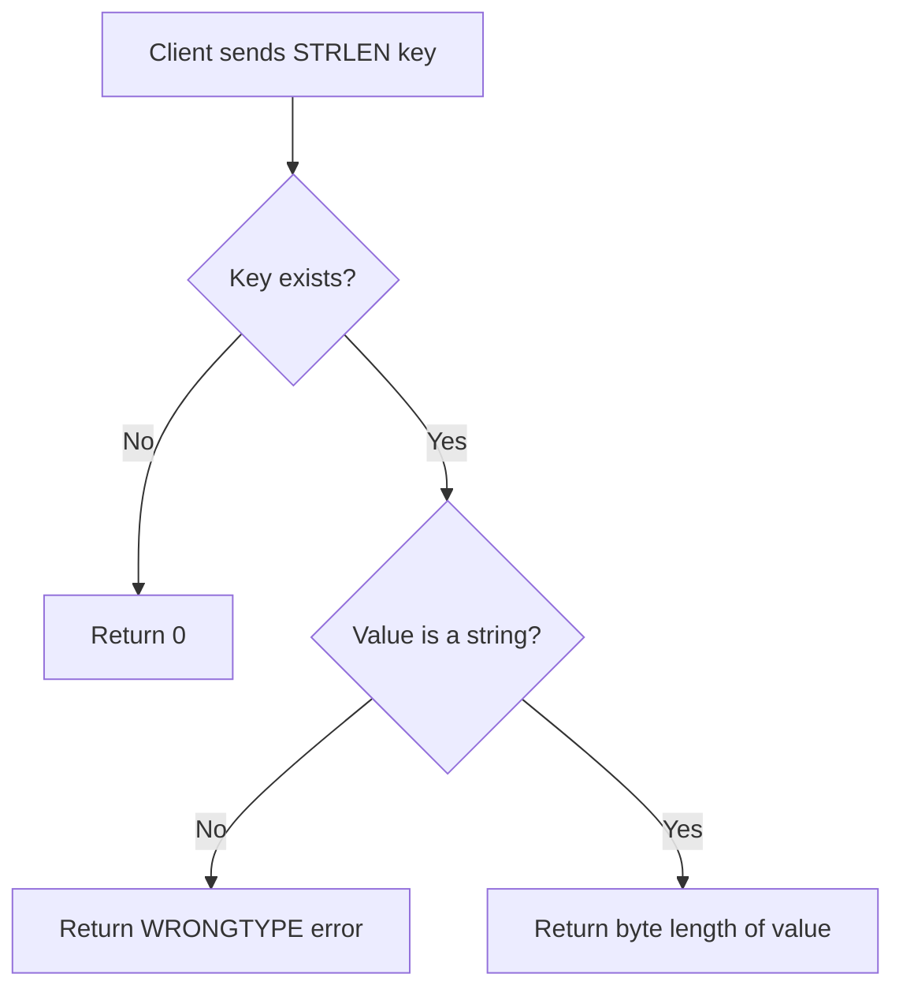

# How to Use STRLEN in Redis to Get String Length

Author: [nawazdhandala](https://www.github.com/nawazdhandala)

Tags: Redis, STRLEN, String, Length, Command

Description: Learn how to use the Redis STRLEN command to get the byte length of a string value stored at a key, with practical examples for validation and monitoring.

---

## How STRLEN Works

`STRLEN` returns the length of the string value stored at a key, measured in bytes. If the key does not exist, it returns 0. If the value is not a string type, Redis returns a WRONGTYPE error.

Because Redis strings are binary-safe, `STRLEN` counts raw bytes - not Unicode characters. A multi-byte UTF-8 character (like an emoji or accented letter) counts as 2-4 bytes.



## Syntax

```redis
STRLEN key
```

Returns an integer: the length of the string in bytes, or 0 if the key does not exist.

## Examples

### Basic usage

```redis
SET greeting "Hello, World!"
STRLEN greeting
```

```text
OK
(integer) 13
```

### Empty string

```redis
SET empty ""
STRLEN empty
```

```text
OK
(integer) 0
```

### Non-existent key

Returns 0, not an error.

```redis
STRLEN nonexistent_key
```

```text
(integer) 0
```

### Tracking a JSON payload size

Store a serialized object and check its byte size.

```redis
SET user:1 '{"id":1,"name":"Alice","email":"alice@example.com"}'
STRLEN user:1
```

```text
OK
(integer) 50
```

### Monitoring APPEND buffer growth

Use `STRLEN` to check how large a log buffer has grown before flushing.

```redis
DEL log:buffer
APPEND log:buffer "2026-03-31T10:00:00 - Request started\n"
APPEND log:buffer "2026-03-31T10:00:01 - DB query ok\n"
STRLEN log:buffer
```

```text
(integer) 0
(integer) 38
(integer) 72
(integer) 72
```

### Multi-byte character byte counting

An emoji is 4 bytes in UTF-8.

```redis
SET emoji_key "hi"
STRLEN emoji_key
```

```text
OK
(integer) 2
```

Now with an emoji (stored via redis-cli with UTF-8 support):

```redis
SET emoji_key "hi 👋"
STRLEN emoji_key
```

```text
OK
(integer) 7
```

"hi " is 3 bytes, and "👋" is 4 bytes = 7 total.

### Validation before processing

Check that a cached value is not empty before passing it to downstream logic.

```bash
LEN=$(redis-cli STRLEN cache:html:homepage)
if [ "$LEN" -eq 0 ]; then
  echo "Cache miss - regenerate content"
else
  echo "Cache hit - $LEN bytes"
fi
```

### STRLEN compared to APPEND return value

Both `STRLEN` and the return value of `APPEND` give the current byte length. You can use the `APPEND` return value in place of a separate `STRLEN` call to save a round-trip.

```redis
DEL buf
APPEND buf "hello"
APPEND buf " world"
```

```text
(integer) 5
(integer) 11
```

The return value 11 is the same as `STRLEN buf`.

## Use Cases

- Validate that a cached value was actually populated (non-zero length)
- Monitor log buffer or data export buffer growth
- Enforce maximum payload size limits before accepting data
- Debugging: confirm that a serialized value has the expected byte count
- Checking if a `SETRANGE` or `APPEND` operation produced the expected result

## Summary

`STRLEN` is a lightweight O(1) command that returns the byte length of a string value. It returns 0 for missing keys and errors on non-string types. It is most useful for cache validation, payload size enforcement, and monitoring incremental buffer growth alongside `APPEND`. Always remember it counts bytes, not Unicode characters.
