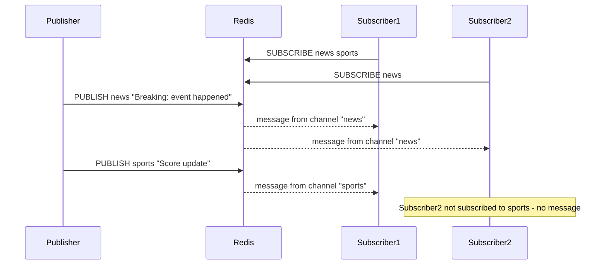

# How to Use SUBSCRIBE and PUBLISH in Redis Pub/Sub

Author: [nawazdhandala](https://www.github.com/nawazdhandala)

Tags: Redis, Pub/Sub, SUBSCRIBE, PUBLISH, Messaging

Description: Learn how to use SUBSCRIBE and PUBLISH to implement a publish/subscribe messaging pattern in Redis for real-time event broadcasting.

---

Redis Pub/Sub provides a fire-and-forget message broadcasting mechanism. Publishers send messages to named channels, and all subscribers to those channels receive them instantly. Unlike Redis Streams, Pub/Sub messages are not persisted - if no subscriber is listening when a message arrives, it is lost.

## How Redis Pub/Sub Works



## Syntax

### SUBSCRIBE

```redis
SUBSCRIBE channel [channel ...]
```

Enters a blocking listen mode. Returns a message for each matching published message.

### PUBLISH

```redis
PUBLISH channel message
```

Publishes `message` to `channel`. Returns the number of subscribers that received it.

## Examples

### Subscribe to a Channel

Open a connection and subscribe (this blocks the connection):

```redis
SUBSCRIBE notifications
```

Response confirms subscription:

```text
1) "subscribe"
2) "notifications"
3) (integer) 1
```

### Subscribe to Multiple Channels

```redis
SUBSCRIBE order-updates payment-events user-alerts
```

### Publish a Message

From a separate connection:

```redis
PUBLISH notifications "User 42 signed up"
```

Returns:

```text
(integer) 2
```

The return value `2` means 2 subscribers received the message.

### Message Format Received by Subscriber

When a message is published, each subscriber receives:

```text
1) "message"
2) "notifications"
3) "User 42 signed up"
```

The three parts are: message type, channel name, and message payload.

### Real-World Example: Live Dashboard Updates

Publisher (backend service):

```redis
PUBLISH dashboard:metrics '{"cpu": 45, "memory": 62, "timestamp": 1711900000}'
```

Subscriber (dashboard consumer):

```redis
SUBSCRIBE dashboard:metrics
```

## Important Characteristics

- Messages are not persisted - late subscribers miss past messages
- A subscribed connection can only use `SUBSCRIBE`, `UNSUBSCRIBE`, `PSUBSCRIBE`, `PUNSUBSCRIBE`, `PING`, and `RESET` commands
- `PUBLISH` returns 0 if no subscribers are active - the message is silently dropped
- Pub/Sub is not suitable for guaranteed delivery - use Redis Streams for that

## Use Cases

- **Live notifications** - broadcast user notifications to all connected sessions
- **Cache invalidation** - publish invalidation events to multiple application servers
- **Real-time dashboards** - push metric updates to all connected dashboard clients
- **Chat applications** - broadcast messages to room subscribers

## Summary

`SUBSCRIBE` and `PUBLISH` provide a simple, low-latency broadcast mechanism in Redis. They are ideal for scenarios where all active subscribers need to receive messages immediately and message loss is acceptable. For durable, guaranteed delivery with consumer groups and message replay, use Redis Streams with `XADD` and `XREADGROUP` instead.
