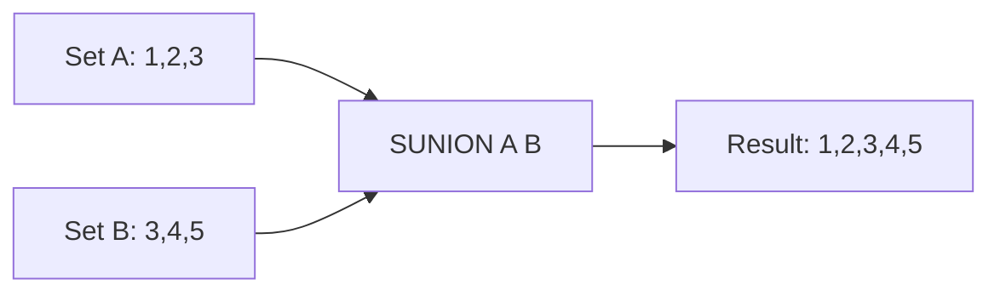

# How to Use SUNION in Redis to Find Union of Sets

Author: [nawazdhandala](https://www.github.com/nawazdhandala)

Tags: Redis, Set, SUNION, Command

Description: Learn how to use SUNION in Redis to combine multiple sets and retrieve all unique members across all provided sets without duplicates.

---

## Introduction

`SUNION` returns the union of two or more sets: all distinct members that appear in at least one of the provided sets. Duplicate members are automatically deduplicated since Redis sets only store unique values. The original sets are never modified.

## Syntax

```redis
SUNION key [key ...]
```

- Accepts one or more set keys.
- Returns all unique members across all sets.
- Missing keys are treated as empty sets.

## How It Works



## Basic Example

```redis
SADD team:backend  "alice" "bob" "charlie"
SADD team:frontend "charlie" "diana" "eve"

SUNION team:backend team:frontend
-- 1) "alice"
-- 2) "bob"
-- 3) "charlie"
-- 4) "diana"
-- 5) "eve"
```

`charlie` appears in both sets but only once in the result.

## Union of Three Sets

```redis
SADD tags:post:1 "redis" "database"
SADD tags:post:2 "redis" "performance"
SADD tags:post:3 "caching" "database"

SUNION tags:post:1 tags:post:2 tags:post:3
-- 1) "redis"
-- 2) "database"
-- 3) "performance"
-- 4) "caching"
```

## Real-World Use Cases

### All Active Users Across Shards

```redis
SADD active:shard:1 "u:1" "u:2" "u:3"
SADD active:shard:2 "u:4" "u:5"
SADD active:shard:3 "u:3" "u:6"

SUNION active:shard:1 active:shard:2 active:shard:3
-- 1) "u:1"
-- 2) "u:2"
-- 3) "u:3"
-- 4) "u:4"
-- 5) "u:5"
-- 6) "u:6"
```

### Aggregated Tag Cloud

```redis
SADD article:1:tags "go" "microservices" "docker"
SADD article:2:tags "docker" "kubernetes" "ci-cd"
SADD article:3:tags "go" "grpc" "protobuf"

SUNION article:1:tags article:2:tags article:3:tags
-- 1) "go"
-- 2) "microservices"
-- 3) "docker"
-- 4) "kubernetes"
-- 5) "ci-cd"
-- 6) "grpc"
-- 7) "protobuf"
```

### Merge Friend Lists

```redis
SADD friends:alice "carol" "dave"
SADD friends:bob   "dave" "eve"

SUNION friends:alice friends:bob
-- 1) "carol"
-- 2) "dave"
-- 3) "eve"
```

## Single Key Behavior

```redis
SADD myset "a" "b" "c"
SUNION myset
-- 1) "a"
-- 2) "b"
-- 3) "c"
```

With a single key, `SUNION` behaves the same as `SMEMBERS`.

## Missing Keys Are Treated as Empty

```redis
SADD existing "x" "y"

SUNION existing nonexistent
-- 1) "x"
-- 2) "y"
```

## Time Complexity

**O(N)** where N is the total number of elements across all input sets.

## SUNION vs SUNIONSTORE

| Command       | Returns | Stores result |
|---------------|---------|---------------|
| `SUNION`      | Members | No            |
| `SUNIONSTORE` | Count   | Yes           |

Use `SUNIONSTORE` when you need to persist or reuse the union.

## Summary

`SUNION` merges multiple sets and returns every unique member across all of them. It is a fast, read-only operation ideal for aggregating tags, combining member lists, or consolidating data spread across multiple sets. For persistent results, use `SUNIONSTORE`.
