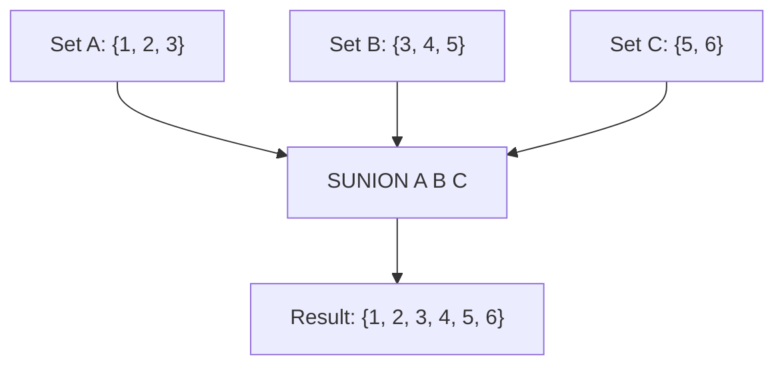

# How to Use SUNION and SUNIONSTORE in Redis for Set Union

Author: [nawazdhandala](https://www.github.com/nawazdhandala)

Tags: Redis, Set, SUNION, SUNIONSTORE, Command

Description: Learn how to use SUNION and SUNIONSTORE in Redis to compute the union of multiple sets, with examples for tag merging, permission aggregation, and combined feeds.

---

## How SUNION and SUNIONSTORE Work

`SUNION` returns all unique members that exist in any of the specified sets - the mathematical union. Duplicate members appearing in multiple sets are returned only once.

`SUNIONSTORE` does the same but instead of returning the result, it stores it in a destination key and returns the count of members in that result set.



## Syntax

```redis
SUNION key [key ...]
SUNIONSTORE destination key [key ...]
```

- `key [key ...]` - one or more set keys to union
- `destination` - key where SUNIONSTORE writes the result; overwrites if it exists

SUNION returns an array of all unique members. SUNIONSTORE returns the integer count of members in the result set.

## Examples

### Basic SUNION

```redis
SADD setA "a" "b" "c"
SADD setB "c" "d" "e"
SUNION setA setB
```

```text
1) "a"
2) "b"
3) "c"
4) "d"
5) "e"
```

"c" appears only once despite being in both sets.

### SUNION with Three Sets

```redis
SADD setC "e" "f" "g"
SUNION setA setB setC
```

```text
1) "a"
2) "b"
3) "c"
4) "d"
5) "e"
6) "f"
7) "g"
```

### Non-Existent Keys Are Treated as Empty Sets

```redis
DEL ghost
SUNION setA ghost
```

```text
1) "a"
2) "b"
3) "c"
```

No error - the non-existent key contributes nothing.

### SUNIONSTORE

```redis
SUNIONSTORE result setA setB
```

```text
(integer) 5
```

```redis
SMEMBERS result
```

```text
1) "a"
2) "b"
3) "c"
4) "d"
5) "e"
```

### SUNIONSTORE Overwrites Destination

```redis
SADD existing "x" "y"
SUNIONSTORE existing setA setB
SMEMBERS existing
```

```text
1) "a"
2) "b"
3) "c"
4) "d"
5) "e"
```

The previous contents of "existing" are replaced.

### SUNIONSTORE with Destination = Source

You can use a source key as the destination to extend a set in place.

```redis
SADD base "1" "2" "3"
SADD extra "3" "4" "5"
SUNIONSTORE base base extra
SMEMBERS base
```

```text
1) "1"
2) "2"
3) "3"
4) "4"
5) "5"
```

## Use Cases

### Merging Tag Sets

Combine tags from multiple authors or categories.

```redis
SADD author:1:tags "redis" "nosql"
SADD author:2:tags "redis" "database" "sql"
SUNION author:1:tags author:2:tags
```

```text
1) "redis"
2) "nosql"
3) "database"
4) "sql"
```

### Aggregating Permissions from Multiple Roles

A user with multiple roles inherits all permissions from each role.

```redis
SADD role:viewer "read"
SADD role:editor "read" "write" "publish"
SADD role:moderator "read" "write" "delete"
SUNIONSTORE user:5:effective_perms role:viewer role:editor role:moderator
SMEMBERS user:5:effective_perms
```

```text
1) "read"
2) "write"
3) "publish"
4) "delete"
```

### Combined Content Feed

Merge friend feeds into a single unified feed key.

```redis
SADD feed:friend1 "post:A" "post:B"
SADD feed:friend2 "post:B" "post:C" "post:D"
SUNIONSTORE feed:combined feed:friend1 feed:friend2
SCARD feed:combined
```

```text
(integer) 4
```

### Available Inventory Across Warehouses

```redis
SADD warehouse:east "sku:1" "sku:2" "sku:3"
SADD warehouse:west "sku:2" "sku:4" "sku:5"
SUNION warehouse:east warehouse:west
```

```text
1) "sku:1"
2) "sku:2"
3) "sku:3"
4) "sku:4"
5) "sku:5"
```

## Difference Between SUNION and SUNIONSTORE

| Aspect | SUNION | SUNIONSTORE |
|---|---|---|
| Output | Returns members directly | Stores result, returns count |
| Persistence | Temporary (in response) | Persistent (stored key) |
| Use when | One-time read | Reusable result or size needed |

## Performance Considerations

- SUNION is O(N) where N is the total number of members across all input sets.
- SUNIONSTORE has the same complexity plus writing the result set.
- For large sets, SUNIONSTORE is more efficient if the result will be read multiple times, as it avoids recomputing the union.

## Summary

`SUNION` computes the union of multiple Redis sets and returns all unique members across them. `SUNIONSTORE` does the same but persists the result to a new key, making it ideal for caching computed unions. Together they power permission aggregation, tag merging, feed combining, and any scenario where you need to flatten multiple sets into a single unique collection.
