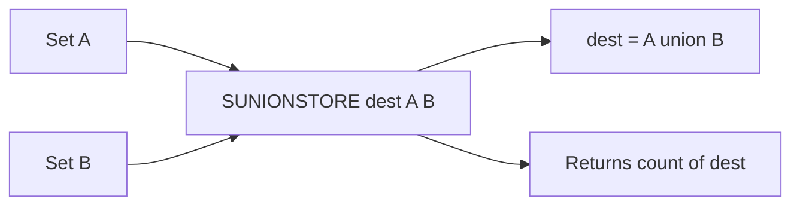

# How to Use SUNIONSTORE in Redis to Store Set Unions

Author: [nawazdhandala](https://www.github.com/nawazdhandala)

Tags: Redis, Set, SUNIONSTORE, Command

Description: Learn how to use SUNIONSTORE in Redis to combine multiple sets and persist the resulting union to a destination key for later use.

---

## Introduction

`SUNIONSTORE` computes the union of two or more sets and stores the result in a destination key, returning the number of elements in the union. It is the persistent counterpart of `SUNION`, useful when the merged result needs to be queried, iterated, or combined with further set operations.

## Syntax

```redis
SUNIONSTORE destination key [key ...]
```

- `destination` receives the union result.
- Returns the number of elements stored.
- If `destination` already exists, it is overwritten.

## How It Works



## Basic Example

```redis
SADD group:engineering "alice" "bob" "charlie"
SADD group:design      "charlie" "diana" "eve"

SUNIONSTORE group:all group:engineering group:design
-- (integer) 5

SMEMBERS group:all
-- 1) "alice"
-- 2) "bob"
-- 3) "charlie"
-- 4) "diana"
-- 5) "eve"
```

## Overwriting the Destination

```redis
SADD group:all "stale-member"

SUNIONSTORE group:all group:engineering group:design
-- (integer) 5

SMEMBERS group:all
-- "stale-member" is no longer present
```

The destination is always replaced with the freshly computed union.

## Real-World Use Cases

### Aggregated Subscriber List

Merge subscribers from multiple channels into a single set for broadcast:

```redis
SADD subscribers:channel:1 "u:1" "u:2" "u:3"
SADD subscribers:channel:2 "u:3" "u:4" "u:5"
SADD subscribers:channel:3 "u:5" "u:6"

SUNIONSTORE broadcast:all subscribers:channel:1 subscribers:channel:2 subscribers:channel:3
-- (integer) 6

SMEMBERS broadcast:all
-- 1) "u:1"
-- 2) "u:2"
-- 3) "u:3"
-- 4) "u:4"
-- 5) "u:5"
-- 6) "u:6"
```

### Unified Tag Index

Rebuild a master tag set from individual content items:

```redis
SADD item:1:tags "redis" "nosql" "database"
SADD item:2:tags "redis" "caching"
SADD item:3:tags "postgresql" "database"

SUNIONSTORE tags:all-items item:1:tags item:2:tags item:3:tags
-- (integer) 4

SMEMBERS tags:all-items
-- 1) "redis"
-- 2) "nosql"
-- 3) "database"
-- 4) "caching"
-- 5) "postgresql"
```

### Combine Role Members for Notification

```redis
SADD role:admin  "u:10" "u:11"
SADD role:editor "u:11" "u:12" "u:13"

SUNIONSTORE notify:privileged role:admin role:editor
-- (integer) 4

EXPIRE notify:privileged 120
-- Result is available for 2 minutes
```

## Chaining with Other Set Operations

```redis
SUNIONSTORE temp:combined set:a set:b

-- Now find which combined members are also in set:c
SINTER temp:combined set:c
```

## Time Complexity

**O(N)** where N is the total number of members across all input sets. Storage is O(K) where K is the union size.

## SUNIONSTORE vs SUNION

| Feature           | SUNION  | SUNIONSTORE       |
|-------------------|---------|-------------------|
| Returns           | Members | Integer (count)   |
| Stores result     | No      | Yes               |
| Supports EXPIRE   | No      | Yes               |
| Overwrites dest   | N/A     | Yes               |

## Summary

`SUNIONSTORE` merges multiple sets and saves the result to a destination key, returning the member count. It is the right tool when you need to cache a combined member list, apply a TTL to a merged set, or use the union result in subsequent set commands. The destination is always overwritten, making it safe to run repeatedly for fresh results.
