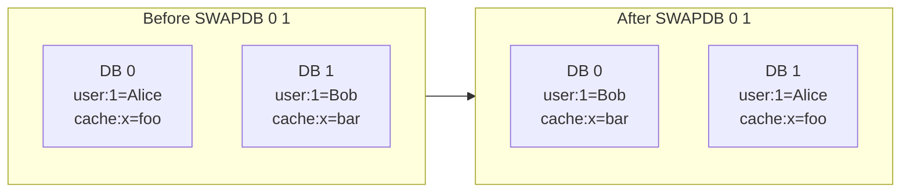

# How to Use SWAPDB in Redis to Swap Two Databases

Author: [nawazdhandala](https://www.github.com/nawazdhandala)

Tags: Redis, Swapdb, Database, Administration, Deployment

Description: Learn how to use SWAPDB to atomically swap the contents of two Redis databases, enabling zero-downtime cache refreshes and blue-green data deployments.

---

## Introduction

`SWAPDB` was introduced in Redis 4.0. It atomically swaps the datasets of two logical databases. After the swap, any connection that was using database A now sees the content of what was previously database B, and vice versa. The operation completes in O(1) time regardless of dataset size because Redis only swaps internal pointers.

## Basic Syntax

```redis
SWAPDB index1 index2
```

- `index1` and `index2` - the two database indices to swap (0 to max databases - 1)

Returns `OK` on success.

## How It Works



The swap is instantaneous and atomic from the perspective of all connected clients.

## Examples

### Basic swap

```redis
SELECT 0
SET version "v1"

SELECT 1
SET version "v2"

SELECT 0
SWAPDB 0 1

GET version
# "v2"

SELECT 1
GET version
# "v1"
```

### Zero-downtime cache refresh pattern

Load fresh data into a staging database while production runs on the current one, then swap:

```redis
# Step 1: populate staging database (db 1)
SELECT 1
FLUSHDB
SET product:1 "{name:Widget,price:9.99}"
SET product:2 "{name:Gadget,price:19.99}"
# ... load all fresh data ...

# Step 2: atomically promote staging to production
SELECT 0
SWAPDB 0 1
# All clients on db 0 now see the fresh data instantly
```

### Swap diagnostics

```redis
SELECT 0
DBSIZE
# (integer) 5000

SELECT 1
DBSIZE
# (integer) 4800

SWAPDB 0 1

SELECT 0
DBSIZE
# (integer) 4800

SELECT 1
DBSIZE
# (integer) 5000
```

## Blue-Green Deployment Pattern

```mermaid
sequenceDiagram
    participant Loader as Data Loader
    participant Redis
    participant App as Application (DB 0)

    App->>Redis: Reads from DB 0 (live)
    Loader->>Redis: SELECT 1; load new dataset into DB 1
    Loader->>Redis: SWAPDB 0 1
    Redis-->>App: DB 0 now contains new dataset
    App->>Redis: Reads from DB 0 (updated, zero downtime)
```

## Important Notes

- `SWAPDB` is O(1) -- it swaps pointers, not data, so it is safe to use even on very large databases.
- Any keyspace notifications subscribed to database 0 or 1 will now fire for the keys that landed in each respective slot after the swap.
- `SWAPDB` is not supported in Redis Cluster mode because Cluster only uses database 0.
- After a swap, TTLs and all key metadata are preserved -- they move with the keys.

## Common Errors

```redis
SWAPDB 0 16
# ERR invalid DB index
```

## Summary

`SWAPDB index1 index2` is an atomic, O(1) operation that exchanges the entire datasets of two Redis logical databases. Its primary use case is zero-downtime cache refreshes: load fresh data into a staging database and then swap it into production without any read interruption. The command is limited to standalone and Sentinel deployments and is not available in Redis Cluster.
