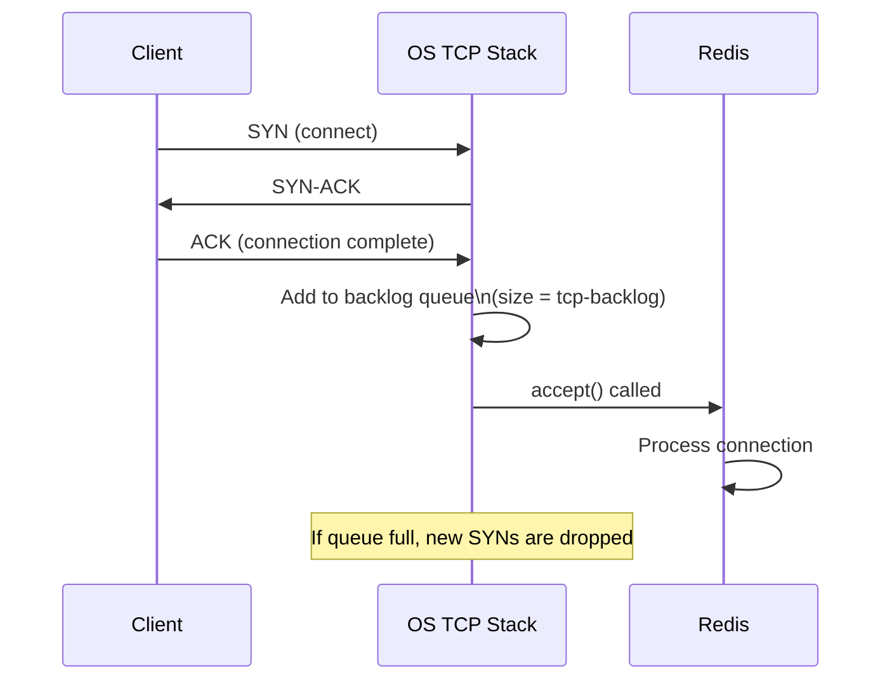
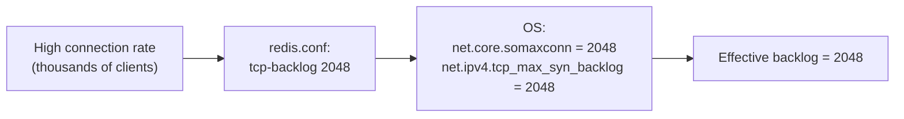

# How to Configure Redis tcp-backlog for High Connections

Author: [nawazdhandala](https://www.github.com/nawazdhandala)

Tags: Redis, Tcp-backlog, Network, Performance, Configuration

Description: Learn how to configure the Redis tcp-backlog setting to handle high connection rates, prevent connection drops, and tune the OS TCP listen queue for production workloads.

---

## Introduction

The `tcp-backlog` setting in Redis controls the size of the TCP listen backlog queue. This queue holds incoming connections that have completed the TCP handshake but have not yet been accepted by the Redis process. Under high connection rates, an undersized backlog causes new connections to be silently dropped by the OS.

## How the TCP Backlog Works



## Default Setting

Redis defaults to a `tcp-backlog` of 511:

```redis
tcp-backlog 511
```

## Changing tcp-backlog

In `redis.conf`:

```redis
tcp-backlog 1024
```

Or at runtime (note: only applies to the socket bind, effective on next restart for the listen backlog):

```redis
CONFIG SET tcp-backlog 1024
```

## OS-Level Requirement

The OS kernel also limits the listen backlog. The actual effective value is:

```
effective_backlog = min(tcp-backlog, net.core.somaxconn)
```

On Linux, check and increase `somaxconn`:

```bash
# Check current value
cat /proc/sys/net/core/somaxconn
# 128   (typical default - often too low)

# Increase temporarily
sysctl -w net.core.somaxconn=1024

# Make persistent
echo "net.core.somaxconn = 1024" >> /etc/sysctl.conf
sysctl -p
```

Also check the SYN backlog:

```bash
cat /proc/sys/net/ipv4/tcp_max_syn_backlog
# 256

sysctl -w net.ipv4.tcp_max_syn_backlog=1024
```

## Redis Warning on Startup

If `net.core.somaxconn` is lower than `tcp-backlog`, Redis logs a warning:

```
WARNING: The TCP backlog setting of 511 cannot be enforced because /proc/sys/net/core/somaxconn is set to the lower value of 128.
```

This warning is common on default Linux installations. Always fix `somaxconn` when increasing `tcp-backlog`.

## Recommended Configuration for High Connection Workloads



In `redis.conf`:

```redis
tcp-backlog 2048
```

On the host OS:

```bash
sysctl -w net.core.somaxconn=2048
sysctl -w net.ipv4.tcp_max_syn_backlog=2048
```

## Kubernetes: Setting somaxconn via initContainer

In Kubernetes, you can set kernel parameters with an initContainer:

```yaml
initContainers:
  - name: sysctl
    image: busybox
    command: ["sysctl", "-w", "net.core.somaxconn=1024"]
    securityContext:
      privileged: true
```

## Monitoring Connection Queue

Check for connection drops caused by a saturated backlog:

```bash
# On Linux, check for listen queue overflows
ss -lnt | grep :6379
# Recv-Q column shows pending connections in the backlog
# State: LISTEN  Recv-Q: 0  Send-Q: 511  Local Address:Port: *:6379

# Check for dropped connections
netstat -s | grep "SYNs to LISTEN"
# 5 SYNs to LISTEN sockets dropped
```

Also check Redis stats:

```redis
INFO stats
# total_connections_received:150000
# rejected_connections:0
```

A non-zero `rejected_connections` indicates Redis itself rejected connections (usually due to `maxclients`), while OS-level drops may not appear here.

## Summary

`tcp-backlog` controls the TCP listen queue size for incoming Redis connections. For high-concurrency workloads, increase it beyond the default 511 to prevent connection drops. Always match the OS `net.core.somaxconn` value to be at least as large as `tcp-backlog`, or Redis's setting will be silently capped. Monitor with `ss -lnt` and `INFO stats` to detect saturation.
