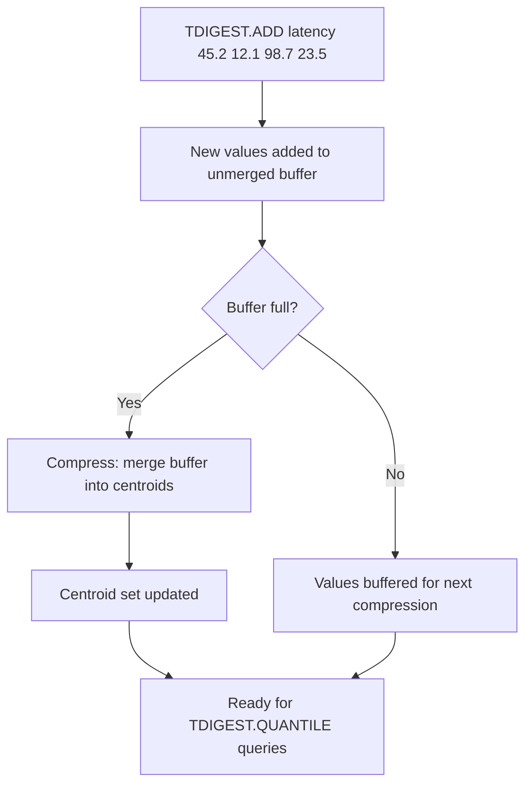

# How to Use TDIGEST.ADD in Redis T-Digest for Data Insertion

Author: [nawazdhandala](https://www.github.com/nawazdhandala)

Tags: Redis, RedisBloom, T-Digest, Probabilistic, Command

Description: Learn how to use TDIGEST.ADD in Redis to insert data points into a T-Digest structure for streaming percentile and quantile computation.

---

## How TDIGEST.ADD Works

`TDIGEST.ADD` inserts one or more numerical values into a T-Digest data structure. The values are absorbed into the digest's centroid representation. You can add values continuously as they are produced by a stream, and the T-Digest will maintain accurate percentile estimates without storing all individual data points.



## Syntax

```redis
TDIGEST.ADD key value [value ...]
```

- `key` - the T-Digest key (auto-created with default compression if not present)
- `value [value ...]` - one or more floating-point numbers to add

Returns `OK` on success.

## Examples

### Add a Single Value

```redis
TDIGEST.CREATE response_ms
TDIGEST.ADD response_ms 45.7
```

```text
OK
```

### Add Multiple Values at Once

```redis
TDIGEST.ADD response_ms 12.1 45.7 98.3 23.5 67.2 8.9 234.1
```

```text
OK
```

Adding multiple values in one call is more efficient than calling `TDIGEST.ADD` repeatedly.

### Continuous Stream Insertion

```redis
-- As requests come in, add their latency
TDIGEST.ADD api_latency 15.3
TDIGEST.ADD api_latency 22.1
TDIGEST.ADD api_latency 8.7
TDIGEST.ADD api_latency 145.2
TDIGEST.ADD api_latency 11.9
```

### Query Percentiles After Insertion

```redis
TDIGEST.ADD response_ms 10 20 30 40 50 60 70 80 90 100 150 200 500 1000

TDIGEST.QUANTILE response_ms 0.5 0.9 0.95 0.99
```

```text
1) "50"
2) "100"
3) "150"
4) "500"
```

## Auto-Creation Behavior

If the key does not exist, `TDIGEST.ADD` automatically creates a T-Digest with default compression (100):

```redis
-- No TDIGEST.CREATE needed
TDIGEST.ADD auto_digest 42.0 55.0 30.0
```

For production use, always create explicitly with `TDIGEST.CREATE` to control the compression parameter.

## Batch vs Single Insertions

Adding multiple values per call reduces command overhead:

```redis
-- Less efficient: one network round trip per value
TDIGEST.ADD latency 45.0
TDIGEST.ADD latency 22.0
TDIGEST.ADD latency 98.0

-- More efficient: one round trip for all values
TDIGEST.ADD latency 45.0 22.0 98.0
```

For high-throughput streams, batch values into groups of 10-100 per `TDIGEST.ADD` call.

## Use Cases

### API Response Time Monitoring

Record latency for each API request and query percentiles for SLA alerting:

```redis
TDIGEST.CREATE "latency:api:/users:2026-03-31"

-- On each API response
TDIGEST.ADD "latency:api:/users:2026-03-31" 45.2

-- Hourly alert check
TDIGEST.QUANTILE "latency:api:/users:2026-03-31" 0.99
-- If P99 > 500ms: trigger alert
```

### Error Rate Tracking

Track error response times separately to identify if errors are faster or slower than successes:

```redis
TDIGEST.CREATE error_latency
TDIGEST.ADD error_latency 102.5 98.3 310.1
```

### Database Query Profiling

Record query execution times and identify slow queries:

```redis
TDIGEST.CREATE "db_query_ms:select_users"

-- After each query execution
TDIGEST.ADD "db_query_ms:select_users" 12.4

-- Check for query degradation
TDIGEST.QUANTILE "db_query_ms:select_users" 0.95 0.99
```

### Order Value Analysis

Add order amounts for financial percentile reporting:

```redis
TDIGEST.CREATE order_amounts

-- On each completed order
TDIGEST.ADD order_amounts 29.99 149.50 9.99 499.00 75.00
```

### IoT Sensor Readings

Track sensor measurements for anomaly detection:

```redis
TDIGEST.CREATE "sensor:temperature:room1"

-- Every minute
TDIGEST.ADD "sensor:temperature:room1" 21.4

-- Detect anomalies above P99.9
TDIGEST.QUANTILE "sensor:temperature:room1" 0.999
-- Readings above this value are outliers
```

## Checking Insertion Status

After adding data, inspect the digest state:

```redis
TDIGEST.INFO response_ms
```

```text
1) "Compression"
2) (integer) 100
...
7) "Observations"
8) (integer) 14
9) "Total compressions"
10) (integer) 1
```

`Observations` shows how many values have been added total.

## Data Range

T-Digest accepts:
- Positive and negative floating-point numbers
- Zero
- Very large or very small values (no overflow issues)
- Duplicate values (counted separately in the weight)

## Summary

`TDIGEST.ADD` inserts one or more numerical values into a Redis T-Digest for approximate percentile computation. Add values in batches for efficiency. The structure is auto-created with default compression if the key does not exist. Use it for continuous stream ingestion of latency measurements, metric values, financial amounts, and any numerical data where you need percentile statistics without storing all individual values.
