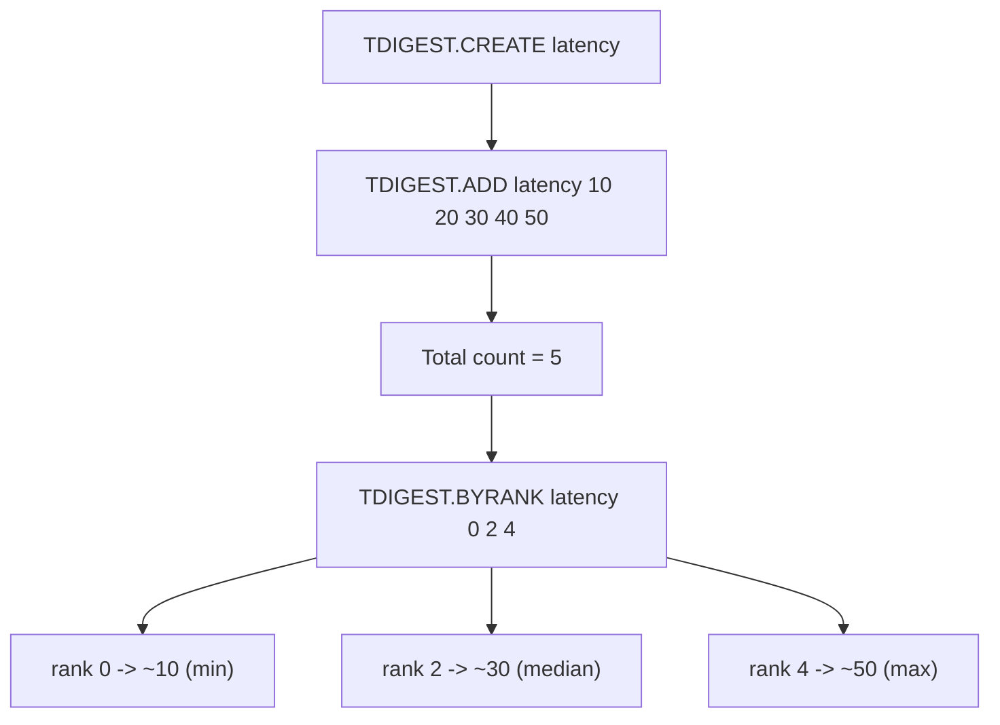

# How to Use TDIGEST.BYRANK in Redis T-Digest

Author: [nawazdhandala](https://www.github.com/nawazdhandala)

Tags: Redis, T-Digest, Percentile, Command

Description: Learn how to use TDIGEST.BYRANK in Redis to retrieve values at specific rank positions within a T-Digest sketch for percentile-style queries.

---

## How TDIGEST.BYRANK Works

`TDIGEST.BYRANK` returns the value at one or more rank positions in a T-Digest sketch. A rank of 0 is the smallest value; a rank of N-1 (where N is the total count) is the largest. This is the inverse of `TDIGEST.RANK`, which converts a value to a rank.



## Syntax

```redis
TDIGEST.BYRANK key rank [rank ...]
```

- `key` - the T-Digest sketch key
- `rank` - zero-based rank position(s) to query
- Returns one value per rank; returns `nan` for out-of-range ranks

## Examples

### Basic Rank Lookup

```redis
TDIGEST.CREATE response-times
TDIGEST.ADD response-times 15 25 35 45 55 65 75 85 95 105
TDIGEST.BYRANK response-times 0 4 9
```

```text
1) "15"
2) "55"
3) "105"
```

Rank 0 is the minimum, rank 4 is the middle value, rank 9 is the maximum.

### Multiple Ranks in One Call

```redis
TDIGEST.BYRANK latency 0 1 2 3 4
```

```text
1) "15"
2) "25"
3) "35"
4) "45"
5) "55"
```

### Out-of-Range Rank Returns nan

```redis
TDIGEST.ADD scores 10 20 30
TDIGEST.BYRANK scores 5
```

```text
1) "nan"
```

Rank 5 does not exist when the count is 3.

### Querying Quartile Ranks

With a sketch of 100 values, ranks 24, 49, and 74 correspond to Q1, Q2, and Q3.

```redis
TDIGEST.BYRANK throughput 24 49 74
```

```text
1) "201.5"
2) "412.3"
3) "689.1"
```

## Use Cases

### Identifying Slowest Requests

Find the top 5 slowest request latencies when the sketch holds 1000 observations:

```redis
TDIGEST.BYRANK api:latency 995 996 997 998 999
```

### Splitting Data into Equal Buckets

Divide a distribution into 10 equal parts by querying every 10th rank:

```redis
TDIGEST.BYRANK sensor:readings 0 9 19 29 39 49 59 69 79 89 99
```

### Correlating with TDIGEST.RANK

Confirm a round-trip: get the rank of a value, then retrieve the value at that rank.

```redis
TDIGEST.ADD prices 10 20 30 40 50
TDIGEST.RANK prices 30
-- Returns approximate rank, e.g. 2
TDIGEST.BYRANK prices 2
-- Returns ~30
```

## TDIGEST.BYRANK vs TDIGEST.QUANTILE

Both return values at positions in the distribution, but they use different scales.

```redis
-- BYRANK uses absolute rank (0 to count-1)
TDIGEST.BYRANK latency 99

-- QUANTILE uses fractional rank (0.0 to 1.0)
TDIGEST.QUANTILE latency 0.99
```

Use `TDIGEST.BYRANK` when you know the exact item position. Use `TDIGEST.QUANTILE` for percentage-based percentiles.

## Performance Considerations

- T-Digest approximations improve at the tails; central values may be less precise.
- Querying multiple ranks in one call is more efficient than individual calls.
- Compression level (set at `TDIGEST.CREATE`) affects accuracy vs memory trade-off.

## Summary

`TDIGEST.BYRANK` retrieves the approximate value at one or more zero-based rank positions in a T-Digest sketch. It is the rank-to-value inverse of `TDIGEST.RANK` and a useful complement to `TDIGEST.QUANTILE` when you need to inspect specific positions in a distribution rather than fractional percentiles.
