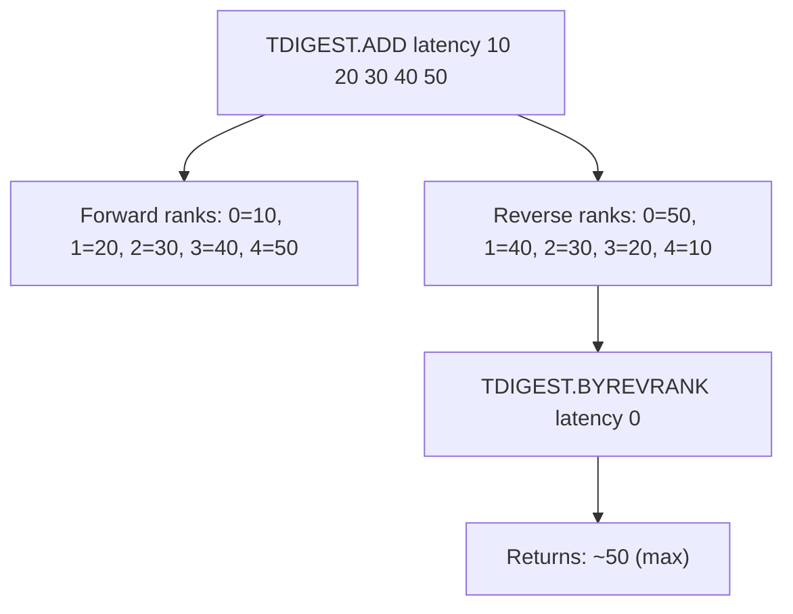

# How to Use TDIGEST.BYREVRANK in Redis T-Digest

Author: [nawazdhandala](https://www.github.com/nawazdhandala)

Tags: Redis, T-Digest, Percentile, Command

Description: Learn how to use TDIGEST.BYREVRANK in Redis to retrieve values at reverse rank positions in a T-Digest sketch, starting from the largest value.

---

## How TDIGEST.BYREVRANK Works

`TDIGEST.BYREVRANK` returns values at reverse rank positions in a T-Digest sketch. Reverse rank 0 is the largest value, reverse rank 1 is the second largest, and so on. This is the mirror of `TDIGEST.BYRANK`, which starts from the smallest value.



## Syntax

```redis
TDIGEST.BYREVRANK key rank [rank ...]
```

- `key` - the T-Digest sketch key
- `rank` - zero-based reverse rank position(s); 0 is the largest value
- Returns one value per rank; returns `nan` for out-of-range positions

## Examples

### Getting the Largest Values

```redis
TDIGEST.CREATE response-times
TDIGEST.ADD response-times 50 120 300 480 750 1200
TDIGEST.BYREVRANK response-times 0 1 2
```

```text
1) "1200"
2) "750"
3) "480"
```

Reverse rank 0 is the slowest request (1200 ms), rank 1 is the second slowest.

### Comparing BYRANK and BYREVRANK

```redis
TDIGEST.ADD scores 10 20 30 40 50

-- Forward: smallest first
TDIGEST.BYRANK scores 0
-- Returns: ~10

-- Reverse: largest first
TDIGEST.BYREVRANK scores 0
-- Returns: ~50
```

### Top-N Outlier Detection

Find the 5 highest latency observations from a sketch of 10,000 records:

```redis
TDIGEST.BYREVRANK api:latency 0 1 2 3 4
```

```text
1) "4821.3"
2) "4190.6"
3) "3975.2"
4) "3801.1"
5) "3654.8"
```

### Out-of-Range Returns nan

```redis
TDIGEST.ADD temps 22.1 23.4 24.8
TDIGEST.BYREVRANK temps 10
```

```text
1) "nan"
```

## Use Cases

### SLO Breach Investigation

When an SLO is breached, quickly find the worst-offending values:

```redis
TDIGEST.BYREVRANK checkout:latency 0 1 2 3 4 5 6 7 8 9
```

### Building a Worst-Offenders Report

Combine reverse rank lookups with metadata to identify problematic samples:

```redis
TDIGEST.BYREVRANK db:query-time 0 1 2
```

```text
1) "9830.4"
2) "8751.2"
3) "7422.0"
```

These values indicate queries that exceeded the acceptable threshold by the largest margin.

### Tail Latency Monitoring

Monitor the top 1% of latencies by querying the last few reverse ranks when count is known:

```redis
-- If 1000 items in sketch, reverse rank 9 = value at rank 990
TDIGEST.BYREVRANK latency:service 0 4 9
```

## TDIGEST.BYREVRANK vs TDIGEST.BYRANK

| Feature | TDIGEST.BYRANK | TDIGEST.BYREVRANK |
|---|---|---|
| Rank 0 | Minimum value | Maximum value |
| Direction | Ascending | Descending |
| Use case | Bottom-N analysis | Top-N analysis |

```redis
-- Smallest 3
TDIGEST.BYRANK distribution 0 1 2

-- Largest 3
TDIGEST.BYREVRANK distribution 0 1 2
```

## Summary

`TDIGEST.BYREVRANK` retrieves approximate values at reverse-ordered rank positions in a T-Digest sketch, where rank 0 is the maximum value. It is ideal for top-N outlier detection, tail latency analysis, and SLO breach investigations where you need to identify the worst-performing values in a distribution without scanning all raw data.
