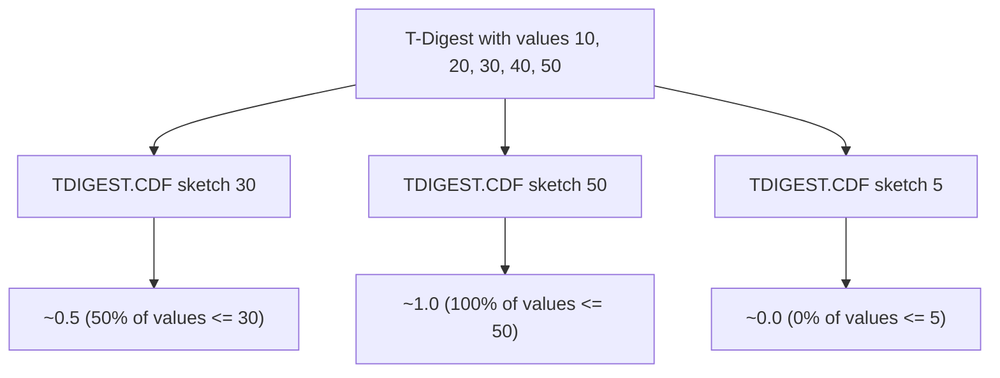

# How to Use TDIGEST.CDF in Redis T-Digest

Author: [nawazdhandala](https://www.github.com/nawazdhandala)

Tags: Redis, T-Digest, Statistics, Command

Description: Learn how to use TDIGEST.CDF in Redis to compute the cumulative distribution function, returning the fraction of values below a given threshold.

---

## How TDIGEST.CDF Works

`TDIGEST.CDF` (Cumulative Distribution Function) returns the fraction of values in a T-Digest sketch that are less than or equal to a given value. The result is a number between 0.0 and 1.0. This is the inverse of `TDIGEST.QUANTILE`: given a value, it returns the percentile; given a percentile, `TDIGEST.QUANTILE` returns the value.



## Syntax

```redis
TDIGEST.CDF key value [value ...]
```

- `key` - the T-Digest sketch key
- `value` - one or more values to compute the CDF for
- Returns a fractional probability between 0.0 and 1.0 for each value

## Examples

### Basic CDF Query

```redis
TDIGEST.CREATE latency
TDIGEST.ADD latency 10 20 30 40 50 60 70 80 90 100
TDIGEST.CDF latency 50
```

```text
1) "0.5"
```

Half of the values are at or below 50.

### Multiple Values in One Call

```redis
TDIGEST.CDF latency 20 50 80 100
```

```text
1) "0.2"
2) "0.5"
3) "0.8"
4) "1"
```

### Value Below the Minimum

```redis
TDIGEST.CDF latency 0
```

```text
1) "0"
```

### Value Above the Maximum

```redis
TDIGEST.CDF latency 999
```

```text
1) "1"
```

### CDF of Fractional Values

```redis
TDIGEST.ADD temps 22.5 23.1 24.8 26.3 28.0
TDIGEST.CDF temps 25.0
```

```text
1) "0.6"
```

## Use Cases

### SLO Compliance Check

Determine what fraction of requests completed within the SLO target of 200 ms:

```redis
TDIGEST.CDF api:latency 200
```

```text
1) "0.987"
```

98.7% of requests completed within 200 ms.

### Threshold Alerting

Alert when the fraction of errors exceeding a severity threshold crosses a limit:

```redis
TDIGEST.CDF error:scores 7.5
-- If result < 0.95, more than 5% of errors are high severity
```

### Comparing Two Distributions

Check if distribution A has more values below a threshold than distribution B:

```redis
TDIGEST.CDF service-a:latency 100
TDIGEST.CDF service-b:latency 100
```

```text
1) "0.92"
-- vs --
1) "0.78"
```

Service A handles 92% of requests under 100 ms vs Service B at 78%.

### Finding the Percentile of a Known Value

If you know a specific measurement (e.g., the SLO boundary), `TDIGEST.CDF` tells you what percentile it falls at:

```redis
-- How many requests completed under 500ms?
TDIGEST.CDF checkout:latency 500
```

## TDIGEST.CDF vs TDIGEST.QUANTILE

These commands are inverses of each other:

```redis
-- CDF: value -> fraction
TDIGEST.CDF latency 100
-- Returns: 0.95

-- QUANTILE: fraction -> value
TDIGEST.QUANTILE latency 0.95
-- Returns: ~100
```

Use `TDIGEST.CDF` when you have a threshold and want to know how much of your data falls below it. Use `TDIGEST.QUANTILE` when you want to find the value at a specific percentile.

## Performance Considerations

- Each value query is O(log N) where N is the number of centroids (compression).
- Querying multiple values in one call reduces round-trip overhead.
- Results are approximate; accuracy is highest at the tails and lower near the median.

## Summary

`TDIGEST.CDF` answers "what fraction of my data is at or below this value?" for one or more thresholds in a single command. It is the complement to `TDIGEST.QUANTILE` and is particularly useful for SLO compliance checks, threshold alerting, and comparing distributions without storing raw data.
