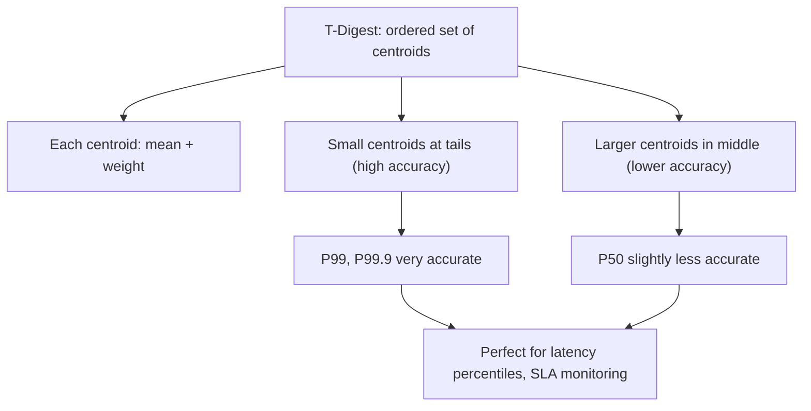

# How to Use TDIGEST.CREATE in Redis T-Digest

Author: [nawazdhandala](https://www.github.com/nawazdhandala)

Tags: Redis, RedisBloom, T-Digest, Probabilistic, Command

Description: Learn how to use TDIGEST.CREATE in Redis to initialize a T-Digest data structure for memory-efficient approximate percentile and quantile computation.

---

## What Is T-Digest?

T-Digest is a probabilistic data structure for computing approximate percentiles and quantiles over a data stream with high accuracy at the distribution tails (P99, P99.9) and lower accuracy near the median (P50). It is far more memory-efficient than storing all data points. Redis implements T-Digest in the RedisBloom module.



## Syntax

```redis
TDIGEST.CREATE key [COMPRESSION compression]
```

- `key` - the T-Digest key
- `COMPRESSION` - controls the number of centroids (default 100; higher = more accurate but more memory)

Returns `OK` on success. Returns an error if the key already exists.

## Default vs Custom Compression

```redis
-- Default compression (100)
TDIGEST.CREATE response_times

-- Custom compression for higher accuracy
TDIGEST.CREATE latencies COMPRESSION 200

-- Lower compression for minimal memory
TDIGEST.CREATE rough_stats COMPRESSION 50
```

## Examples

### Create a Default T-Digest

```redis
TDIGEST.CREATE api_latency
```

```text
OK
```

### Create with Custom Compression

```redis
TDIGEST.CREATE sla_latency COMPRESSION 300
```

Higher compression retains more centroids, improving accuracy at all quantiles at the cost of more memory.

### Verify Creation

```redis
TDIGEST.INFO api_latency
```

```text
1) "Compression"
2) (integer) 100
3) "Capacity"
4) (integer) 610
5) "Merged nodes"
6) (integer) 0
7) "Unmerged nodes"
8) (integer) 0
9) "Merged weight"
10) "0"
11) "Unmerged weight"
12) "0"
13) "Observations"
14) (integer) 0
15) "Total compressions"
16) (integer) 0
17) "Memory usage"
18) (integer) 5520
```

Empty T-Digest with no observations yet.

## Understanding Compression

The `COMPRESSION` parameter controls the maximum number of centroids:
- Maximum centroids = `COMPRESSION * 6 + 10` (approximately)
- Default (100) allows up to ~610 centroids
- Higher compression = better accuracy = more memory

### Accuracy vs Memory Trade-off

| Compression | Approximate Memory | Tail Accuracy |
|-------------|-------------------|---------------|
| 50 | ~3 KB | Good |
| 100 (default) | ~6 KB | Very good |
| 200 | ~12 KB | Excellent |
| 500 | ~30 KB | Near exact |

For most use cases, the default compression of 100 provides excellent tail accuracy (P99, P99.9) with very low memory overhead.

## When to Create with Higher Compression

Use higher compression when:
- You need accurate P50 (median) estimates
- Data volume is small and memory is not a concern
- You are computing extremely precise SLA percentiles (P99.99)

```redis
-- SLA monitoring requiring P99.99 accuracy
TDIGEST.CREATE sla_tracker COMPRESSION 500
```

## After Creation

Once created, add values with `TDIGEST.ADD`:

```redis
TDIGEST.CREATE response_ms
TDIGEST.ADD response_ms 12.5 45.2 8.1 123.4 67.8
```

Then query percentiles with `TDIGEST.QUANTILE`:

```redis
TDIGEST.QUANTILE response_ms 0.5 0.95 0.99
```

## Typical Use Cases

### API Latency Monitoring

```redis
TDIGEST.CREATE "latency:api:2026-03-31"
```

Record each request latency and query P99 for SLA alerting.

### Database Query Performance

```redis
TDIGEST.CREATE db_query_ms
```

Track query execution times and identify slow-query outliers at P99.9.

### User Session Duration

```redis
TDIGEST.CREATE session_duration_sec
```

Compute median and percentile session lengths for user behavior analytics.

### Order Value Distribution

```redis
TDIGEST.CREATE order_values_usd COMPRESSION 200
```

Analyze order value percentiles for financial reporting.

## T-Digest vs Exact Percentiles

| Approach | Memory | Accuracy | Scale |
|----------|--------|---------|-------|
| Store all values, sort | O(N) | Exact | Limited by memory |
| Redis Sorted Set + ZRANK | O(N) | Exact | Limited by memory |
| T-Digest | O(compression) | Approximate | Unlimited stream |

For a million data points:
- Storing all values: ~4 MB (float32)
- T-Digest (default): ~6 KB

That is 700x less memory with accuracy within 1% at P99.

## Summary

`TDIGEST.CREATE` initializes an empty Redis T-Digest data structure for approximate percentile computation. The `COMPRESSION` parameter controls the accuracy-memory tradeoff; the default of 100 is suitable for most latency and metric monitoring use cases. T-Digest excels at tail percentiles (P99, P99.9) with minimal memory, making it ideal for API latency tracking, SLA monitoring, and streaming analytics.
