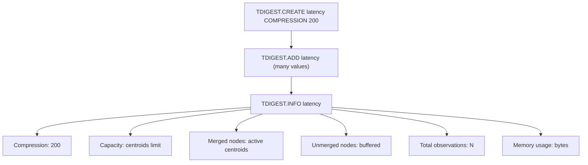
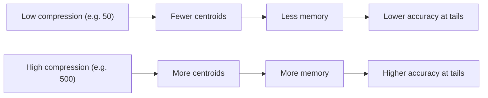

# How to Use TDIGEST.INFO in Redis T-Digest

Author: [nawazdhandala](https://www.github.com/nawazdhandala)

Tags: Redis, T-Digest, Monitoring, Command

Description: Learn how to use TDIGEST.INFO in Redis to inspect T-Digest sketch metadata including compression, centroid count, memory usage, and total observations.

---

## How TDIGEST.INFO Works

`TDIGEST.INFO` returns detailed metadata about a T-Digest sketch. This includes the compression parameter, the number of centroids currently stored, total observations added, memory size, and whether the sketch has been trimmed. It is the primary diagnostic tool for understanding the state of a sketch.



## Syntax

```redis
TDIGEST.INFO key
```

- `key` - the T-Digest sketch key
- Returns a list of field-value pairs describing the sketch

## Fields Returned

| Field | Description |
|---|---|
| Compression | The compression parameter set at creation |
| Capacity | Maximum number of centroids the sketch can hold |
| Merged nodes | Number of centroids that have been merged |
| Unmerged nodes | Number of buffered nodes not yet merged |
| Merged weight | Sum of weights of merged centroids |
| Unmerged weight | Sum of weights of unmerged nodes |
| Observations | Total number of values added |
| Total compressions | How many merge/compression passes have occurred |
| Memory usage | Bytes used by the sketch in memory |

## Examples

### Inspect a Newly Created Sketch

```redis
TDIGEST.CREATE latency COMPRESSION 100
TDIGEST.INFO latency
```

```text
 1) "Compression"
 2) (integer) 100
 3) "Capacity"
 4) (integer) 610
 5) "Merged nodes"
 6) (integer) 0
 7) "Unmerged nodes"
 8) (integer) 0
 9) "Merged weight"
10) "0"
11) "Unmerged weight"
12) "0"
13) "Observations"
14) (integer) 0
15) "Total compressions"
16) (integer) 0
17) "Memory usage"
18) (integer) 5040
```

### After Adding Values

```redis
TDIGEST.ADD latency 10 20 30 40 50 60 70 80 90 100
TDIGEST.INFO latency
```

```text
 1) "Compression"
 2) (integer) 100
 3) "Capacity"
 4) (integer) 610
 5) "Merged nodes"
 6) (integer) 10
 7) "Unmerged nodes"
 8) (integer) 0
 9) "Merged weight"
10) "10"
11) "Unmerged weight"
12) "0"
13) "Observations"
14) (integer) 10
15) "Total compressions"
16) (integer) 1
17) "Memory usage"
18) (integer) 5248
```

### Default Compression

When created without specifying compression:

```redis
TDIGEST.CREATE default-sketch
TDIGEST.INFO default-sketch
```

```text
 1) "Compression"
 2) (integer) 100
```

The default compression is 100.

## Use Cases

### Diagnosing Accuracy Issues

If percentile estimates seem inaccurate, check the compression level. Higher compression means more centroids and better accuracy at the cost of memory.

```redis
TDIGEST.INFO high-accuracy-sketch
-- Compression: 500 means up to 3060 centroids
```

### Capacity Planning

Monitor memory usage across many sketches:

```redis
TDIGEST.INFO service:latency:p99
-- Memory usage: 8192
```

### Verifying Data Ingestion

Confirm that a sketch received the expected number of observations after a data load:

```redis
TDIGEST.INFO daily-metrics
-- Observations: 86400 (one per second for a day)
```

### Understanding Merge Behavior

Unmerged nodes accumulate until a compression pass occurs. A high number of unmerged nodes before a query is normal - they are merged on demand.

```redis
TDIGEST.INFO streaming-latency
-- Unmerged nodes: 150 (will merge when queried)
```

## Compression and Accuracy Trade-off



```redis
-- Low memory, approximate results
TDIGEST.CREATE fast-sketch COMPRESSION 50

-- High accuracy, more memory
TDIGEST.CREATE accurate-sketch COMPRESSION 500

TDIGEST.INFO fast-sketch
-- Capacity: ~306

TDIGEST.INFO accurate-sketch
-- Capacity: ~3060
```

## Summary

`TDIGEST.INFO` provides a complete view of a T-Digest sketch's configuration and state, including compression, centroid counts, total observations, and memory usage. Use it to verify data ingestion, diagnose accuracy problems, plan memory capacity, and understand the internal state of your sketches.
