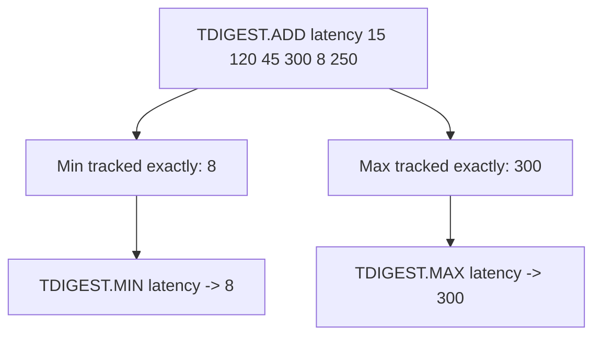

# How to Use TDIGEST.MAX and TDIGEST.MIN in Redis

Author: [nawazdhandala](https://www.github.com/nawazdhandala)

Tags: Redis, T-Digest, Statistics, Command

Description: Learn how to use TDIGEST.MAX and TDIGEST.MIN in Redis to retrieve the exact maximum and minimum values stored in a T-Digest sketch.

---

## How TDIGEST.MAX and TDIGEST.MIN Work

Unlike most T-Digest operations that return approximations, `TDIGEST.MAX` and `TDIGEST.MIN` return the exact maximum and minimum values that have been added to the sketch. T-Digest preserves the extremes with full accuracy, making these commands reliable for boundary checks.



## Syntax

```redis
TDIGEST.MIN key
TDIGEST.MAX key
```

- `key` - the T-Digest sketch key
- Returns the exact minimum or maximum value
- Returns `nan` if the sketch is empty

## Examples

### Basic Min and Max

```redis
TDIGEST.CREATE response-times
TDIGEST.ADD response-times 45 120 15 300 8 250 90
TDIGEST.MIN response-times
TDIGEST.MAX response-times
```

```text
"8"
"300"
```

### Empty Sketch Returns nan

```redis
TDIGEST.CREATE empty-sketch
TDIGEST.MIN empty-sketch
TDIGEST.MAX empty-sketch
```

```text
"nan"
"nan"
```

### Monitoring Sensor Extremes

```redis
TDIGEST.CREATE temperature:sensor-1
TDIGEST.ADD temperature:sensor-1 22.5 23.1 21.8 24.9 20.3 26.1
TDIGEST.MIN temperature:sensor-1
TDIGEST.MAX temperature:sensor-1
```

```text
"20.3"
"26.1"
```

### After Merging Sketches

```redis
TDIGEST.CREATE region-east
TDIGEST.ADD region-east 10 200 50
TDIGEST.CREATE region-west
TDIGEST.ADD region-west 5 350 75
TDIGEST.MERGE combined 2 region-east region-west
TDIGEST.MIN combined
TDIGEST.MAX combined
```

```text
"5"
"350"
```

## Use Cases

### Anomaly Detection

Detect outliers by comparing incoming values against the observed range:

```redis
TDIGEST.MIN api:latency
TDIGEST.MAX api:latency
-- If new value > MAX * 2, flag as anomaly
```

### Dashboard Range Display

Show the observed range of a metric in a monitoring dashboard:

```redis
TDIGEST.MIN checkout:duration
TDIGEST.MAX checkout:duration
```

```text
"210"
"8500"
```

The checkout duration ranged from 210 ms to 8,500 ms.

### Validating Data Ingestion

After loading historical data into a sketch, confirm the range matches expectations:

```redis
TDIGEST.MIN historical:prices
TDIGEST.MAX historical:prices
```

### Alert on Absolute Extremes

```redis
-- Alert if max latency exceeds hard threshold
TDIGEST.MAX service:latency
-- If result > 5000, trigger alert
```

## TDIGEST.MAX / TDIGEST.MIN vs TDIGEST.BYRANK

`TDIGEST.BYRANK` at rank 0 also returns the minimum, and at rank N-1 returns the maximum, but as approximations. `TDIGEST.MIN` and `TDIGEST.MAX` are always exact.

```redis
TDIGEST.ADD demo 10 20 30 40 50

-- Exact
TDIGEST.MIN demo
-- Returns: "10"

TDIGEST.MAX demo
-- Returns: "50"

-- Approximate (same values here due to small dataset)
TDIGEST.BYRANK demo 0
-- Returns: ~10

TDIGEST.BYRANK demo 4
-- Returns: ~50
```

For large datasets with many centroids, prefer `TDIGEST.MIN` and `TDIGEST.MAX` when you need the true boundary values.

## TDIGEST.MAX / TDIGEST.MIN vs TDIGEST.QUANTILE

```redis
-- QUANTILE 0.0 approximates the minimum
TDIGEST.QUANTILE demo 0.0
-- QUANTILE 1.0 approximates the maximum
TDIGEST.QUANTILE demo 1.0

-- MIN and MAX return exact values
TDIGEST.MIN demo
TDIGEST.MAX demo
```

## Performance Considerations

- Both commands are O(1) - the min and max are stored separately in the sketch structure.
- They do not trigger a centroid merge pass.
- Accuracy is guaranteed regardless of the compression parameter.

## Summary

`TDIGEST.MAX` and `TDIGEST.MIN` return the exact maximum and minimum values from a T-Digest sketch in O(1) time. Unlike other T-Digest operations that produce approximations, these commands preserve boundary values with full precision, making them reliable for anomaly detection, range validation, and dashboard displays.
