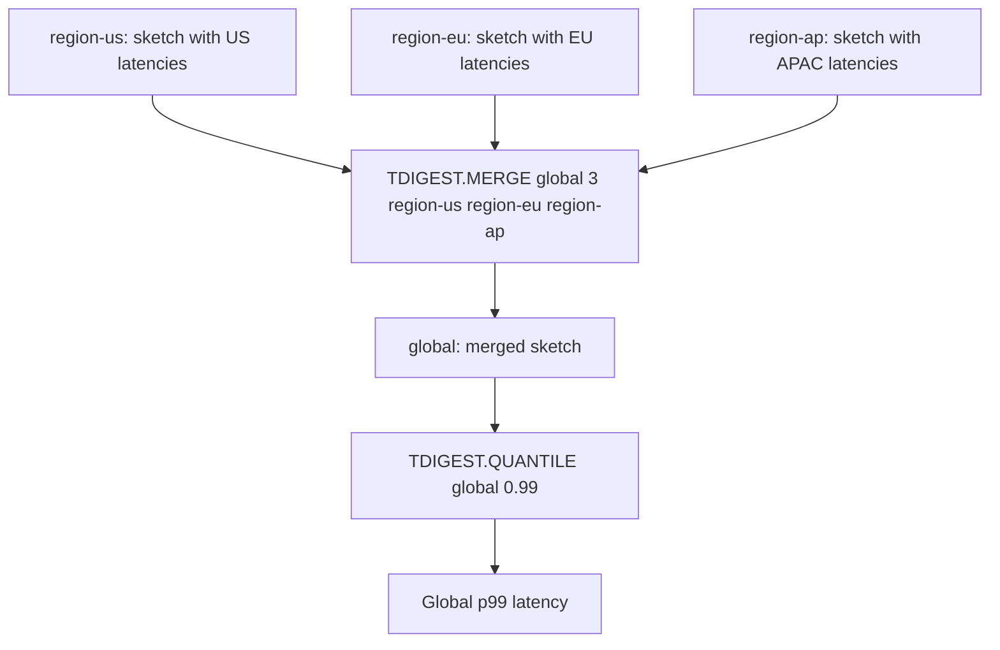

# How to Use TDIGEST.MERGE in Redis to Combine T-Digests

Author: [nawazdhandala](https://www.github.com/nawazdhandala)

Tags: Redis, T-Digest, Statistics, Command

Description: Learn how to use TDIGEST.MERGE in Redis to combine multiple T-Digest sketches into one, enabling distributed percentile computation across data shards.

---

## How TDIGEST.MERGE Works

`TDIGEST.MERGE` merges multiple source T-Digest sketches into a destination sketch. This is the key operation for distributed percentile computation: each shard or time window maintains its own sketch, and they are merged for global percentile queries. The merge preserves accuracy within the bounds of the destination compression parameter.



## Syntax

```redis
TDIGEST.MERGE destination numkeys source [source ...] [COMPRESSION compression] [OVERRIDE]
```

- `destination` - key to write the merged sketch to
- `numkeys` - number of source keys
- `source` - one or more source T-Digest keys
- `COMPRESSION` - compression parameter for the destination (optional)
- `OVERRIDE` - if specified, overwrites an existing destination; default behavior is to merge into it

## Examples

### Basic Merge of Two Sketches

```redis
TDIGEST.CREATE shard-1
TDIGEST.ADD shard-1 10 20 30 40 50
TDIGEST.CREATE shard-2
TDIGEST.ADD shard-2 60 70 80 90 100
TDIGEST.MERGE combined 2 shard-1 shard-2
TDIGEST.QUANTILE combined 0.5
```

```text
"OK"
"55"
```

### Merging Three Regional Sketches

```redis
TDIGEST.CREATE latency:us
TDIGEST.ADD latency:us 100 200 150 300
TDIGEST.CREATE latency:eu
TDIGEST.ADD latency:eu 120 180 220 400
TDIGEST.CREATE latency:ap
TDIGEST.ADD latency:ap 80 160 240 350
TDIGEST.MERGE latency:global 3 latency:us latency:eu latency:ap
TDIGEST.QUANTILE latency:global 0.99
```

```text
"OK"
"395.75"
```

### Merge with Custom Compression

```redis
TDIGEST.MERGE global-high-accuracy 2 shard-1 shard-2 COMPRESSION 500
TDIGEST.INFO global-high-accuracy
```

```text
1) "Compression"
2) (integer) 500
```

### Merge with OVERRIDE

By default, merging into an existing key accumulates all data. OVERRIDE replaces it:

```redis
TDIGEST.MERGE snapshot 2 shard-1 shard-2 OVERRIDE
```

Each call with OVERRIDE produces a fresh snapshot of the current source state.

### Merge into Existing Destination (Accumulate)

```redis
TDIGEST.CREATE rolling
TDIGEST.ADD rolling 10 20 30
TDIGEST.MERGE rolling 1 shard-1
-- rolling now contains data from both sets
```

## Use Cases

### Distributed Percentile Aggregation

Each application instance writes to its own sketch. A background job merges them for global statistics:

```redis
-- Per-instance sketches
TDIGEST.ADD latency:instance-1 ...
TDIGEST.ADD latency:instance-2 ...
TDIGEST.ADD latency:instance-3 ...

-- Merge for global p99
TDIGEST.MERGE latency:global 3 latency:instance-1 latency:instance-2 latency:instance-3 OVERRIDE
TDIGEST.QUANTILE latency:global 0.99
```

### Time-Window Aggregation

Maintain per-hour sketches and merge for daily views:

```redis
TDIGEST.MERGE daily:2026-03-31 24 latency:h00 latency:h01 latency:h02 latency:h03 latency:h04 latency:h05 latency:h06 latency:h07 latency:h08 latency:h09 latency:h10 latency:h11 latency:h12 latency:h13 latency:h14 latency:h15 latency:h16 latency:h17 latency:h18 latency:h19 latency:h20 latency:h21 latency:h22 latency:h23 OVERRIDE
TDIGEST.QUANTILE daily:2026-03-31 0.95
```

### Comparing Before and After Deploys

```redis
-- Merge baseline sketches
TDIGEST.MERGE pre-deploy 2 shard-a:before shard-b:before OVERRIDE
-- Merge post-deploy sketches
TDIGEST.MERGE post-deploy 2 shard-a:after shard-b:after OVERRIDE

TDIGEST.QUANTILE pre-deploy 0.99
TDIGEST.QUANTILE post-deploy 0.99
```

## Performance Considerations

- Merge is O(N log N) where N is the total number of centroids across all sources.
- Using OVERRIDE avoids unbounded growth in the destination sketch.
- Set destination compression to at least as high as the source compression for best accuracy.
- Source sketches are not modified by the merge.

## Summary

`TDIGEST.MERGE` combines multiple T-Digest sketches into a single destination sketch, enabling distributed percentile computation across shards, regions, or time windows. The `OVERRIDE` option ensures the destination reflects only the current sources rather than accumulating over time, and the `COMPRESSION` option lets you tune the accuracy of the merged result.
