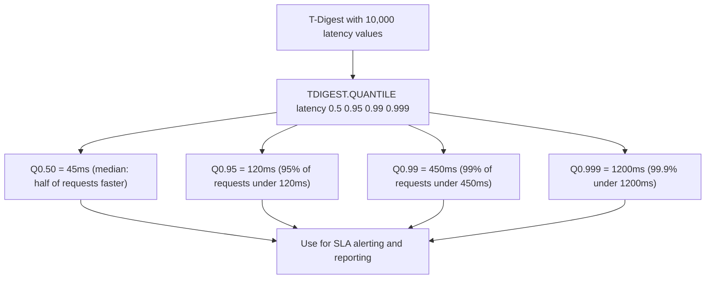
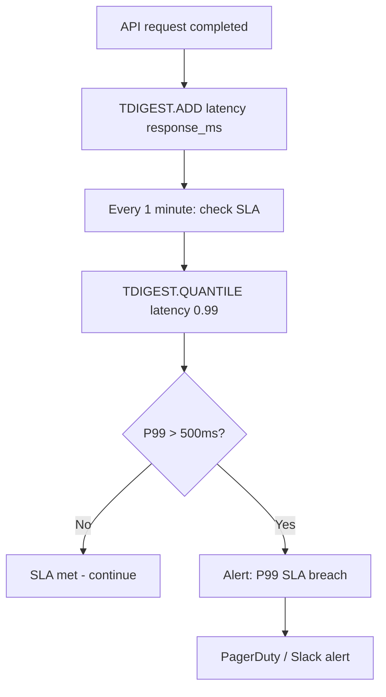

# How to Use TDIGEST.QUANTILE in Redis T-Digest for Percentiles

Author: [nawazdhandala](https://www.github.com/nawazdhandala)

Tags: Redis, RedisBloom, T-Digest, Probabilistic, Command

Description: Learn how to use TDIGEST.QUANTILE in Redis to compute approximate percentile values from a T-Digest structure for latency monitoring and SLA reporting.

---

## How TDIGEST.QUANTILE Works

`TDIGEST.QUANTILE` returns the approximate value at one or more quantile positions in the T-Digest. A quantile of `0.99` gives the P99 value (the value below which 99% of observations fall). T-Digest is particularly accurate at the tails (P95, P99, P99.9), making it ideal for latency monitoring and SLA compliance checks.



## Syntax

```redis
TDIGEST.QUANTILE key quantile [quantile ...]
```

- `key` - the T-Digest key
- `quantile [quantile ...]` - one or more quantile values between 0.0 and 1.0

Returns an array of floating-point values, one per quantile. Returns `nan` for quantiles when the digest is empty or has only one observation.

## Examples

### Query a Single Percentile

```redis
TDIGEST.CREATE api_latency
TDIGEST.ADD api_latency 10 20 30 40 50 60 70 80 90 100 150 200 300 500 1000

-- P99 (99th percentile)
TDIGEST.QUANTILE api_latency 0.99
```

```text
1) "500"
```

### Query Multiple Percentiles at Once

```redis
TDIGEST.QUANTILE api_latency 0.5 0.75 0.90 0.95 0.99 0.999
```

```text
1) "50"
2) "80"
3) "100"
4) "150"
5) "500"
6) "1000"
```

### Min and Max via Quantile

```redis
-- 0.0 = minimum value, 1.0 = maximum value
TDIGEST.QUANTILE api_latency 0.0 1.0
```

```text
1) "10"
2) "1000"
```

Equivalently use `TDIGEST.MIN` and `TDIGEST.MAX` for cleaner syntax.

### Empty Digest Returns nan

```redis
TDIGEST.CREATE empty_digest
TDIGEST.QUANTILE empty_digest 0.99
```

```text
1) "nan"
```

## Setting Up a Complete Latency Monitoring Example

```redis
TDIGEST.CREATE "latency:api:2026-03-31" COMPRESSION 200

-- Simulate 20 API calls with realistic latency values (ms)
TDIGEST.ADD "latency:api:2026-03-31" \
  8.1 9.2 10.5 11.0 12.3 15.7 18.2 21.4 25.0 30.1 \
  35.2 45.8 52.1 68.3 89.4 120.5 180.2 350.1 720.4 1450.3

-- Query all key percentiles
TDIGEST.QUANTILE "latency:api:2026-03-31" 0.50 0.75 0.90 0.95 0.99 0.999
```

```text
1) "25.025"
2) "45.8"
3) "68.3"
4) "120.5"
5) "720.4"
6) "1450.3"
```

P50 = 25ms, P99 = 720ms.

## SLA Monitoring Workflow



```redis
-- SLA check script (runs every minute)
TDIGEST.QUANTILE api_latency 0.99 0.999

-- Alert if P99 > 500ms or P999 > 2000ms
```

## Rolling Window Approach

For time-window monitoring, use date-based keys with TTL:

```redis
-- Create a new digest each hour with 24-hour TTL
TDIGEST.CREATE "latency:2026-03-31:14" COMPRESSION 100
EXPIRE "latency:2026-03-31:14" 86400

-- Add latencies during the hour
TDIGEST.ADD "latency:2026-03-31:14" 45.2 12.1 ...

-- Query current hour's P99
TDIGEST.QUANTILE "latency:2026-03-31:14" 0.99

-- Compare with previous hour
TDIGEST.QUANTILE "latency:2026-03-31:13" 0.99
```

## Other Useful T-Digest Commands

Complement `TDIGEST.QUANTILE` with:

```redis
-- Get the CDF value (fraction of observations below a given value)
TDIGEST.CDF api_latency 100.0
-- e.g., "0.75" means 75% of requests were under 100ms

-- Get minimum and maximum
TDIGEST.MIN api_latency
TDIGEST.MAX api_latency

-- Get mean
TDIGEST.MEAN api_latency

-- Merge two digests (e.g., from two servers)
TDIGEST.MERGE combined_latency 2 server1_latency server2_latency
```

## Accuracy at Different Quantiles

T-Digest is most accurate at the tails and less accurate at the median:

| Quantile | Relative Error (default compression=100) |
|----------|----------------------------------------|
| P1, P99 | < 0.5% |
| P0.1, P99.9 | < 1% |
| P50 (median) | < 1-2% |

The accuracy at P99 and P99.9 is the reason T-Digest is preferred over other probabilistic data structures for latency SLA monitoring.

## Summary

`TDIGEST.QUANTILE` computes approximate percentile values from a Redis T-Digest for one or more quantile positions in a single call. Use it for P50 through P99.9 latency reporting, SLA compliance checks, financial value distribution analysis, and any streaming metric where you need tail percentiles with minimal memory. T-Digest is particularly accurate at the tails (P95+), making it ideal for detecting latency outliers and SLA breaches.
