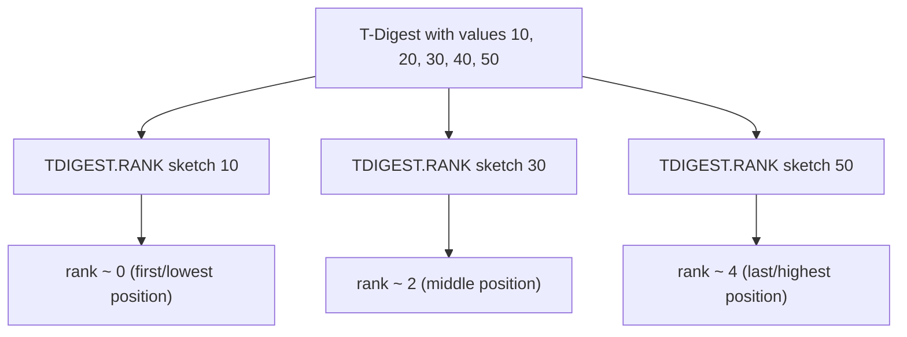

# How to Use TDIGEST.RANK in Redis T-Digest

Author: [nawazdhandala](https://www.github.com/nawazdhandala)

Tags: Redis, T-Digest, Statistics, Command

Description: Learn how to use TDIGEST.RANK in Redis to find the approximate rank of one or more values within a T-Digest sketch.

---

## How TDIGEST.RANK Works

`TDIGEST.RANK` returns the approximate rank (zero-based position) of one or more values within a T-Digest sketch. A rank of 0 means the value is at or below the minimum; a rank of N-1 means it is at or above the maximum. This is the inverse of `TDIGEST.BYRANK`, which converts a rank to a value.



## Syntax

```redis
TDIGEST.RANK key value [value ...]
```

- `key` - the T-Digest sketch key
- `value` - one or more values to find the rank for
- Returns the zero-based integer rank for each value
- Returns -1 for values below the minimum; returns N for values above the maximum (where N is the count)

## Examples

### Basic Rank Lookup

```redis
TDIGEST.CREATE latency
TDIGEST.ADD latency 10 20 30 40 50
TDIGEST.RANK latency 30
```

```text
1) (integer) 2
```

30 is at rank 2 (third position from the bottom).

### Multiple Values

```redis
TDIGEST.RANK latency 10 20 30 40 50
```

```text
1) (integer) 0
2) (integer) 1
3) (integer) 2
4) (integer) 3
5) (integer) 4
```

### Value Below the Minimum

```redis
TDIGEST.RANK latency 1
```

```text
1) (integer) -1
```

### Value Above the Maximum

```redis
TDIGEST.RANK latency 999
```

```text
1) (integer) 5
```

When count is 5, returning 5 means the value is above all observed values.

### Querying Rank on a Large Sketch

```redis
TDIGEST.ADD api:times 150 200 250 300 350 400 450 500 550 600
TDIGEST.RANK api:times 300 500
```

```text
1) (integer) 4
2) (integer) 8
```

300 ms is at rank 4; 500 ms is at rank 8 out of 10 total observations.

## Use Cases

### Determining How Bad a Single Request Was

When a slow request is logged, find where it falls in the distribution:

```redis
-- A request took 850ms
TDIGEST.RANK service:latency 850
-- Returns rank 9847 (out of 10000)
-- This is in the 98.47th percentile
```

### Sorting Incoming Events by Historical Position

```redis
TDIGEST.RANK transaction:amounts 250.00 1000.00 75.50
```

Rank these transactions relative to all historical transactions to apply risk scoring.

### Validate Sketch Distribution

Check that known boundary values have expected ranks:

```redis
TDIGEST.RANK calibration:data 0 50 100
```

```text
1) (integer) 0
2) (integer) 499
3) (integer) 999
```

### Finding the Position of a Threshold

Find where an SLO threshold sits in the observed distribution:

```redis
-- SLO says 200ms
TDIGEST.RANK checkout:latency 200
-- Returns rank 9400 out of 10000 = 94th percentile
```

## TDIGEST.RANK vs TDIGEST.CDF

Both convert a value to a position in the distribution, but they use different scales:

```redis
-- RANK returns an integer rank (0 to N-1)
TDIGEST.RANK latency 100
-- Returns: 9500

-- CDF returns a fraction (0.0 to 1.0)
TDIGEST.CDF latency 100
-- Returns: 0.95
```

`TDIGEST.CDF` is equivalent to `TDIGEST.RANK / count`. Use `TDIGEST.RANK` when you need the absolute position; use `TDIGEST.CDF` for percentage-based comparisons.

## Performance Considerations

- O(log N) per value query where N is the compression (number of centroids).
- Querying multiple values in one call reduces round-trip latency.
- Results are approximate; accuracy is highest at the tails.

## Summary

`TDIGEST.RANK` returns the approximate zero-based rank position of one or more values in a T-Digest sketch, making it the inverse of `TDIGEST.BYRANK`. Use it to determine where a specific measurement falls within your observed distribution, to score incoming values by historical position, or to find where threshold boundaries sit relative to your data.
