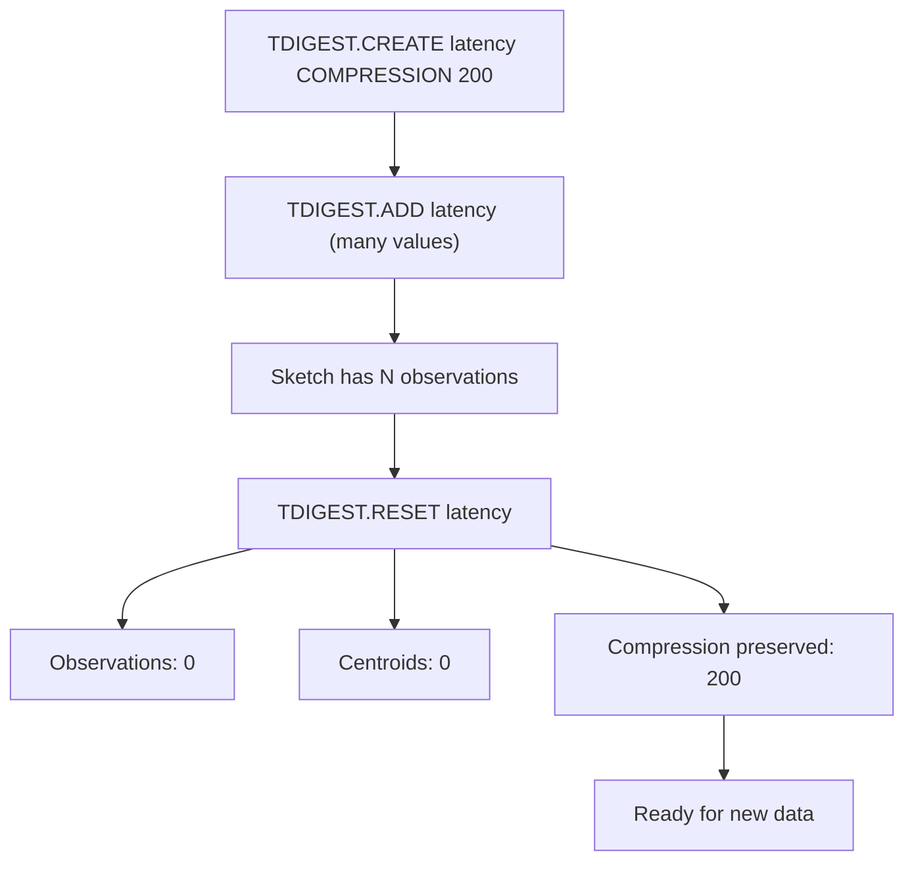

# How to Use TDIGEST.RESET in Redis T-Digest

Author: [nawazdhandala](https://www.github.com/nawazdhandala)

Tags: Redis, T-Digest, Statistics, Command

Description: Learn how to use TDIGEST.RESET in Redis to clear all data from a T-Digest sketch while preserving the key and its compression configuration.

---

## How TDIGEST.RESET Works

`TDIGEST.RESET` clears all the data (centroids and observations) from an existing T-Digest sketch without deleting the key. The sketch retains its compression parameter and is ready to accept new values immediately. This is useful for rolling windows, periodic resets, and reuse of pre-configured sketches.



## Syntax

```redis
TDIGEST.RESET key
```

- `key` - the T-Digest sketch key to reset
- Returns `OK` on success
- Returns an error if the key does not exist or is not a T-Digest

## Examples

### Basic Reset

```redis
TDIGEST.CREATE latency COMPRESSION 100
TDIGEST.ADD latency 10 20 30 40 50
TDIGEST.INFO latency
```

```text
...
13) "Observations"
14) (integer) 5
```

```redis
TDIGEST.RESET latency
TDIGEST.INFO latency
```

```text
...
13) "Observations"
14) (integer) 0
```

### Confirm Data Is Gone After Reset

```redis
TDIGEST.ADD scores 100 200 300
TDIGEST.QUANTILE scores 0.5
```

```text
1) "200"
```

```redis
TDIGEST.RESET scores
TDIGEST.QUANTILE scores 0.5
```

```text
1) "nan"
```

### Compression is Preserved After Reset

```redis
TDIGEST.CREATE precise-sketch COMPRESSION 500
TDIGEST.ADD precise-sketch 1 2 3 4 5
TDIGEST.RESET precise-sketch
TDIGEST.INFO precise-sketch
```

```text
 1) "Compression"
 2) (integer) 500
 3) "Observations"
 4) (integer) 0
```

The compression setting persists through the reset.

### Resetting Multiple Sketches

```redis
TDIGEST.RESET latency:service-a
TDIGEST.RESET latency:service-b
TDIGEST.RESET latency:service-c
```

## Use Cases

### Rolling Time Windows

Reset per-minute or per-hour sketches at the start of each interval:

```redis
-- At the start of each minute
TDIGEST.RESET latency:current-minute
-- Now collect fresh data for this minute
```

### Periodic Stats Collection

Collect a snapshot of the last period's percentiles, then reset for the next period:

```redis
-- 1. Read the current period's stats
TDIGEST.QUANTILE latency:period 0.50 0.95 0.99
-- 2. Store or publish these values elsewhere
-- 3. Reset for the next period
TDIGEST.RESET latency:period
```

### A/B Test Epoch Reset

When starting a new A/B test, clear the sketch so it only captures data from the new experiment:

```redis
TDIGEST.RESET experiment:variant-a:latency
TDIGEST.RESET experiment:variant-b:latency
```

### Clearing Stale Data Without Dropping the Key

If a pipeline feeds data continuously but you want to start fresh after a code deployment:

```redis
TDIGEST.RESET api:response-time
-- New data from updated code is now isolated
```

## TDIGEST.RESET vs DEL

```redis
-- RESET: clears data, preserves key and compression
TDIGEST.RESET latency
-- latency key still exists, compression retained

-- DEL: removes the key entirely
DEL latency
-- latency key no longer exists; must TDIGEST.CREATE again
```

Use `TDIGEST.RESET` when you want to reuse an existing sketch configuration. Use `DEL` when you no longer need the sketch at all.

## Performance Considerations

- `TDIGEST.RESET` is O(N) where N is the number of centroids, as it frees centroid memory.
- It is significantly faster than deleting and recreating a sketch with the same compression.
- The key remains in memory even after reset; use `DEL` if you want to reclaim the key's overhead.

## Summary

`TDIGEST.RESET` clears all observations and centroids from a T-Digest sketch while preserving the key and its compression configuration. Use it for rolling windows, periodic statistics collection, A/B test epochs, and any scenario where you need a clean slate without the overhead of recreating a sketch from scratch.
