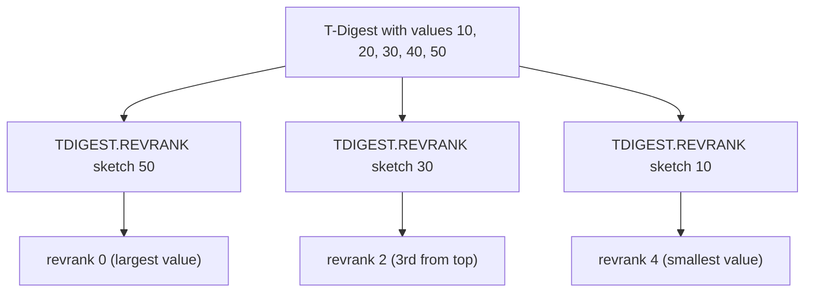

# How to Use TDIGEST.REVRANK in Redis T-Digest

Author: [nawazdhandala](https://www.github.com/nawazdhandala)

Tags: Redis, T-Digest, Statistics, Command

Description: Learn how to use TDIGEST.REVRANK in Redis to find the reverse rank of values in a T-Digest sketch, where rank 0 corresponds to the largest value.

---

## How TDIGEST.REVRANK Works

`TDIGEST.REVRANK` returns the reverse rank of one or more values in a T-Digest sketch. Reverse rank 0 corresponds to the largest value (maximum), and the rank increases as values decrease. It is the inverse of `TDIGEST.BYREVRANK` and the reverse-ordered counterpart to `TDIGEST.RANK`.



## Syntax

```redis
TDIGEST.REVRANK key value [value ...]
```

- `key` - the T-Digest sketch key
- `value` - one or more values to find the reverse rank for
- Returns zero-based reverse rank for each value
- Returns -1 for values above the maximum; returns N for values below the minimum

## Examples

### Basic Reverse Rank

```redis
TDIGEST.CREATE latency
TDIGEST.ADD latency 10 20 30 40 50
TDIGEST.REVRANK latency 50
```

```text
1) (integer) 0
```

50 is at reverse rank 0 - the largest value.

### Multiple Values

```redis
TDIGEST.REVRANK latency 50 30 10
```

```text
1) (integer) 0
2) (integer) 2
3) (integer) 4
```

### Value Above the Maximum Returns -1

```redis
TDIGEST.REVRANK latency 999
```

```text
1) (integer) -1
```

### Value Below the Minimum Returns N

```redis
TDIGEST.REVRANK latency 1
```

```text
1) (integer) 5
```

When count is 5, returning 5 means the value is below all observed values.

### Ranking Slow Requests

```redis
TDIGEST.ADD service:latency 120 450 890 300 1200 75 600
-- How bad was the 890ms request?
TDIGEST.REVRANK service:latency 890
```

```text
1) (integer) 1
```

890ms has reverse rank 1 - it is the second slowest request.

## Use Cases

### Scoring Incident Severity

When an incident is detected, find where its impact metric falls in the "worst" distribution:

```redis
-- Error rate spike of 15%
TDIGEST.REVRANK error-rates 15.0
-- Returns 3 -> this is the 4th worst rate ever seen
```

### Top-N Analysis Without Sorting Raw Data

Find the relative position of a specific value among the worst performers:

```redis
TDIGEST.REVRANK query:times 5000
-- Returns 0 -> this query is the slowest ever seen
```

### Identifying Whether a Value is an Outlier

```redis
TDIGEST.REVRANK response:sizes 1048576
-- Returns 12 -> 1MB response is the 13th largest ever
-- Compare to total count to determine if it is a top-1% outlier
```

### Comparing Two Values' Relative Severity

```redis
TDIGEST.REVRANK checkout:errors 8 15
```

```text
1) (integer) 50
2) (integer) 5
```

An error score of 15 has reverse rank 5 (near the top), while 8 has reverse rank 50 (much less severe).

## TDIGEST.REVRANK vs TDIGEST.RANK

| Feature | TDIGEST.RANK | TDIGEST.REVRANK |
|---|---|---|
| Rank 0 = | Smallest value | Largest value |
| Returns -1 for | Values below min | Values above max |
| Returns N for | Values above max | Values below min |
| Use case | Bottom-N scoring | Top-N severity scoring |

```redis
-- Forward rank: where does 80ms fall from the bottom?
TDIGEST.RANK latency 80
-- Returns: 950 (out of 1000)

-- Reverse rank: where does 80ms fall from the top?
TDIGEST.REVRANK latency 80
-- Returns: 49 (49th slowest)
```

## TDIGEST.REVRANK vs TDIGEST.BYREVRANK

These are inverses of each other:

```redis
-- REVRANK: value -> reverse rank
TDIGEST.REVRANK latency 850
-- Returns: 5

-- BYREVRANK: reverse rank -> value
TDIGEST.BYREVRANK latency 5
-- Returns: ~850
```

## Summary

`TDIGEST.REVRANK` returns the reverse-ordered rank of one or more values in a T-Digest sketch, where rank 0 is the maximum value. Use it to score incident severity, identify top outliers, and determine how many worse values exist above a specific measurement - all without storing or sorting raw data.
