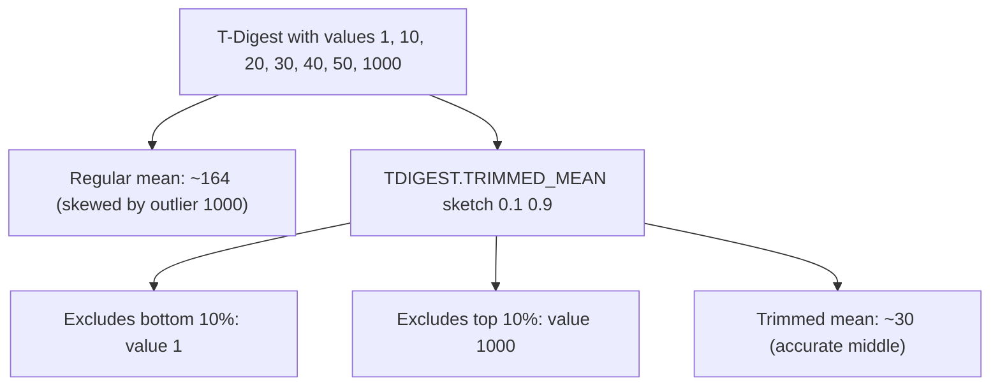

# How to Use TDIGEST.TRIMMED_MEAN in Redis T-Digest

Author: [nawazdhandala](https://www.github.com/nawazdhandala)

Tags: Redis, T-Digest, Statistics, Command

Description: Learn how to use TDIGEST.TRIMMED_MEAN in Redis to compute the mean of values within a specified quantile range, excluding extreme outliers.

---

## How TDIGEST.TRIMMED_MEAN Works

`TDIGEST.TRIMMED_MEAN` computes the arithmetic mean of all values in a T-Digest sketch that fall between two quantile boundaries (low and high). Values below the low quantile and above the high quantile are excluded from the calculation. This produces a robust average that is resistant to outliers and extreme values.



## Syntax

```redis
TDIGEST.TRIMMED_MEAN key low_cut_quantile high_cut_quantile
```

- `key` - the T-Digest sketch key
- `low_cut_quantile` - lower quantile boundary (0.0 to 1.0); values below this are excluded
- `high_cut_quantile` - upper quantile boundary (0.0 to 1.0); values above this are excluded
- Returns the trimmed mean as a float, or `nan` if no values fall in the range

## Examples

### Basic Trimmed Mean (Interquartile Range)

```redis
TDIGEST.CREATE latency
TDIGEST.ADD latency 10 20 30 40 50 60 70 80 90 100
TDIGEST.TRIMMED_MEAN latency 0.25 0.75
```

```text
"55"
```

The mean of values between the 25th and 75th percentiles.

### Excluding Extreme Outliers

```redis
TDIGEST.ADD response-times 50 60 70 80 90 100 5000
TDIGEST.TRIMMED_MEAN response-times 0.0 0.9
```

```text
"75"
```

The 5000ms outlier is excluded; the mean reflects typical behavior.

### Full Range (Same as Regular Mean)

```redis
TDIGEST.TRIMMED_MEAN latency 0.0 1.0
```

Returns the mean of all values (no trimming).

### Symmetric Trim (5% Each Side)

```redis
TDIGEST.TRIMMED_MEAN api:duration 0.05 0.95
```

Excludes the worst 5% and best 5% of response times, yielding a stable average.

### Empty Range Returns nan

```redis
TDIGEST.TRIMMED_MEAN latency 0.9 0.1
```

```text
"nan"
```

Low quantile must be less than high quantile.

## Use Cases

### Performance Benchmarking

Exclude warm-up and spike measurements from benchmark averages:

```redis
TDIGEST.ADD benchmark:runs 250 260 270 5000 265 255 275 280
TDIGEST.TRIMMED_MEAN benchmark:runs 0.1 0.9
```

The 5000ms cold-start spike is excluded from the reported average.

### SLO Reporting Without Skew

Report average latency to stakeholders without outlier distortion:

```redis
TDIGEST.TRIMMED_MEAN api:latency 0.05 0.95
```

This excludes the bottom and top 5% of requests for a stable average.

### Detecting Bimodal Distributions

By comparing different trim ranges, identify whether data has two clusters:

```redis
-- Mean of the lower cluster
TDIGEST.TRIMMED_MEAN response-times 0.0 0.5
-- Mean of the upper cluster
TDIGEST.TRIMMED_MEAN response-times 0.5 1.0
```

If these differ significantly, the distribution is bimodal.

### Sensor Data with Known Noise

Exclude known measurement noise at the edges:

```redis
TDIGEST.ADD temperature:outdoor 18.5 19.0 19.5 20.0 -99.0 20.5
TDIGEST.TRIMMED_MEAN temperature:outdoor 0.1 0.9
```

The erroneous -99.0 reading is excluded from the average.

## TDIGEST.TRIMMED_MEAN vs Regular Mean

A regular arithmetic mean is sensitive to outliers. TDIGEST.TRIMMED_MEAN is robust:

```redis
TDIGEST.ADD demo 10 20 30 40 50 10000

-- Regular mean would be ~1693 (pulled by 10000)
-- Trimmed mean excludes the extremes
TDIGEST.TRIMMED_MEAN demo 0.1 0.9
-- Returns: ~30 (representative of the bulk of data)
```

## Choosing Trim Boundaries

| Trim | Description |
|---|---|
| 0.0 - 1.0 | No trimming (full mean) |
| 0.1 - 0.9 | Remove bottom and top 10% |
| 0.25 - 0.75 | Interquartile mean (IQM) |
| 0.05 - 0.95 | Light trim for benchmarks |
| 0.0 - 0.9 | Remove only the top 10% (outlier suppression) |

## Performance Considerations

- O(N) where N is the number of centroids in the compression range.
- Results are approximate due to the T-Digest approximation model.
- Accuracy is higher at the tails (where trimming happens) than at the center.

## Summary

`TDIGEST.TRIMMED_MEAN` computes the mean of a distribution after excluding values outside specified quantile boundaries. It produces outlier-resistant averages suitable for benchmarking, SLO reporting, sensor data analysis, and any scenario where extreme values would distort a simple mean.
