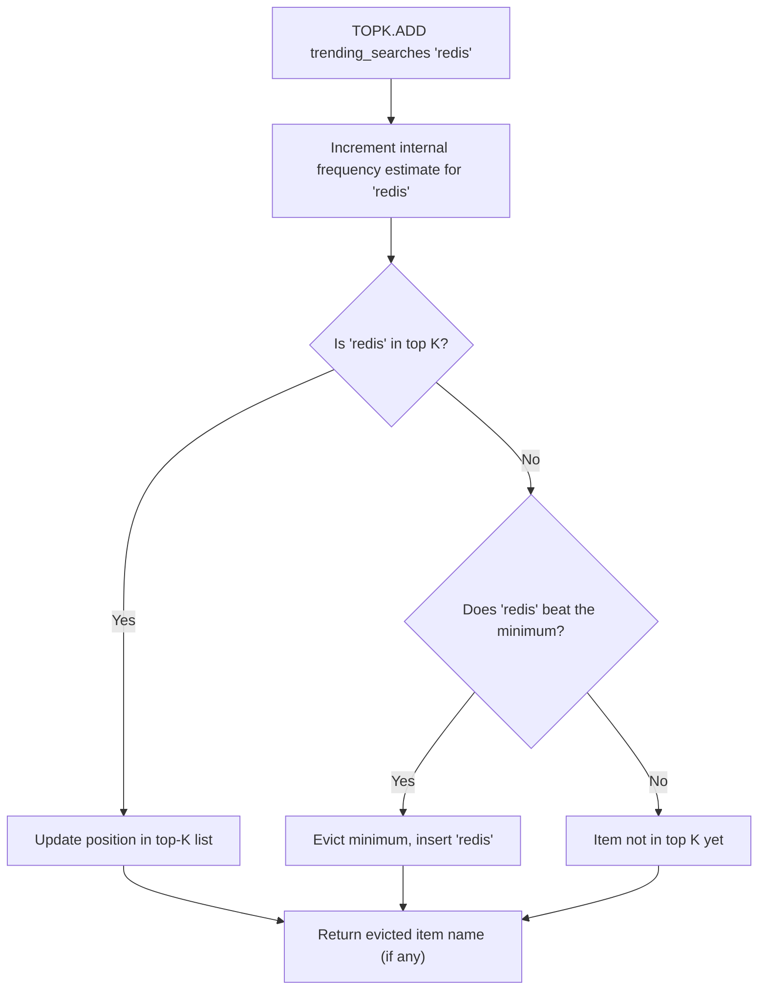

# How to Use TOPK.ADD in Redis TopK Structure

Author: [nawazdhandala](https://www.github.com/nawazdhandala)

Tags: Redis, RedisBloom, TopK, Probabilistic, Command

Description: Learn how to use TOPK.ADD in Redis to add elements to a TopK data structure that maintains a list of the most frequently seen items using minimal memory.

---

## What Is the TopK Structure?

The TopK data structure in Redis maintains a list of the K most frequently occurring items in a data stream. It uses the Heavy Hitters algorithm internally (a combination of a Count-Min Sketch and a min-heap), allowing it to track the top K items using far less memory than exact approaches. Items that do not make it into the top K are discarded.



## Syntax

```redis
TOPK.ADD key item [item ...]
```

- `key` - the TopK structure key (auto-created with defaults if not present)
- `item [item ...]` - one or more elements to add

Returns an array, one entry per item. Each entry is either `nil` (item was added/updated without eviction) or the name of the item that was evicted from the top-K list to make room.

## Default Structure Settings

When auto-created by `TOPK.ADD`, the default parameters are:
- K = 50 (maintains top 50 items)
- Width = 8
- Depth = 7
- Decay = 0.9

Use `TOPK.RESERVE` to specify custom parameters.

## Examples

### Add a Single Item

```redis
TOPK.ADD trending "redis"
```

```text
1) (nil)
```

No eviction occurred.

### Add Multiple Items

```redis
TOPK.ADD search_terms "redis" "docker" "kubernetes" "postgres"
```

```text
1) (nil)
2) (nil)
3) (nil)
4) (nil)
```

### Observe Eviction

Once the top-K list is full, adding a more frequent item evicts the least frequent:

```redis
-- Reserve a very small TopK to demonstrate eviction
TOPK.RESERVE tiny_topk 3 50 3 0.9

TOPK.ADD tiny_topk "a"
TOPK.ADD tiny_topk "b"
TOPK.ADD tiny_topk "c"

-- Add many more occurrences of "d" - it beats "a"
TOPK.ADD tiny_topk "d" "d" "d" "d" "d"
```

```text
(some eviction will occur once d becomes frequent enough)
```

The evicted item name is returned so your application can log or handle the ejection.

## Creating with Custom Parameters First

For production use, reserve the structure with explicit parameters before adding:

```redis
TOPK.RESERVE trending_products 100 2000 7 0.925

-- Now add items
TOPK.ADD trending_products "product:A"
TOPK.ADD trending_products "product:B"
```

## Use Cases

### Real-Time Trending Topics

Track which search terms are most frequent in a time window:

```redis
TOPK.RESERVE trending_now 20 2000 7 0.9

-- On each search query
TOPK.ADD trending_now "redis tutorial"
TOPK.ADD trending_now "docker swarm"
TOPK.ADD trending_now "redis tutorial"

-- Get top 20 trending terms
TOPK.LIST trending_now
```

### Popular Products

Track the most viewed or purchased products:

```redis
TOPK.RESERVE popular_products 50 5000 7 0.9

-- On each product view
TOPK.ADD popular_products "product:1234"
```

### Frequent API Consumers

Identify which client IDs make the most API calls:

```redis
TOPK.RESERVE heavy_api_users 10 1000 5 0.9

-- On each request
TOPK.ADD heavy_api_users "client:abc"
TOPK.ADD heavy_api_users "client:xyz"
```

### Most Active Users

Track the most active users on a platform:

```redis
TOPK.RESERVE active_users 100 10000 7 0.9

-- On each user action
TOPK.ADD active_users "user:42"
```

## Handling Eviction Returns

The return value tells you which item was removed from the top-K list. Use it for monitoring:

```redis
TOPK.ADD trending "new_item"
-- If returns a non-nil value, log the evicted item
-- e.g., "old_trending_item" was removed from top-K
```

This is useful for tracking which items have "fallen out" of trending status.

## TOPK.ADD vs CMS.INCRBY

| Feature | TOPK.ADD | CMS.INCRBY |
|---------|---------|-----------|
| Output | Top K items | Frequency count of any item |
| Use case | "What are the top K?" | "How often does item X appear?" |
| Memory | Fixed | Fixed |
| Query type | List the leaders | Query a specific item |

Use TopK when you care about ranking; use Count-Min Sketch when you want to query arbitrary item frequencies.

## Summary

`TOPK.ADD` adds one or more items to a Redis TopK structure and maintains an approximate list of the K most frequent items. It returns the name of any item evicted from the top-K list. Use it for real-time trending topics, popular product tracking, heavy API user identification, and any scenario where you need the top K items from a high-volume stream with minimal memory. Use `TOPK.LIST` to retrieve the current top-K ranking.
