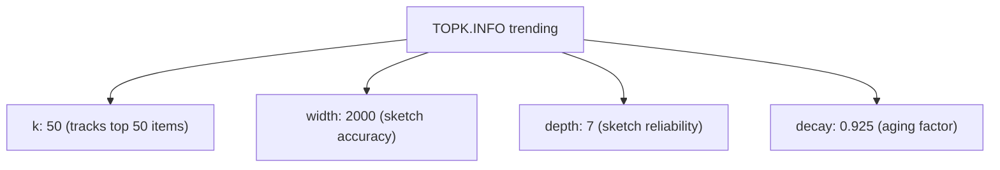

# How to Use TOPK.INFO in Redis to Get TopK Stats

Author: [nawazdhandala](https://www.github.com/nawazdhandala)

Tags: Redis, RedisBloom, TopK, Probabilistic, Command

Description: Learn how to use TOPK.INFO in Redis to retrieve the configuration parameters of a TopK structure including K, width, depth, and decay settings.

---

## How TOPK.INFO Works

`TOPK.INFO` returns the configuration parameters of a Redis TopK structure. It shows the value of K (how many top items are tracked), the internal heavy-hitters sketch dimensions (width and depth), and the decay factor. Use it to verify the structure was created with the intended parameters and to document the configuration for monitoring and auditing.



## Syntax

```redis
TOPK.INFO key
```

- `key` - the TopK structure key

Returns a flat array of field-value pairs. Returns an error if the key does not exist.

## Examples

### Default Structure Parameters

```redis
-- Auto-created by first TOPK.ADD call
TOPK.ADD auto_created "item"
TOPK.INFO auto_created
```

```text
1) "k"
2) (integer) 50
3) "width"
4) (integer) 8
5) "depth"
6) (integer) 7
7) "decay"
8) "0.9"
```

### Custom Reserved Structure

```redis
TOPK.RESERVE custom_topk 20 3000 10 0.925
TOPK.INFO custom_topk
```

```text
1) "k"
2) (integer) 20
3) "width"
4) (integer) 3000
5) "depth"
6) (integer) 10
7) "decay"
8) "0.925"
```

### Comparing Expected vs Actual Parameters

After deployment, verify your TopK was configured correctly:

```redis
TOPK.INFO production_trending
-- Confirm: k=100, width=5000, depth=7, decay=0.9
-- If different, the structure may have been auto-created with defaults
```

## Understanding the Parameters

### k

The number of heavy hitters maintained. A TopK with `k=50` tracks the 50 most frequent items. Items outside the top 50 are not stored.

### width and depth

These are the dimensions of the internal Count-Min Sketch used to estimate frequencies:
- `width` - number of counters per row; larger = more accurate frequency estimates
- `depth` - number of rows (hash functions); larger = more reliable estimates

### decay

The decay factor (0 to 1) reduces old counter values over time. A decay of `0.9` means each time a counter is "bumped" in the cuckoo eviction process, competing counters are multiplied by 0.9, gradually aging out items that are no longer frequent. Lower decay ages items out faster, making the structure more responsive to recent trends.

## Using TOPK.INFO in Monitoring

### Audit Script Pattern

```redis
-- Verify all production TopK structures have expected parameters
TOPK.INFO trending_products
TOPK.INFO top_search_queries
TOPK.INFO heavy_api_clients

-- Compare k values with deployment documentation
```

### Configuration Drift Detection

If a TopK structure was accidentally deleted and auto-recreated by a `TOPK.ADD` call, the default parameters (`k=50, width=8, depth=7`) would be very different from your intended configuration. `TOPK.INFO` reveals this:

```redis
TOPK.INFO my_topk
-- Expected: k=200, width=5000, depth=10
-- Actual: k=50, width=8, depth=7  <- auto-created with defaults!
-- Action: recreate with TOPK.RESERVE
```

## TOPK.INFO vs BF.INFO vs CMS.INFO

All probabilistic data structures have an INFO command for inspecting their configuration:

```redis
-- Bloom filter info
BF.INFO mybloom
-- Shows: capacity, size, number of filters, error rate

-- Count-Min Sketch info
CMS.INFO mysketch
-- Shows: width, depth, count

-- TopK info
TOPK.INFO mytopk
-- Shows: k, width, depth, decay
```

## Summary

`TOPK.INFO` returns the configuration parameters of a Redis TopK structure: `k` (the ranking depth), `width` and `depth` (internal sketch dimensions), and `decay` (the aging factor for older counts). Use it to verify that production structures were created with the intended settings, detect accidental auto-creation with default parameters, and document TopK configurations for operational runbooks.
