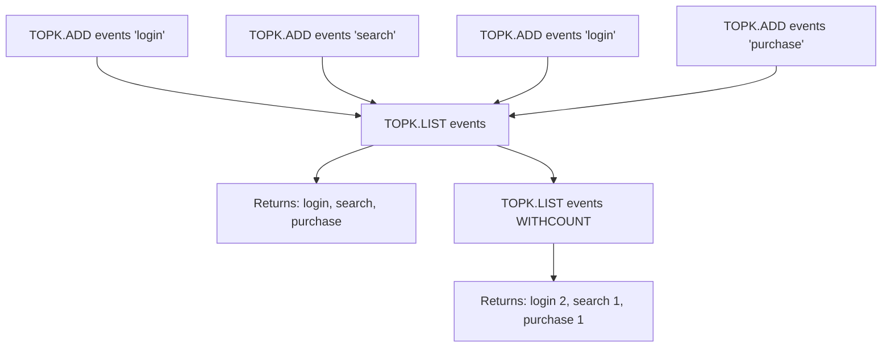

# How to Use TOPK.LIST in Redis to Get Top-K Elements

Author: [nawazdhandala](https://www.github.com/nawazdhandala)

Tags: Redis, RedisBloom, TopK, Probabilistic, Command

Description: Learn how to use TOPK.LIST in Redis to retrieve all items currently in the top-K list, optionally with their approximate frequency counts.

---

## How TOPK.LIST Works

`TOPK.LIST` returns all items currently tracked in the top-K list. This is the primary read command for discovering which items are most frequent in your data stream. Items are returned in no guaranteed order (not sorted by frequency); use `WITHCOUNT` to get frequency estimates and sort them in your application.



## Syntax

```redis
TOPK.LIST key [WITHCOUNT]
```

- `key` - the TopK structure key
- `WITHCOUNT` - also return the approximate frequency count for each item

Returns an array of item names. With `WITHCOUNT`, returns alternating item/count pairs.

## Examples

### Get the Top-K List

```redis
TOPK.RESERVE search_terms 5 2000 7 0.9

TOPK.ADD search_terms "redis" "redis" "redis" "docker" "docker" "kubernetes" "postgres"

TOPK.LIST search_terms
```

```text
1) "redis"
2) "docker"
3) "kubernetes"
4) "postgres"
5) (nil)
```

`nil` entries represent empty slots in the top-K list that have not been filled yet.

### Get the Top-K List with Counts

```redis
TOPK.LIST search_terms WITHCOUNT
```

```text
1) "redis"
2) (integer) 3
3) "docker"
4) (integer) 2
5) "kubernetes"
6) (integer) 1
7) "postgres"
8) (integer) 1
9) (nil)
10) (integer) 0
```

### Full Example: Building a Trending Section

```redis
TOPK.RESERVE trending 10 5000 7 0.9

-- Simulate traffic over time
TOPK.ADD trending "article:redis-guide" "article:redis-guide" "article:redis-guide"
TOPK.ADD trending "article:docker-intro" "article:docker-intro"
TOPK.ADD trending "article:k8s-deploy"
TOPK.ADD trending "article:redis-guide"
TOPK.ADD trending "article:docker-intro" "article:docker-intro"

TOPK.LIST trending WITHCOUNT
```

```text
1) "article:redis-guide"
2) (integer) 4
3) "article:docker-intro"
4) (integer) 4
5) "article:k8s-deploy"
6) (integer) 1
...
```

## Filtering Out Nil Entries

The top-K list may contain `nil` entries if fewer than K distinct items have been added. Filter them in your application:

```redis
TOPK.LIST trending
-- Some entries may be nil; skip them when rendering
```

## Sorting by Count

`TOPK.LIST WITHCOUNT` returns items in internal order, not sorted by frequency. To get a ranked list:

```redis
TOPK.LIST trending WITHCOUNT
-- Parse pairs: (item, count), sort by count descending in application
```

## Use Cases

### Trending Products Widget

Display the top 10 most viewed products on a homepage:

```redis
TOPK.RESERVE popular_products 10 5000 7 0.9

-- On each product view
TOPK.ADD popular_products "product:123"

-- Every 5 minutes: retrieve and display
TOPK.LIST popular_products WITHCOUNT
```

### Daily Top Search Terms

Show users which searches are popular today:

```redis
TOPK.RESERVE "trending:2026-03-31" 20 10000 7 0.9

-- On each search
TOPK.ADD "trending:2026-03-31" "search_term_here"

-- Display top 20 searches
TOPK.LIST "trending:2026-03-31" WITHCOUNT
```

### Leaderboard for API Consumers

Identify your top 10 API clients by request volume:

```redis
TOPK.RESERVE api_heavy_users 10 2000 7 0.9

-- On each API request
TOPK.ADD api_heavy_users "client:abc"

-- Ops dashboard query
TOPK.LIST api_heavy_users WITHCOUNT
```

### Most Active Pages in Analytics

Track the most visited pages in real time:

```redis
TOPK.RESERVE hot_pages 50 20000 7 0.9

-- On each page view
TOPK.ADD hot_pages "/products/redis"

-- Analytics query
TOPK.LIST hot_pages WITHCOUNT
```

## TOPK.LIST vs Sorted Sets

| Feature | TOPK.LIST | Redis Sorted Set |
|---------|----------|-----------------|
| Memory | Fixed | Grows with unique items |
| Accuracy | Approximate | Exact |
| Ranking | Not sorted (sort manually) | Sorted by score |
| Scale | Millions of unique items | Thousands before memory concern |
| Use case | High-cardinality heavy hitters | Exact leaderboards with few members |

Use `TOPK.LIST` for high-traffic stream analytics. Use sorted sets for exact leaderboards with a manageable number of participants.

## Summary

`TOPK.LIST` returns all items in the current top-K list. The `WITHCOUNT` option includes approximate frequency estimates for each item. Items are not sorted by frequency; sort them in your application after retrieval. Filter `nil` entries which represent unfilled slots. Use it to power trending displays, popular product widgets, active user dashboards, and any feature that needs the top K heaviest hitters from a data stream.
